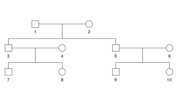
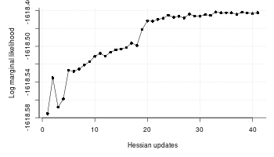
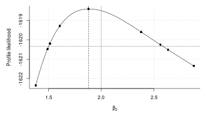
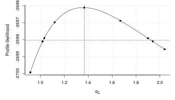
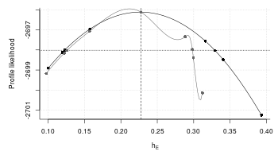
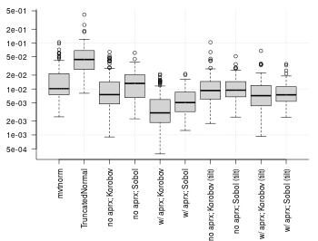

# pedmod: Pedigree Models

[](https://github.com/boennecd/pedmod/actions)
[](https://CRAN.R-project.org/package=pedmod)
[](https://CRAN.R-project.org/package=pedmod)

The pedmod package provides functions to estimate models for pedigree
data. Particularly, the package provides functions to estimate mixed
models of the form:

, 1) \\
\vec\epsilon_i = (\epsilon_{i1}, \dots, \epsilon_{in_i})^\top &\sim
  N^{(n_i)}\left(\vec 0, \sum_{l = 1}^K\sigma_l^2 C_{il}
  \right)
\end{align*}")

where

is the binary outcome of interest for individual
 in
family/cluster
,

is the individual’s known covariates,

is the standard normal distribution’s CDF, and

implies a binomial distribution such if
")
then the density of
 is:

 = \begin{pmatrix} n \\ z \end{pmatrix}p^z(1 - p)^{n-z}")

A different and equivalent way of writing the model is as:

^\top &\sim
  N^{(n_i)}\left(\vec 0, I_{n_i} + \sum_{l = 1}^K\sigma_l^2 C_{il}
  \right)
\end{align*}")

where

is the

dimensional identity matrix which comes from the unshared/individual
specific random effect. This effect is always included. The models are
commonly known as liability threshold models or mixed probit models.

The
s
are known scale/correlation matrices where each of the
’th
types correspond to a type of effect. An arbitrary number of such
matrices can be passed to include e.g. a genetic effect, a maternal
effect, a paternal, an effect of a shared adult environment etc.
Usually, these matrices are correlation matrices as this simplifies
later interpretation and we will assume that all the matrices are
correlation matrices. A typical example is that

is two times the kinship matrix in which case we call:


the heritability. That is, the proportion of the variance attributable
to the the
’th
effect which in this case is the direct genetic effect. The scale
parameters, the
s,
may be the primary interest in an analysis. The scale in the model
cannot be identified. That is, an equivalent model is:

^\top &\sim
  N^{(n_i)}\left(\vec 0, 
  \phi\left(I_{n_i} + \sum_{l = 1}^K\sigma_l^2 C_{il}\right)
  \right)
\end{align*}")

for any
.
A common option other than

is to set
^{-1}").
This has the effect that


is the proportion of variance attributable to the
’th
effect (assuming all

matrices are correlation matrices). Moreover,

is the proportion of variance attributable to the individual specific
effect.

The parameterizations used in the package are

which we call the direct parameterizations and
^{-1}")
which we call the standardized parameterizations. The latter have the
advantage that it is easier to interpret as the scale parameters are the
proportion of variance attributable to each effect (assuming that only
correlation matrices are used) and the

are often very close the estimate from a GLM (that is, the model without
the other random effects) when the covariates are unrelated to random
effects that are added to the model. The latter makes it easy to find
starting values.

For the above reason, two parameterization are used. For the direct
parameterization where
,
we work directly with
,
and we use
.
For the standardized parameterization where
^{-1}"),
we work with
^{-1}"),
,
and

}{1 +\sum_{l = 1}^k\exp(\psi_l)}\Leftrightarrow\sigma_l^2 = \exp(\psi_l).")

This package provides randomized quasi-Monte Carlo methods to
approximate the log marginal likelihood for these types of models with
an arbitrary number scale matrices,
, and
the derivatives with respect to
^\top")
(that is, we work with
)
or
").

We have re-written the Fortran code by Genz and Bretz (2002) in C++,
made it easy to extend from a log marginal likelihood approximation to
other approximations such as the derivatives, and added less precise but
faster approximations of the

and
.
Our own experience suggests that using the latter has a small effect on
the precision of the result but can yield substantial reduction in
computation times for moderate sized families/clusters.

The approximation by Genz and Bretz (2002) have already been used to
estimate these types of models (Pawitan et al. 2004). However, not
having the gradients may slow down estimation substantially. Moreover,
our implementation supports computation in parallel which is a major
advantage given the availability of multi-core processors.

Since the implementation is easy to extend, possible extensions are:

1.  Survival times using mixed generalized survival models (Liu,
    Pawitan, and Clements 2017) with a similar random effect structure
    as the model shown above. This way, one avoids dichotomizing
    outcomes and can account for censoring.
2.  Generalized linear mixed model with binary, binomial, ordinal, or
    multinomial outcomes with a probit link. The method we use here may
    be beneficial if the number of random effects per cluster is not
    much smaller then the number observations in each cluster. This is
    used for imputation in the mdgc package.

## Installation

The package can be installed from Github by calling:

``` r
remotes::install_github("boennecd/pedmod", build_vignettes = TRUE)
```

The code benefits from being build with automatic vectorization so
having e.g.  `-O3` in the `CXX14FLAGS` flags in your Makevars file may
be useful.

## Example

We start with a simple example only with a direct genetic effect. We
have one type of family which consists of two couples which are related
through one of the parents being siblings. The family is shown below.

``` r
# create the family we will use
fam <- data.frame(id = 1:10, sex = rep(1:2, 5L),
                  father = c(NA, NA, 1L, NA, 1L, NA, 3L, 3L, 5L, 5L), 
                  mother = c(NA, NA, 2L, NA, 2L, NA, 4L, 4L, 6L, 6L))

# plot the pedigree
library(kinship2)
ped <- with(fam, pedigree(id = id, dadid = father, momid = mother, sex = sex))
plot(ped)
```



We set the scale matrix to be two times the kinship matrix to model the
direct genetic effect. Each individual also has a standard normally
distributed covariate and a binary covariate. Thus, we can simulate a
data set with a function like:

``` r
# simulates a data set. 
# 
# Args:
#   n_fams: number of families.
#   beta: the fixed effect coefficients.
#   sig_sq: the scale parameter.
sim_dat <- function(n_fams, beta = c(-3, 1, 2), sig_sq = 3){
  # setup before the simulations
  Cmat <- 2 * kinship(ped)
  n_obs <- NROW(fam)
  Sig <- diag(n_obs) + sig_sq * Cmat
  Sig_chol <- chol(Sig)
  
  # simulate the data
  out <- replicate(
    n_fams, {
      # simulate covariates
      X <- cbind(`(Intercept)` = 1, Continuous = rnorm(n_obs), 
                 Binary = runif(n_obs) > .5)
      
      # assign the linear predictor + noise
      eta <- drop(X %*% beta) + drop(rnorm(n_obs) %*% Sig_chol)
      
      # return the list in the format needed for the package
      list(y = as.numeric(eta > 0), X = X, scale_mats = list(Cmat))
    }, simplify = FALSE)
  
  # add attributes with the true values and return 
  attributes(out) <- list(beta = beta, sig_sq = sig_sq)
  out
}
```

The model is

 \\
 B_{ij} &\sim \text{Bin}(0.5, 1) \\
 (G_{i1}, \dots G_{in_{i}})^\top &\sim N^{(n_i)}(\vec 0, \sigma^2 C_{i1}) \\
 R_{ij} &\sim N(0, 1)\end{align*}")

where

is two times the kinship matrix and

and

are observed covariates. We can now estimate the model with a simulated
data set as follows:

``` r
# simulate a data set
set.seed(27107390)
dat <- sim_dat(n_fams = 400L)

# perform the optimization. We start with finding the starting values
library(pedmod)
ll_terms <- pedigree_ll_terms(dat, max_threads = 4L)
system.time(start <- pedmod_start(ptr = ll_terms, data = dat, n_threads = 4L))
#>    user  system elapsed 
#>  14.343   0.100   3.723

# log likelihood without the random effects and at the starting values
start$logLik_no_rng
#> [1] -1690
start$logLik_est # this is unreliably/imprecise
#> [1] -1619

# estimate the model
system.time(
  opt_out <- pedmod_opt(
    ptr = ll_terms, par = start$par, abs_eps = 0, use_aprx = TRUE, 
    n_threads = 4L, 
    maxvls = 25000L, rel_eps = 1e-3, minvls = 5000L))
#>    user  system elapsed 
#>   45.37    0.00   11.34
```

The results of the estimation are shown below:

``` r
# parameter estimates versus the truth
rbind(opt_out       = head(opt_out$par, -1), 
      opt_out_quick = head(start  $par, -1), 
      truth         = attr(dat, "beta"))
#>               (Intercept) Continuous Binary
#> opt_out            -2.872     0.9689  1.878
#> opt_out_quick      -2.844     0.9860  1.857
#> truth              -3.000     1.0000  2.000
c(opt_out       = exp(tail(opt_out$par, 1)), 
  opt_out_quick = exp(tail(start  $par, 1)), 
  truth         = attr(dat, "sig_sq"))
#>       opt_out opt_out_quick         truth 
#>         2.908         2.812         3.000

# log marginal likelihoods
print(start   $logLik_est, digits = 8) # this is unreliably/imprecise
#> [1] -1618.5064
print(-opt_out$value     , digits = 8)
#> [1] -1618.4045
```

We emphasize that we set the `rel_eps` parameter to `1e-3` above which
perhaps is fine for this size of a data set but may not be fine for
larger data sets for the following reason. Suppose that we have

families/clusters and suppose that we estimate the log likelihood term
for each family with a variance of
.
This implies that the variance of the log likelihood for all the
families is
.
Thus, the precision we require for each family’s log likelihood term
needs to be proportional to
")
if we want a fixed number of precise digits for the log likelihood for
all number of families. The latter is important e.g.  for the profile
likelihood curve we compute later and also for the line search used by
some optimization methods. Thus, one may need to reduce `rel_eps` and
increase `maxvls` when there are many families.

As an alternative to the direct parameterization we use above, we can
also use the standardized parameterization. Below are some illustrations
which you may skip.

``` r
#####
# transform the parameters and check that we get the same likelihood
std_par <- direct_to_standardized(opt_out$par, n_scales = 1L)
std_par # the standardized parameterization
#> (Intercept)  Continuous      Binary             
#>     -1.4528      0.4901      0.9502      1.0673
opt_out$par # the direct parameterization 
#> (Intercept)  Continuous      Binary             
#>     -2.8718      0.9689      1.8783      1.0673

# we can map back as follows
par_back <- standardized_to_direct(std_par, n_scales = 1L)
all.equal(opt_out$par, par_back, check.attributes = FALSE)
#> [1] TRUE
# the proportion of variance of each effect
attr(par_back, "variance proportions") 
#> Residual          
#>   0.2559   0.7441

# the proportion match
exp(tail(opt_out$par, 1)) / (exp(tail(opt_out$par, 1)) + 1)
#>        
#> 0.7441

# compute the likelihood with either parameterization
set.seed(1L)
eval_pedigree_ll(ptr = ll_terms, par = opt_out$par, maxvls = 10000L, 
                 minvls = 1000L, rel_eps = 1e-3, use_aprx = TRUE, abs_eps = 0)
#> [1] -1618
#> attr(,"n_fails")
#> [1] 10
#> attr(,"std")
#> [1] 0.004053
set.seed(1L)
eval_pedigree_ll(ptr = ll_terms, par = std_par    , maxvls = 10000L, 
                 minvls = 1000L, rel_eps = 1e-3, use_aprx = TRUE, abs_eps = 0, 
                 standardized = TRUE)
#> [1] -1618
#> attr(,"n_fails")
#> [1] 10
#> attr(,"std")
#> [1] 0.004053

# we can also get the same gradient with an application of the chain rule
jac <- attr(
  standardized_to_direct(std_par, n_scales = 1L, jacobian = TRUE), 
  "jacobian")

set.seed(1L)
g1 <- eval_pedigree_grad(ptr = ll_terms, par = opt_out$par, maxvls = 10000L, 
                         minvls = 1000L, rel_eps = 1e-3, use_aprx = TRUE, 
                         abs_eps = 0)
set.seed(1L)
g2 <- eval_pedigree_grad(ptr = ll_terms, par = std_par, maxvls = 10000L, 
                         minvls = 1000L, rel_eps = 1e-3, use_aprx = TRUE, 
                         abs_eps = 0, standardized = TRUE)
all.equal(drop(g1 %*% jac), g2, check.attributes = FALSE)
#> [1] TRUE
```

The model can also be estimated with the standardized parameterization:

``` r
# perform the optimization. We start with finding the starting values
system.time(start_std <- pedmod_start(
  ptr = ll_terms, data = dat, n_threads = 4L, standardized = TRUE))
#>    user  system elapsed 
#>   4.734   0.022   1.215

# the starting values are close
standardized_to_direct(start_std$par, n_scales = 1L)
#> (Intercept)  Continuous      Binary             
#>     -2.8435      0.9858      1.8566      1.0332 
#> attr(,"variance proportions")
#> Residual          
#>   0.2625   0.7375
start$par
#> (Intercept)  Continuous      Binary             
#>      -2.844       0.986       1.857       1.034

# this may have required different number of gradient and function evaluations
start_std$opt$counts
#> function gradient 
#>       31       31
start    $opt$counts
#> function gradient 
#>       48       48

# estimate the model
system.time(
  opt_out_std <- pedmod_opt(
    ptr = ll_terms, par = start_std$par, abs_eps = 0, use_aprx = TRUE, 
    n_threads = 4L, standardized = TRUE,
    maxvls = 25000L, rel_eps = 1e-3, minvls = 5000L))
#>    user  system elapsed 
#>  30.896   0.000   7.724

# we get the same
standardized_to_direct(opt_out_std$par, n_scales = 1L)
#> (Intercept)  Continuous      Binary             
#>     -2.8708      0.9691      1.8772      1.0674 
#> attr(,"variance proportions")
#> Residual          
#>   0.2559   0.7441
opt_out$par
#> (Intercept)  Continuous      Binary             
#>     -2.8718      0.9689      1.8783      1.0673

# this may have required different number of gradient and function evaluations
opt_out_std$counts
#> function gradient 
#>       15       10
opt_out    $counts
#> function gradient 
#>       37       12
```

### Stochastic Quasi-Newton Method

The package includes a stochastic quasi-Newton method which can be used
to estimate the model. This may be useful for larger data sets or in
situations where `pedmod_opt` “get stuck” near a maximum. The reason for
the latter is presumably that `pedmod_opt` (by default) uses the BFGS
method which does not assume any noise in the gradient or the function.
We give an example below of how to use the stochastic quasi-Newton
method provided through the `pedmod_sqn` function.

``` r
# fit the model with the stochastic quasi-Newton method
set.seed(46712994)
system.time(
  sqn_out <- pedmod_sqn(
    ptr = ll_terms, par = start$par, abs_eps = 0, use_aprx = TRUE, 
    n_threads = 4L, rel_eps = 1e-3, step_factor = .1, maxvls = 25000L, 
    minvls = 1000L, n_it = 400L, n_grad_steps = 10L, n_grad = 100L, 
    n_hess = 400L))
#>    user  system elapsed 
#> 330.315   0.024  83.157

# show the log marginal likelihood
ll_wrapper <- function(x)
  eval_pedigree_ll(
    ptr = ll_terms, x, maxvls = 50000L, minvls = 1000L, abs_eps = 0, 
    rel_eps = 1e-4, n_threads = 4L)
print(ll_wrapper(sqn_out$par), digits = 8)
#> [1] -1618.4635
#> attr(,"n_fails")
#> [1] 151
#> attr(,"std")
#> [1] 0.00073468344
print(ll_wrapper(opt_out$par), digits = 8)
#> [1] -1618.4063
#> attr(,"n_fails")
#> [1] 169
#> attr(,"std")
#> [1] 0.00073978509

# compare the parameters
rbind(optim = opt_out$par, 
      sqn   = sqn_out$par)
#>       (Intercept) Continuous Binary      
#> optim      -2.872     0.9689  1.878 1.067
#> sqn        -2.841     0.9734  1.865 1.039

# plot the marginal log likelihood versus the iteration number
lls <- apply(sqn_out$omegas, 2L, ll_wrapper)
par(mar = c(5, 5, 1, 1))
plot(lls, ylab = "Log marginal likelihood", bty = "l", pch = 16,
     xlab = "Hessian updates")
lines(smooth.spline(seq_along(lls), lls))
grid()
```



``` r
# perhaps we could have used fewer samples in each iteration
set.seed(46712994)
system.time(
  sqn_out_few <- pedmod_sqn(
    ptr = ll_terms, par = start$par, abs_eps = 0, use_aprx = TRUE, 
    n_threads = 4L, rel_eps = 1e-3, step_factor = .1, maxvls = 25000L, 
    minvls = 1000L, n_grad_steps = 20L,
    # we take more iterations
    n_it = 2000L, 
    # but use fewer samples in each iteration
    n_grad = 20L, n_hess = 100L))
#>    user  system elapsed 
#>   330.2     0.0    82.6

# compute the marginal log likelihood and compare the parameter estimates
print(ll_wrapper(sqn_out_few$par), digits = 8)
#> [1] -1618.4489
#> attr(,"n_fails")
#> [1] 156
#> attr(,"std")
#> [1] 0.00074678963

rbind(optim       = opt_out    $par, 
      sqn         = sqn_out    $par, 
      `sqn (few)` = sqn_out_few$par)
#>           (Intercept) Continuous Binary      
#> optim          -2.872     0.9689  1.878 1.067
#> sqn            -2.841     0.9734  1.865 1.039
#> sqn (few)      -2.845     0.9533  1.877 1.035
```

### Profile Likelihood Curve

We can compute a profile likelihood curve like this:

``` r
# assign the scale parameter at which we will evaluate the profile likelihood
rg <- range(exp(tail(opt_out$par, 1) / 2) * c(.5, 2),
            sqrt(attr(dat, "sig_sq")) * c(.9, 1.1))
sigs <- seq(rg[1], rg[2], length.out = 10)
sigs <- sort(c(sigs, exp(tail(opt_out$par, 1) / 2)))

# compute the profile likelihood
ll_terms <- pedigree_ll_terms(dat, max_threads = 4L)
pl_curve_res <- lapply(sigs, function(sig){
  # set the parameters to pass
  beta <- start$beta_no_rng
  sig_sq_log <- 2 * log(sig)
  beta_scaled <- beta * sqrt(1 + sig^2)
  
  # optimize like before but using the fix argument
  opt_out_quick <- pedmod_opt(
    ptr = ll_terms, par = c(beta_scaled, sig_sq_log), maxvls = 1000L, 
    abs_eps = 0, rel_eps = 1e-2, minvls = 100L, use_aprx = TRUE, n_threads = 4L, 
    fix = length(beta) + 1L)
  opt_out <- pedmod_opt(
    ptr = ll_terms, par = c(opt_out_quick$par, sig_sq_log), abs_eps = 0, 
    use_aprx = TRUE, n_threads = 4L, fix = length(beta) + 1L,
    # we changed these parameters
    maxvls = 25000L, rel_eps = 1e-3, minvls = 5000L)
  
  # report to console and return
  message(sprintf("\nLog likelihood %.5f (%.5f). Estimated parameters:", 
                  -opt_out$value, -opt_out_quick$value))
  message(paste0(capture.output(print(
    c(opt_out$par, Scale = sig))), collapse = "\n"))
  
  list(opt_out_quick = opt_out_quick, opt_out = opt_out)
})
```

We can construct an approximate 95% confidence interval using an
estimated cubic smoothing spline for the profile likelihood (more `sigs`
points may be needed to get a good estimate of the smoothing spline):

``` r
# get the critical values
alpha <- .05
crit_val <- qchisq(1 - alpha, 1)

# fit the cubic smoothing spline
pls <- -sapply(pl_curve_res, function(x) x$opt_out$value)
smooth_est <- smooth.spline(sigs, pls)

# check that we have values within the bounds
max_ml <- -opt_out$value
ll_diffs <- 2 * (max_ml - pls)
stopifnot(any(head(ll_diffs, length(ll_diffs) / 2) > crit_val), 
          any(tail(ll_diffs, length(ll_diffs) / 2) > crit_val))

# find the values
max_par <- tail(opt_out$par, 1)
lb <- uniroot(function(x) 2 * (max_ml - predict(smooth_est, x)$y) - crit_val, 
              c(min(sigs)       , exp(max_par / 2)))$root
ub <- uniroot(function(x) 2 * (max_ml - predict(smooth_est, x)$y) - crit_val, 
              c(exp(max_par / 2), max(sigs)))$root

# the confidence interval 
c(lb, ub)
#> [1] 1.259 2.528
c(lb, ub)^2 # on the variance scale
#> [1] 1.586 6.392
```

A caveat is that issues with the

approximation may arise on the boundary of the scale parameter
(;
e.g.  see <https://stats.stackexchange.com/a/4894/81865>). Notice that
the above may fail if the estimated profile likelihood is not smooth
e.g. because of convergence issues. We can plot the profile likelihood
and highlight the critical value as follows:

``` r
par(mar = c(5, 5, 1, 1))
plot(sigs, pls, bty = "l",
     pch = 16, xlab = expression(sigma), ylab = "Profile likelihood")
grid()
lines(predict(smooth_est, seq(min(sigs), max(sigs), length.out = 100)))
abline(v = exp(tail(opt_out$par, 1) / 2), lty = 2) # the estimate
abline(v = sqrt(attr(dat, "sig_sq")), lty = 3) # the true value
abline(v = lb, lty = 3) # mark the lower bound
abline(v = ub, lty = 3) # mark the upper bound
abline(h = max_ml - crit_val / 2, lty = 3) # mark the critical value
```


The `pedmod_profile` function is a convenience function to do like
above. An example of using the `pedmod_profile` function is provided
below:

``` r
# find the profile likelihood based confidence interval
prof_res <- pedmod_profile(
  ptr = ll_terms, par = opt_out$par, delta = .5, maxvls = 10000L, 
  minvls = 1000L, alpha = .05, abs_eps = 0, rel_eps = 1e-4, which_prof = 4L,
  use_aprx = TRUE, n_threads = 4L, verbose = TRUE)
#> The estimate of the standard error of the log likelihood is 0.00264089. Preferably this should be below 0.001
#> 
#> Finding the lower limit of the profile likelihood curve
#> LogLike: -1619.7619 at         0.567300
#> LogLike: -1619.7602 at         0.567300
#> LogLike: -1624.4396 at         0.067300
#> LogLike: -1624.4340 at         0.067300
#> LogLike: -1620.8786 at         0.405931. Lb, target, ub: -1620.8786, -1620.3315, -1619.7602
#> LogLike: -1620.8729 at         0.405931. Lb, target, ub: -1620.8729, -1620.3315, -1619.7602
#> LogLike: -1620.3400 at         0.477023. Lb, target, ub: -1620.3400, -1620.3315, -1619.7602
#> LogLike: -1620.3378 at         0.477023. Lb, target, ub: -1620.3378, -1620.3315, -1619.7602
#> 
#> Finding the upper limit of the profile likelihood curve
#> LogLike: -1619.3169 at         1.567300
#> LogLike: -1619.3037 at         1.567300
#> LogLike: -1621.2055 at         2.067300
#> LogLike: -1621.1781 at         2.067300
#> LogLike: -1620.2903 at         1.838320. Lb, target, ub: -1621.1781, -1620.3315, -1620.2903
#> LogLike: -1620.2683 at         1.838320. Lb, target, ub: -1621.1781, -1620.3315, -1620.2683
#> LogLike: -1620.4497 at         1.878615. Lb, target, ub: -1620.4497, -1620.3315, -1620.2683
#> LogLike: -1620.4236 at         1.878615. Lb, target, ub: -1620.4236, -1620.3315, -1620.2683
#> LogLike: -1618.4107 at         1.067300

# the confidence interval for the scale parameter
exp(prof_res$confs)
#>  2.50 pct. 97.50 pct. 
#>      1.613      6.393

# plot the estimated profile likelihood curve and check that everything looks 
# fine
sigs <- exp(prof_res$xs / 2)
pls <- prof_res$p_log_Lik
par(mar = c(5, 5, 1, 1))
plot(sigs, pls, bty = "l",
     pch = 16, xlab = expression(sigma), ylab = "Profile likelihood")
grid()
smooth_est <- smooth.spline(sigs, pls)
lines(predict(smooth_est, seq(min(sigs), max(sigs), length.out = 100)))
abline(v = exp(tail(opt_out$par, 1) / 2), lty = 2) # the estimate
abline(v = sqrt(attr(dat, "sig_sq")), lty = 3) # the true value
abline(h = max(pls) - qchisq(.95, 1) / 2, lty = 3) # mark the critical value
```


``` r
# we can do the same for the slope of the binary covariates
prof_res <- pedmod_profile(
  ptr = ll_terms, par = opt_out$par, delta = .5, maxvls = 10000L, 
  minvls = 1000L, alpha = .05, abs_eps = 0, rel_eps = 1e-4, which_prof = 3L,
  use_aprx = TRUE, n_threads = 4L, verbose = TRUE)
#> The estimate of the standard error of the log likelihood is 0.00264089. Preferably this should be below 0.001
#> 
#> Finding the lower limit of the profile likelihood curve
#> LogLike: -1622.3662 at         1.378256
#> LogLike: -1622.3591 at         1.378256
#> LogLike: -1618.4107 at         1.878256
#> LogLike: -1619.2925 at         1.606492. Lb, target, ub: -1622.3591, -1620.3315, -1619.2925
#> LogLike: -1619.2884 at         1.606492. Lb, target, ub: -1622.3591, -1620.3315, -1619.2884
#> LogLike: -1620.4844 at         1.490049. Lb, target, ub: -1620.4844, -1620.3315, -1619.2884
#> LogLike: -1620.4816 at         1.490049. Lb, target, ub: -1620.4816, -1620.3315, -1619.2884
#> LogLike: -1620.1984 at         1.512492. Lb, target, ub: -1620.4816, -1620.3315, -1620.1984
#> LogLike: -1620.1982 at         1.512492. Lb, target, ub: -1620.4816, -1620.3315, -1620.1982
#> 
#> Finding the upper limit of the profile likelihood curve
#> LogLike: -1619.6178 at         2.378256
#> LogLike: -1619.5991 at         2.378256
#> LogLike: -1621.3787 at         2.878256
#> LogLike: -1621.3504 at         2.878256
#> LogLike: -1620.5401 at         2.634563. Lb, target, ub: -1620.5401, -1620.3315, -1619.5991
#> LogLike: -1620.5161 at         2.634563. Lb, target, ub: -1620.5161, -1620.3315, -1619.5991
#> LogLike: -1620.2801 at         2.561453. Lb, target, ub: -1620.5161, -1620.3315, -1620.2801
#> LogLike: -1620.2571 at         2.561453. Lb, target, ub: -1620.5161, -1620.3315, -1620.2571
#> LogLike: -1618.4107 at         1.878256

# the confidence interval for the slope of the binary covariate
prof_res$confs
#>  2.50 pct. 97.50 pct. 
#>      1.502      2.583
```

``` r
# plot the estimated profile likelihood curve and check that everything looks 
# fine
bin_slope <- prof_res$xs
pls <- prof_res$p_log_Lik
par(mar = c(5, 5, 1, 1))
plot(bin_slope, pls, bty = "l",
     pch = 16, xlab = expression(beta[2]), ylab = "Profile likelihood")
grid()
lines(spline(bin_slope, pls, n = 100))
abline(v = opt_out$par[3], lty = 2) # the estimate
abline(v = attr(dat, "beta")[3], lty = 3) # the true value
abline(h = max(pls) - qchisq(.95, 1) / 2, lty = 3) # mark the critical value
```



We only ran the above with one seed. We can draw the curve with using
different seeds to check if this does not change the estimates. We will
likely need to use more samples if the result depends on the seed.

``` r
# compute the profile likelihood using different seeds
pl_curve_res <- lapply(1:5, function(seed) pedmod_profile(
  ptr = ll_terms, par = opt_out$par, delta = .5, maxvls = 10000L, 
  minvls = 1000L, alpha = .05, abs_eps = 0, rel_eps = 1e-4, which_prof = 4L,
  use_aprx = TRUE, n_threads = 4L, seed = seed))
```

We show the estimated profile likelihood based confidence intervals
below:

``` r
# the profile likelihood based confidence intervals
print(exp(t(sapply(pl_curve_res, `[[`, "confs"))), digits = 8)
#>      2.50 pct. 97.50 pct.
#> [1,] 1.6129060  6.3925594
#> [2,] 1.6113411  6.4126763
#> [3,] 1.6126743  6.3943564
#> [4,] 1.6125941  6.3911922
#> [5,] 1.6124628  6.4165030
```

### Randomized Quasi-Monte Carlo

There are two randomized quasi-Monte Carlo methods which are implemented
in the package: randomized Korobov rules as in the implementation by
Genz and Bretz (2002) and scrambled Sobol sequences. The former is used
by default. The questions is which method to use. As an example, we will
increase the number of samples with either methods and see how this
effects the error for the gradient of the log likelihood from the first
couple of families. We do this below:

``` r
# create a simple function which computes the gradient. We set the convergence 
# threshold values low such that all the samples will be used
gr <- function(maxvls, method, par = start$par, minvls = 500L)
  eval_pedigree_grad(ptr = ll_terms, par = par, maxvls = maxvls, abs_eps = 0,
                     rel_eps = 1e-12, indices = 0:9, minvls = minvls, 
                     method = method, n_threads = 4L)

# compute the estimator for either method using an increasing number of samples
n_samp <- 1000 * 2^(0:9) # the sample sizes we will use
seeds <- 1:40 # the seeds we will use

res <- sapply(setNames(n_samp, n_samp), function(maxvls){
  sapply(c(Korobov = 0, Sobol = 1), function(method){
    # estimate the gradient
    ests <- sapply(seeds, function(s){
      set.seed(s)
      gr(maxvls = maxvls, minvls = maxvls, method = method)
    })
    
    # return the mean of the estimators and the standard deviation
    rbind(mean = rowMeans(ests), 
          sd = apply(ests, 1L, sd))
  }, simplify = "array")
}, simplify = "array")

# set the names of the dimensions
dimnames(res) <- list(
  metric = dimnames(res)[[1L]], parameter = names(opt_out$par),
  method = dimnames(res)[[3L]], samples = n_samp)

# they seem to converge to the same estimate as expected
print(t(res["mean", , "Korobov", ]), digits = 6)
#>         parameter
#> samples  (Intercept) Continuous   Binary          
#>   1000     -0.542977    3.07220 -1.64744 -0.903425
#>   2000     -0.545156    3.07124 -1.64875 -0.904159
#>   4000     -0.545396    3.07055 -1.64847 -0.903605
#>   8000     -0.545606    3.07174 -1.64928 -0.902010
#>   16000    -0.545329    3.07147 -1.64913 -0.903307
#>   32000    -0.545353    3.07142 -1.64903 -0.903075
#>   64000    -0.545338    3.07154 -1.64908 -0.902849
#>   128000   -0.545369    3.07151 -1.64908 -0.902838
#>   256000   -0.545366    3.07148 -1.64908 -0.902898
#>   512000   -0.545370    3.07149 -1.64910 -0.902875
print(t(res["mean", , "Sobol"  , ]), digits = 6)
#>         parameter
#> samples  (Intercept) Continuous   Binary          
#>   1000     -0.545443    3.07244 -1.64925 -0.909546
#>   2000     -0.544713    3.07247 -1.64857 -0.907893
#>   4000     -0.545858    3.07177 -1.64887 -0.903273
#>   8000     -0.545198    3.07091 -1.64901 -0.903082
#>   16000    -0.545413    3.07152 -1.64880 -0.902484
#>   32000    -0.545362    3.07154 -1.64900 -0.902564
#>   64000    -0.545370    3.07142 -1.64907 -0.902848
#>   128000   -0.545363    3.07144 -1.64906 -0.902843
#>   256000   -0.545373    3.07149 -1.64907 -0.902815
#>   512000   -0.545372    3.07149 -1.64909 -0.902858

# get a best estimator of the gradient by combining the two
precise_est <- rowMeans(res["mean", , , length(n_samp)])
  
# the standard deviation of the result scaled by the absolute value of the 
# estimated gradient to get the number of significant digits
round(t(res["sd", , "Korobov", ] / abs(precise_est)), 6)
#>         parameter
#> samples  (Intercept) Continuous   Binary         
#>   1000      0.020412   0.008023 0.006444 0.026864
#>   2000      0.003959   0.001780 0.001473 0.007806
#>   4000      0.004619   0.002070 0.001824 0.008830
#>   8000      0.001635   0.000607 0.000610 0.003488
#>   16000     0.000653   0.000251 0.000256 0.001580
#>   32000     0.000389   0.000155 0.000168 0.001423
#>   64000     0.000235   0.000103 0.000094 0.000637
#>   128000    0.000075   0.000028 0.000025 0.000217
#>   256000    0.000046   0.000022 0.000024 0.000162
#>   512000    0.000091   0.000041 0.000033 0.000286
round(t(res["sd", , "Sobol"  , ] / abs(precise_est)), 6)
#>         parameter
#> samples  (Intercept) Continuous   Binary         
#>   1000      0.019472   0.008728 0.007275 0.033470
#>   2000      0.011401   0.004239 0.004862 0.020085
#>   4000      0.006189   0.002074 0.002653 0.013707
#>   8000      0.003146   0.001051 0.001301 0.005197
#>   16000     0.001674   0.000675 0.000741 0.003351
#>   32000     0.000834   0.000346 0.000284 0.001169
#>   64000     0.000352   0.000175 0.000173 0.000862
#>   128000    0.000193   0.000083 0.000076 0.000398
#>   256000    0.000099   0.000051 0.000049 0.000203
#>   512000    0.000047   0.000020 0.000017 0.000135
```

``` r
# look at a log-log regression to check convergence rate. We expect a rate 
# between 0.5, O(sqrt(n)) rate, and 1, O(n) rate, which can be seen from minus  
# the slopes below
coef(lm(t(log(res["sd", , "Korobov", ])) ~ log(n_samp)))
#>             (Intercept) Continuous  Binary        
#> (Intercept)       1.404     2.1636  1.2910  1.4868
#> log(n_samp)      -0.934    -0.9249 -0.9073 -0.8022
coef(lm(t(log(res["sd", , "Sobol", ])) ~ log(n_samp)))
#>             (Intercept) Continuous  Binary        
#> (Intercept)      2.3776     2.8581  2.5625  3.0248
#> log(n_samp)     -0.9801    -0.9438 -0.9763 -0.9262

# plot the two standard deviation estimates
par(mar = c(5, 5, 1, 1))
matplot(n_samp, t(res["sd", , "Korobov", ]), log = "xy", ylab = "L2 error", 
        type = "p", pch = c(0:2, 5L), col = "black", bty = "l", 
        xlab = "Number of samples", ylim = range(res["sd", , , ]))
matlines(n_samp, t(res["sd", , "Korobov", ]), col = "black", lty = 2)

# add the points from Sobol method
matplot(n_samp, t(res["sd", , "Sobol", ]), type = "p", pch = 15:18, 
        col = "darkgray", add = TRUE)
matlines(n_samp, t(res["sd", , "Sobol", ]), col = "darkgray", lty = 3)
```


The above seems to suggest that the randomized Korobov rules are
preferable and that both method achieve close to a
")
rate for some small
.
Notice that we have to set `minvls` equal to `maxvls` to achieve the
")
rate with randomized Korobov rules.

We can also consider the convergence rate for the log likelihood. We
also show how the error can be reduced by using fewer randomized
qausi-Monte Carlo sequences at the cost of the precision of the error
estimate:

``` r
# create a simple function which computes the log likelihood. We set the 
# convergence threshold values low such that all the samples will be used
fn <- function(maxvls, method, par = start$par, ptr = ll_terms,  minvls = 500L)
  eval_pedigree_ll(ptr = ptr, par = par, maxvls = maxvls, abs_eps = 0,
                   rel_eps = 1e-12, indices = 0:9, minvls = minvls, 
                   method = method, n_threads = 4L)

# compute the estimator for either method using an increasing number of samples
res <- sapply(setNames(n_samp, n_samp), function(maxvls){
  sapply(c(Korobov = 0, Sobol = 1), function(method){
    # estimate the gradient
    ests <- sapply(seeds, function(s){
      set.seed(s)
      fn(maxvls = maxvls, minvls = maxvls, method = method)
    })
    
    # return the mean of the estimators and the standard deviation
    c(mean = mean(ests), sd = sd(ests))
  }, simplify = "array")
}, simplify = "array")

# compute the errors with fewer randomized quasi-Monte Carlo sequences
ll_terms_few_sequences <- pedigree_ll_terms(dat, max_threads = 4L, 
                                            n_sequences = 1L)
res_few_seqs <- sapply(setNames(n_samp, n_samp), function(maxvls){
  sapply(c(Korobov = 0, Sobol = 1), function(method){
    # estimate the gradient
    ests <- sapply(seeds, function(s){
      set.seed(s)
      fn(maxvls = maxvls, minvls = maxvls, method = method, 
         ptr = ll_terms_few_sequences)
    })
    
    # return the mean of the estimators and the standard deviation
    c(mean = mean(ests), sd = sd(ests))
  }, simplify = "array")
}, simplify = "array")
```

``` r
# the standard deviation of the result scaled by the absolute value of the 
# estimated log likelihood to get the number of significant digits. Notice that
# we scale up the figures by 1000!
precise_est <- mean(res["mean", , length(n_samp)])
round(1000 * res["sd", "Korobov", ] / abs(precise_est), 6)
#>     1000     2000     4000     8000    16000    32000    64000   128000   256000   512000 
#> 0.063582 0.011445 0.013834 0.004873 0.002329 0.000949 0.000855 0.000219 0.000160 0.000245
round(1000 * res["sd", "Sobol"  , ] / abs(precise_est), 6)
#>     1000     2000     4000     8000    16000    32000    64000   128000   256000   512000 
#> 0.109163 0.046504 0.024819 0.011072 0.006090 0.003202 0.001260 0.000630 0.000336 0.000167

# with fewer sequences
round(1000 * res_few_seqs["sd", "Korobov", ] / abs(precise_est), 6)
#>     1000     2000     4000     8000    16000    32000    64000   128000   256000   512000 
#> 0.013899 0.004954 0.003055 0.002181 0.000653 0.000439 0.000625 0.000190 0.000051 0.000053
round(1000 * res_few_seqs["sd", "Sobol"  , ] / abs(precise_est), 6)
#>     1000     2000     4000     8000    16000    32000    64000   128000   256000   512000 
#> 0.033697 0.016389 0.007411 0.004601 0.001951 0.000921 0.000505 0.000208 0.000109 0.000063

# look at log-log regressions
coef(lm(log(res["sd", "Korobov", ]) ~ log(n_samp)))
#> (Intercept) log(n_samp) 
#>     -0.1441     -0.9335
coef(lm(log(res["sd", "Sobol", ]) ~ log(n_samp)))
#> (Intercept) log(n_samp) 
#>       1.609      -1.035
coef(lm(log(res_few_seqs["sd", "Korobov", ]) ~ log(n_samp)))
#> (Intercept) log(n_samp) 
#>     -1.7043     -0.8761
coef(lm(log(res_few_seqs["sd", "Sobol", ]) ~ log(n_samp)))
#> (Intercept) log(n_samp) 
#>      0.3902     -1.0215

# plot the two standard deviation estimates. Dashed lines are with fewer 
# sequences
par(mar = c(5, 5, 1, 1))
sds <- cbind(t(res["sd", , ]), t(res_few_seqs["sd", , ]))
matplot(n_samp, sds, log = "xy", ylab = "L2 error", lty = c(1, 1, 2, 2), 
        type = "l", bty = "l", xlab = "Number of samples", 
        col = c("black", "darkgray"))
matplot(n_samp, sds, pch = c(1, 16), col = c("black", "darkgray"), 
        add = TRUE)
```


Again the randomized Korobov rules seems preferable. In general, a
strategy can be to use only one randomized quasi-Monte Carlo sequence as
above and set `minvls` and `maxvls` to the desired number of samples.
This will though imply the method cannot stop early if it is easy to
approximate the log likelihood and its derivative. We fit the model
again below as example of using the scrambled Sobol sequences:

``` r
# estimate the model using Sobol sequences
system.time(
  opt_out_sobol <- pedmod_opt(
    ptr = ll_terms, par = start$par, abs_eps = 0, use_aprx = TRUE, 
    n_threads = 4L, 
    maxvls = 25000L, rel_eps = 1e-3, minvls = 5000L, method = 1L))
#>    user  system elapsed 
#>  50.685   0.136  12.843

# compare the result. We start with the log likelihood
print(-opt_out_sobol$value, digits = 8)
#> [1] -1618.4027
print(-opt_out      $value, digits = 8)
#> [1] -1618.4045

# the parameters
rbind(Korobov = opt_out      $par, 
      Sobol   = opt_out_sobol$par)
#>         (Intercept) Continuous Binary      
#> Korobov      -2.872     0.9689  1.878 1.067
#> Sobol        -2.874     0.9694  1.880 1.069

# number of used function and gradient evaluations
opt_out$counts
#> function gradient 
#>       37       12
opt_out_sobol$counts
#> function gradient 
#>       13       10
```

### Simulation Study

We make a small simulation study below where we are interested in the
estimation time and bias.

``` r
# the seeds we will use
seeds <- c(36451989L, 18774630L, 76585289L, 31898455L, 55733878L, 99681114L, 37725150L, 99188448L, 66989159L, 20673587L, 47985954L, 42571905L, 53089211L, 18457743L, 96049437L, 70222325L, 86393368L, 45380572L, 81116968L, 48291155L, 89755299L, 69891073L, 1846862L, 15263013L, 37537710L, 
           25194071L, 14471551L, 38278606L, 55596031L, 5436537L, 75008107L, 83382936L, 50689482L, 71708788L, 52258337L, 23423931L, 61069524L, 24452554L, 32406673L, 14900280L, 24818537L, 59733700L, 82407492L, 95500692L, 62528680L, 88728797L, 9891891L, 36354594L, 69630736L, 41755287L)

# run the simulation study
sim_study <- lapply(seeds, function(s){
  set.seed(s)
  
  # only run the result if it has not been computed
  f <- file.path("cache", "sim_study_simple", paste0("simple-", s, ".RDS"))
  if(!file.exists(f)){
    # simulate the data
    dat <- sim_dat(n_fams = 400L)
    
    # get the starting values
    library(pedmod)
    do_fit <- function(standardized){
      ll_terms <- pedigree_ll_terms(dat, max_threads = 4L)
      ti_start <- system.time(start <- pedmod_start(
        ptr = ll_terms, data = dat, n_threads = 4L, 
        standardized = standardized))
      start$time <- ti_start
      
      ti_fit <- system.time(
        opt_out <- pedmod_opt(
          ptr = ll_terms, par = start$par, abs_eps = 0, use_aprx = TRUE, 
          n_threads = 4L, 
          maxvls = 25000L, rel_eps = 1e-3, minvls = 5000L, 
          standardized = standardized))
      opt_out$time <- ti_fit
      
      if(standardized){
        start$par   <- standardized_to_direct(start$par, 1L)
        opt_out$par <- standardized_to_direct(opt_out$par, 1L)
      }
      
      list(start = start, opt_out = opt_out, 
           ll_no_rng = start$logLik_no_rng)
    }
    
    fit_direct <- do_fit(standardized = FALSE)
    fit_std    <- do_fit(standardized = TRUE)
    saveRDS(list(fit_direct = fit_direct, fit_std = fit_std), f)
  }
  
  # report to console and return 
  out <- readRDS(f)
  message(paste0(capture.output(out$fit_direct$opt_out$par), collapse = "\n"))
  message(paste0(capture.output(out$fit_std   $opt_out$par), collapse = "\n"))
  message(sprintf(
    "Time %12.1f, %12.1f. Max ll: %12.4f, %12.4f\n",
    with(out$fit_direct, start$time["elapsed"] + opt_out$time["elapsed"]),
    with(out$fit_std   , start$time["elapsed"] + opt_out$time["elapsed"]),
    -out$fit_direct$opt_out$value,
    -out$fit_std   $opt_out$value))
  
  out
})

# gather the estimates
beta_est <- sapply(sim_study, function(x) 
  cbind(Direct       = head(x$fit_direct$opt_out$par, 3), 
        Standardized = head(x$fit_std   $opt_out$par, 3)), 
  simplify = "array")
sigma_est <- sapply(sim_study, function(x) 
  cbind(Direct       = exp(tail(x$fit_direct$opt_out$par, 1) / 2), 
        Standardized = exp(tail(x$fit_std   $opt_out$par, 1) / 2)), 
  simplify = "array")

# compute the errors
tmp <- sim_dat(2L)
err_beta  <- beta_est  - attr(tmp, "beta")
err_sigma <- sigma_est - sqrt(attr(tmp, "sig_sq"))
dimnames(err_sigma)[[1L]] <- "std genetic"
err <- abind::abind(err_beta, err_sigma, along = 1)

# get the bias estimates and the standard errors
bias <- apply(err, 1:2, mean)
n_sims <- dim(err)[[3]]
SE <- apply(err , 1:2, sd) / sqrt(n_sims)
bias
#>               Direct Standardized
#> (Intercept) -0.06567     -0.06507
#> Continuous   0.02814      0.02796
#> Binary       0.03732      0.03677
#> std genetic  0.05619      0.05587
SE
#>              Direct Standardized
#> (Intercept) 0.05068      0.05024
#> Continuous  0.01714      0.01703
#> Binary      0.03360      0.03327
#> std genetic 0.03900      0.03868

# make a box plot
b_vals <- expand.grid(rownames(err), strtrim(colnames(err), 1))
box_dat <- data.frame(Error = c(err), 
                      Parameter = rep(b_vals$Var1, n_sims), 
                      Method = rep(b_vals$Var2, dim(err)[[3]]))
par(mar = c(7, 5, 1, 1))
# S is for the standardized and D is for the direct parameterization
boxplot(Error ~ Method + Parameter, box_dat, ylab = "Error", las = 2, 
        xlab = "")
abline(h = 0, lty = 2)
grid()
```


``` r
# get the average computation times
time_vals <- sapply(sim_study, function(x) {
  . <- function(z){
    keep <- c("opt_out", "start")
    out <- setNames(sapply(z[keep], function(z) z$time["elapsed"]), keep)
    c(out, total = sum(out))
  }
  
  rbind(Direct       = .(x$fit_direct), 
        Standardized = .(x$fit_std))
}, simplify = "array")
apply(time_vals, 1:2, mean)
#>              opt_out start total
#> Direct         6.048 1.889 7.937
#> Standardized   7.983 1.873 9.855
apply(time_vals, 1:2, sd)
#>              opt_out start total
#> Direct         3.315 1.067 3.591
#> Standardized   2.499 1.187 2.713
apply(time_vals, 1:2, quantile)
#> , , opt_out
#> 
#>      Direct Standardized
#> 0%    2.806        3.995
#> 25%   3.961        5.996
#> 50%   4.461        8.018
#> 75%   7.989        9.578
#> 100% 20.399       13.009
#> 
#> , , start
#> 
#>      Direct Standardized
#> 0%    0.698        0.679
#> 25%   1.210        1.164
#> 50%   1.557        1.357
#> 75%   2.151        2.099
#> 100%  6.060        6.072
#> 
#> , , total
#> 
#>      Direct Standardized
#> 0%    4.015        5.349
#> 25%   5.469        7.776
#> 50%   6.650        9.661
#> 75%   9.653       11.723
#> 100% 24.266       15.324
```

## Example: Adding Child Environment Effects

As an extension, we can add a child environment effect. The new scale
matrix, the
’s,
can be written as:

``` r
C_env <- diag(1, NROW(fam))
C_env[c(3, 5), c(3, 5)] <- 1
C_env[c(7:8 ), c(7:8 )] <- 1
C_env[c(9:10), c(9:10)] <- 1

Matrix::Matrix(C_env, sparse = TRUE)
#> 10 x 10 sparse Matrix of class "dsCMatrix"
#>                          
#>  [1,] 1 . . . . . . . . .
#>  [2,] . 1 . . . . . . . .
#>  [3,] . . 1 . 1 . . . . .
#>  [4,] . . . 1 . . . . . .
#>  [5,] . . 1 . 1 . . . . .
#>  [6,] . . . . . 1 . . . .
#>  [7,] . . . . . . 1 1 . .
#>  [8,] . . . . . . 1 1 . .
#>  [9,] . . . . . . . . 1 1
#> [10,] . . . . . . . . 1 1
```

We assign the new simulation function below but this time we include
only binary covariates:

``` r
# simulates a data set. 
# 
# Args:
#   n_fams: number of families.
#   beta: the fixed effect coefficients.
#   sig_sq: the scale parameters.
sim_dat <- function(n_fams, beta = c(-3, 4), sig_sq = c(2, 1)){
  # setup before the simulations
  Cmat <- 2 * kinship(ped)
  n_obs <- NROW(fam)
  Sig <- diag(n_obs) + sig_sq[1] * Cmat + sig_sq[2] * C_env
  Sig_chol <- chol(Sig)
  
  # simulate the data
  out <- replicate(
    n_fams, {
      # simulate covariates
      X <- cbind(`(Intercept)` = 1, Binary = runif(n_obs) > .9)
      
      # assign the linear predictor + noise
      eta <- drop(X %*% beta) + drop(rnorm(n_obs) %*% Sig_chol)
      
      # return the list in the format needed for the package
      list(y = as.numeric(eta > 0), X = X, scale_mats = list(
        Genetic = Cmat, Environment = C_env))
    }, simplify = FALSE)
  
  # add attributes with the true values and return 
  attributes(out) <- list(beta = beta, sig_sq = sig_sq)
  out
}
```

The model is

 \\
 B_{ij} &\sim \text{Bin}(0.5, 1) \\
 (G_{i1}, \dots G_{in_{i}})^\top &\sim N^{(n_i)}(\vec 0, \sigma^2_G C_{i1}) \\
(E_{i1}, \dots E_{in_{i}})^\top &\sim N^{(n_i)}(\vec 0, \sigma^2_E C_{i2}) \\
 R_{ij} &\sim N(0, 1)\end{align*}")

where

is two times the kinship matrix,

is singular matrix for the environment effect, and

is an observed covariate. In this case, we exploit that some of log
marginal likelihood terms are identical. That is, some of the
combinations of pedigrees, covariates, and outcomes match. Therefor, we
can use the `cluster_weights` arguments to reduce the computation time
as shown below:

``` r
# simulate a data set
set.seed(27107390)
dat <- sim_dat(n_fams = 1000L)

# compute the log marginal likelihood by not using that some of the log marginal 
# likelihood terms are identical
beta_true   <- attr(dat, "beta")
sig_sq_true <- attr(dat, "sig_sq")

library(pedmod)
ll_terms <- pedigree_ll_terms(dat, max_threads = 4L)
system.time(ll_res <- eval_pedigree_ll(
  ll_terms, c(beta_true, log(sig_sq_true)), maxvls = 100000L, abs_eps = 0, 
  rel_eps = 1e-3, minvls = 2500L, use_aprx = TRUE, n_threads = 4))
#>    user  system elapsed 
#>   0.599   0.000   0.151
system.time(grad_res <- eval_pedigree_grad(
  ll_terms, c(beta_true, log(sig_sq_true)), maxvls = 100000L, abs_eps = 0, 
  rel_eps = 1e-3, minvls = 2500L, use_aprx = TRUE, n_threads = 4))
#>    user  system elapsed 
#>  15.514   0.000   3.923

# find the duplicated combinations of pedigrees, covariates, and outcomes. One 
# likely needs to change this code if the pedigrees are not identical but are 
# identical if they are permuted. In this case, the code below will miss 
# identical log marginal likelihood terms
dat_unqiue <- dat[!duplicated(dat)]
attributes(dat_unqiue) <- attributes(dat)
length(dat_unqiue) # number of unique terms
#> [1] 420

# get the weights. This can be written in a much more efficient way
c_weights <- sapply(dat_unqiue, function(x)
  sum(sapply(dat, identical, y = x)))

# get the C++ object and show that the computation time is reduced
ll_terms <- pedigree_ll_terms(dat_unqiue, max_threads = 4L)

system.time(ll_res_fast <- eval_pedigree_ll(
  ll_terms, c(beta_true, log(sig_sq_true)), maxvls = 100000L, abs_eps = 0, 
  rel_eps = 1e-3, minvls = 2500L, use_aprx = TRUE, n_threads = 4, 
  cluster_weights = c_weights))
#>    user  system elapsed 
#>   0.251   0.000   0.066
system.time(grad_res_fast <- eval_pedigree_grad(
  ll_terms, c(beta_true, log(sig_sq_true)), maxvls = 100000L, abs_eps = 0, 
  rel_eps = 1e-3, minvls = 2500L, use_aprx = TRUE, n_threads = 4, 
  cluster_weights = c_weights))
#>    user  system elapsed 
#>   6.278   0.000   1.642

# show that we get the same (up to a Monte Carlo error)
print(c(redundant = ll_res, fast = ll_res_fast), digits = 6)
#> redundant      fast 
#>  -2696.62  -2696.63
rbind(redundant = grad_res, fast = grad_res_fast)
#>             [,1]  [,2]   [,3]   [,4]
#> redundant -12.03 5.148 -13.48 -8.580
#> fast      -12.05 5.155 -13.56 -8.665
rm(dat) # will not need this anymore

# find the starting values
system.time(
  start <- pedmod_start(ptr = ll_terms, data = dat_unqiue, 
                        cluster_weights = c_weights))
#>    user  system elapsed 
#>   5.553   0.000   5.553

# optimize
system.time(
  opt_out_quick <- pedmod_opt(
    ptr = ll_terms, par = start$par, abs_eps = 0, use_aprx = TRUE, 
    n_threads = 4L,  cluster_weights = c_weights,
    maxvls = 5000L, rel_eps = 1e-2, minvls = 500L))
#>    user  system elapsed 
#>   8.474   0.000   2.124
system.time(
  opt_out <- pedmod_opt(
    ptr = ll_terms, par = opt_out_quick$par, abs_eps = 0, use_aprx = TRUE, 
    n_threads = 4L,  cluster_weights = c_weights,
    # we changed these parameters
    maxvls = 25000L, rel_eps = 1e-3, minvls = 5000L))
#>    user  system elapsed 
#>  61.026   0.012  15.330
```

The results are shown below:

``` r
# parameter estimates versus the truth
rbind(opt_out       = head(opt_out$par, -2), 
      opt_out_quick = head(start  $par, -2), 
      truth         = attr(dat_unqiue, "beta"))
#>               (Intercept) Binary
#> opt_out            -2.892  3.871
#> opt_out_quick      -2.756  3.681
#> truth              -3.000  4.000
rbind(opt_out       = exp(tail(opt_out$par, 2)), 
      opt_out_quick = exp(tail(start  $par, 2)), 
      truth         = attr(dat_unqiue, "sig_sq"))
#>                           
#> opt_out       1.815 0.8082
#> opt_out_quick 1.606 0.6941
#> truth         2.000 1.0000

# log marginal likelihoods
print( start  $logLik_est, digits = 8)  # this is unreliably/imprecise
#> [1] -2696.1881
print(-opt_out$value     , digits = 8)
#> [1] -2696.1193
```

As before, we can also work with the standardized parameterization.

``` r
#####
# transform the parameters and check that we get the same likelihood
std_par <- direct_to_standardized(opt_out$par, n_scales = 2L)
std_par # the standardized parameterization
#> (Intercept)      Binary                         
#>     -1.5191      2.0336      0.5960     -0.2129
opt_out$par # the direct parameterization 
#> (Intercept)      Binary                         
#>     -2.8916      3.8708      0.5960     -0.2129

# we can map back as follows
par_back <- standardized_to_direct(std_par, n_scales = 2L)
all.equal(opt_out$par, par_back, check.attributes = FALSE)
#> [1] TRUE
# the proportion of variance of each effect
attr(par_back, "variance proportions") 
#> Residual                   
#>   0.2760   0.5009   0.2231

# the proportions match
total_var <- sum(exp(tail(opt_out$par, 2))) + 1
exp(tail(opt_out$par, 2)) / total_var
#>               
#> 0.5009 0.2231

# compute the likelihood with either parameterization
set.seed(1L)
eval_pedigree_ll(ptr = ll_terms, par = opt_out$par, maxvls = 10000L, 
                 minvls = 1000L, rel_eps = 1e-3, use_aprx = TRUE, abs_eps = 0)
#> [1] -1754
#> attr(,"n_fails")
#> [1] 1
#> attr(,"std")
#> [1] 0.004233
set.seed(1L)
eval_pedigree_ll(ptr = ll_terms, par = std_par    , maxvls = 10000L, 
                 minvls = 1000L, rel_eps = 1e-3, use_aprx = TRUE, abs_eps = 0, 
                 standardized = TRUE)
#> [1] -1754
#> attr(,"n_fails")
#> [1] 1
#> attr(,"std")
#> [1] 0.004233

# we can also get the same gradient with an application of the chain rule
jac <- attr(
  standardized_to_direct(std_par, n_scales = 2L, jacobian = TRUE), 
  "jacobian")

set.seed(1L)
g1 <- eval_pedigree_grad(ptr = ll_terms, par = opt_out$par, maxvls = 10000L, 
                         minvls = 1000L, rel_eps = 1e-3, use_aprx = TRUE, 
                         abs_eps = 0)
set.seed(1L)
g2 <- eval_pedigree_grad(ptr = ll_terms, par = std_par, maxvls = 10000L, 
                         minvls = 1000L, rel_eps = 1e-3, use_aprx = TRUE, 
                         abs_eps = 0, standardized = TRUE)
all.equal(drop(g1 %*% jac), g2, check.attributes = FALSE)
#> [1] TRUE
```

The model can also be estimated with the the standardized
parameterization:

``` r
# perform the optimization. We start with finding the starting values
system.time(start_std <- pedmod_start(
  ptr = ll_terms, data = dat_unqiue, cluster_weights = c_weights, 
  standardized = TRUE))
#>    user  system elapsed 
#>   5.534   0.026   5.557

# are the starting values similar?
standardized_to_direct(start_std$par, n_scales = 2L)
#> (Intercept)      Binary                         
#>     -2.7558      3.6812      0.4737     -0.3651 
#> attr(,"variance proportions")
#> Residual                   
#>   0.3030   0.4866   0.2103
start$par
#> (Intercept)      Binary                         
#>     -2.7558      3.6812      0.4737     -0.3651

# this may have required different number of gradient and function evaluations
start_std$opt$counts
#> function gradient 
#>       34       34
start    $opt$counts
#> function gradient 
#>       34       34

# estimate the model
system.time(
  opt_out_quick_std <- pedmod_opt(
    ptr = ll_terms, par = start_std$par, abs_eps = 0, use_aprx = TRUE, 
    n_threads = 4L,  cluster_weights = c_weights, standardized = TRUE,
    maxvls = 5000L, rel_eps = 1e-2, minvls = 500L))
#>    user  system elapsed 
#>  14.847   0.000   3.718
system.time(
  opt_out_std <- pedmod_opt(
    ptr = ll_terms, par = opt_out_quick_std$par, abs_eps = 0, use_aprx = TRUE, 
    n_threads = 4L,  cluster_weights = c_weights, standardized = TRUE,
    # we changed these parameters
    maxvls = 25000L, rel_eps = 1e-3, minvls = 5000L))
#>    user  system elapsed 
#>  41.845   0.004  10.468

# we get the same
standardized_to_direct(opt_out_std$par, n_scales = 2L)
#> (Intercept)      Binary                         
#>     -2.9087      3.8935      0.6071     -0.1847 
#> attr(,"variance proportions")
#> Residual                   
#>   0.2727   0.5005   0.2267
opt_out$par
#> (Intercept)      Binary                         
#>     -2.8916      3.8708      0.5960     -0.2129

# this may have required different number of gradient and function evaluations
opt_out_quick_std$counts
#> function gradient 
#>       36       29
opt_out_quick    $counts
#> function gradient 
#>       32       14

opt_out_std$counts
#> function gradient 
#>       30       10
opt_out    $counts
#> function gradient 
#>       35       16
```

### Profile Likelihood Curve

We can make a 2D profile likelihood curve as follows:

``` r
# get the values at which we evaluate the profile likelihood
rg <- Map(function(est, truth)
  range(exp(est / 2) * c(.8, 1.25), truth), 
  est = tail(opt_out$par, 2), truth = sqrt(attr(dat_unqiue, "sig_sq")))

sig_vals1 <- seq(rg[[1]][1], rg[[1]][2], length.out = 5)
sig_vals2 <- seq(rg[[2]][1], rg[[2]][2], length.out = 5)
sigs <- expand.grid(sigma1 = sig_vals1,
                    sigma2 = sig_vals2)

# function to compute the profile likelihood. 
# 
# Args:
#   fix: indices of parameters to fix. 
#   fix_val: values of the fixed parameters.
#   sig_start: starting values for the scale parameters.
ll_terms <- pedigree_ll_terms(dat_unqiue, max_threads = 4L)
pl_curve_func <- function(fix, fix_val, 
                          sig_start = exp(tail(opt_out$par, 2) / 2)){
  # get the fixed indices of the fixed parameters
  beta = start$beta_no_rng
  is_fix_beta <- fix <= length(beta)
  fix_beta <- fix[is_fix_beta]
  is_fix_sigs <- fix >  length(beta)
  fix_sigs <- fix[is_fix_sigs]
  
  # set the parameters to pass
  sig <- sig_start
  if(length(fix_sigs) > 0)
    sig[fix_sigs - length(beta)] <- fix_val[is_fix_sigs]
  
  # re-scale beta and setup the sigma argument to pass
  sig_sq_log <- 2 * log(sig)
  beta_scaled <- beta * sqrt(1 + sum(sig^2))
  
  # setup the parameter vector
  fix_par <- c(beta_scaled, sig_sq_log)
  if(length(fix_beta) > 0)
    fix_par[fix_beta] <- fix_val[is_fix_beta]
  
  # optimize like before but using the fix argument
  opt_out_quick <- pedmod_opt(
    ptr = ll_terms, par = fix_par, maxvls = 5000L, abs_eps = 0, 
    rel_eps = 1e-2, minvls = 500L, use_aprx = TRUE, n_threads = 4L, 
    fix = fix, cluster_weights = c_weights)
  
  # notice that pedmod_opt only returns a subset of the parameters. These are 
  # the parameters that have been optimized over
  par_new <- fix_par
  par_new[-fix] <- opt_out_quick$par
  opt_out <- pedmod_opt(
    ptr = ll_terms, par = par_new, abs_eps = 0, 
    use_aprx = TRUE, n_threads = 4L, fix = fix,
    cluster_weights = c_weights,
    # we changed these parameters
    maxvls = 25000L, rel_eps = 1e-3, minvls = 5000L)
  
  # report to console and return
  message(sprintf("\nLog likelihood %.5f (%.5f). Estimated parameters:", 
                  -opt_out$value, -opt_out_quick$value))
  message(paste0(capture.output(print(
    c(`non-fixed` = opt_out$par, fixed = fix_par[fix]))), collapse = "\n"))
  
  list(opt_out_quick = opt_out_quick, opt_out = opt_out)
}

# compute the profile likelihood
pl_curve_res <- Map(
  function(sig1, sig2) pl_curve_func(fix = 0:1 + length(opt_out$par) - 1L, 
                                     fix_val = c(sig1, sig2)), 
  sig1 = sigs$sigma1, sig2 = sigs$sigma2)
```

``` r
par(mfcol = c(2, 2), mar = c(1, 1, 1, 1))
pls <- -sapply(pl_curve_res, function(x) x$opt_out$value)
for(i in 1:3 - 1L)
  persp(sig_vals1, sig_vals2, matrix(pls, length(sig_vals1)), 
        xlab = "\nGenetic", ylab = "\nEnvironment", 
        zlab = "\n\nProfile likelihood", theta = 65 + i * 90, 
        ticktype = "detailed")
```


We may just be interested in creating two profile likelihood curves for
each of the scale parameters. This can be done as follows:

``` r
# first we compute data for the two profile likelihood curves staring with the
# curve for the additive genetic effect
pl_genetic <- pedmod_profile(
  ptr = ll_terms, par = opt_out$par, delta = .4, maxvls = 20000L, 
  minvls = 1000L, alpha = .05, abs_eps = 0, rel_eps = 1e-4, which_prof = 3L,
  use_aprx = TRUE, n_threads = 4L, verbose = TRUE, cluster_weights = c_weights)
#> The estimate of the standard error of the log likelihood is 0.00796661. Preferably this should be below 0.001
#> 
#> Finding the lower limit of the profile likelihood curve
#> LogLike: -2697.1606 at         0.196047
#> LogLike: -2697.1191 at         0.196047
#> LogLike: -2700.2574 at        -0.203953
#> LogLike: -2700.2299 at        -0.203953
#> LogLike: -2698.5037 at        -0.011106. Lb, target, ub: -2698.5037, -2698.0519, -2697.1191
#> LogLike: -2698.4569 at        -0.011106. Lb, target, ub: -2698.4569, -2698.0519, -2697.1191
#> LogLike: -2698.0674 at         0.054138. Lb, target, ub: -2698.0674, -2698.0519, -2697.1191
#> LogLike: -2697.9735 at         0.054138. Lb, target, ub: -2698.4569, -2698.0519, -2697.9735
#> 
#> Finding the upper limit of the profile likelihood curve
#> LogLike: -2696.8713 at         0.996047
#> LogLike: -2696.7918 at         0.996047
#> LogLike: -2698.5228 at         1.396047
#> LogLike: -2698.4226 at         1.396047
#> LogLike: -2697.9914 at         1.281210. Lb, target, ub: -2698.4226, -2698.0519, -2697.9914
#> LogLike: -2697.8986 at         1.281210. Lb, target, ub: -2698.4226, -2698.0519, -2697.8986
#> LogLike: -2696.1311 at         0.596047
exp(pl_genetic$confs) # the confidence interval
#>  2.50 pct. 97.50 pct. 
#>      1.044      3.727

# then we compute the curve for the environment effect
pl_env <- pedmod_profile(
  ptr = ll_terms, par = opt_out$par, delta = .6, maxvls = 20000L, 
  minvls = 1000L, alpha = .05, abs_eps = 0, rel_eps = 1e-4, which_prof = 4L,
  use_aprx = TRUE, n_threads = 4L, verbose = TRUE, cluster_weights = c_weights)
#> The estimate of the standard error of the log likelihood is 0.00796661. Preferably this should be below 0.001
#> 
#> Finding the lower limit of the profile likelihood curve
#> LogLike: -2697.2884 at        -0.812885
#> LogLike: -2697.2150 at        -0.812885
#> LogLike: -2699.3877 at        -1.412885
#> LogLike: -2699.3365 at        -1.412885
#> LogLike: -2698.3506 at        -1.126819. Lb, target, ub: -2698.3506, -2698.0519, -2697.2150
#> LogLike: -2698.2814 at        -1.126819. Lb, target, ub: -2698.2814, -2698.0519, -2697.2150
#> LogLike: -2698.0293 at        -1.037811. Lb, target, ub: -2698.2814, -2698.0519, -2698.0293
#> LogLike: -2697.9637 at        -1.037811. Lb, target, ub: -2698.2814, -2698.0519, -2697.9637
#> 
#> Finding the upper limit of the profile likelihood curve
#> LogLike: -2697.2930 at         0.387115
#> LogLike: -2697.1768 at         0.387115
#> LogLike: -2700.0477 at         0.987115
#> LogLike: -2699.9166 at         0.987115
#> LogLike: -2698.5369 at         0.688023. Lb, target, ub: -2698.5369, -2698.0519, -2697.1768
#> LogLike: -2698.4407 at         0.688023. Lb, target, ub: -2698.4407, -2698.0519, -2697.1768
#> LogLike: -2698.0739 at         0.587586. Lb, target, ub: -2698.0739, -2698.0519, -2697.1768
#> LogLike: -2697.9821 at         0.587586. Lb, target, ub: -2698.4407, -2698.0519, -2697.9821
#> LogLike: -2696.1311 at        -0.212885
exp(pl_env$confs) # the confidence interval
#>  2.50 pct. 97.50 pct. 
#>     0.3454     1.8286
```

We plot the two profile likelihood curves below:

``` r
do_plot <- function(obj, xlab, estimate, trans = function(x) exp(x / 2), 
                    max_diff = 8, add = FALSE, col = "black"){
  xs <- trans(obj$xs)
  pls <- obj$p_log_Lik
  keep <- pls > max(pls) - max_diff
  xs <- xs[keep]
  pls <- pls[keep]
  if(add)
    points(xs, pls, pch = 16, col = col)
  else {
    plot(xs, pls, bty = "l", pch = 16, xlab = xlab, ylab = "Profile likelihood", 
         col = col)
    grid()
    abline(v = estimate, lty = 2, col = col) # the estimate
    # mark the critical value
    abline(h = max(pls) - qchisq(.95, 1) / 2, lty = 3, col = col) 
  }
  
  lines(spline(xs, pls, n = 100L), col = col)
}

par(mar = c(5, 5, 1, 1))
do_plot(pl_genetic, expression(sigma[G]), exp(opt_out$par[3] / 2))
```



``` r
do_plot(pl_env, expression(sigma[E]), exp(opt_out$par[4] / 2))
```


#### Profile Likelihood Curve: Proportion of Variance

Suppose that we want a profile likelihood curve for the proportion of
variance explained by each random effect. If

then we can use the profile likelihood curve for

as the proportion of variance for the first effect when

is a monotone transformation of this parameter only and thus we can use
the scale invariance of the likelihood ratio. However, this is not true
for more effects,
.
To see this, notice that proportion of variance is given by

^{-1}\sigma_i^2\Leftrightarrow 
  \sigma_i^2 = 
    \frac{h_i}{1 - h_i}\left(1 + \sum_{k \in \{1,\dots,K\}\setminus\{i\}}\sigma_k^2\right)")

Let
")
be the log likelihood. Then the profile likelihood in the proportion of
variance explained by the
th
effect is

 = \max_{\vec\beta,\sigma_1,\dots,\sigma_{k-1},\sigma_{k+1},\dots,\sigma_K}
  l\left(\vec\beta,\sigma_1,\dots,\sigma_{k-1},
  \frac{h_i}{1 - h_i}\left(1 + \sum_{k \in \{1,\dots,K\}\setminus\{i\}}\sigma_k^2\right),
  \sigma_{k+1},\dots,\sigma_K\right)")

As these proportions are often the interest of the analysis, the
`pedmod_profile_prop` function is implemented to produce profile
likelihood based confidence intervals for
.
We provide an example of using `pedmod_profile_prop` below.

``` r
# confidence interval for the proportion of variance for the genetic effect
pl_genetic_prop <- pedmod_profile_prop(
  ptr = ll_terms, par = opt_out$par, maxvls = 20000L, 
  minvls = 1000L, alpha = .05, abs_eps = 0, rel_eps = 1e-4, which_prof = 1L,
  use_aprx = TRUE, n_threads = 4L, verbose = TRUE, cluster_weights = c_weights)
#> The estimate of the standard error of the log likelihood is 0.00796661. Preferably this should be below 0.001
#> 
#> Finding the upper limit of the profile likelihood curve
#> LogLike: -2746.8503 at         0.990000
#> LogLike: -2746.8503 at         0.990000
#> LogLike: -2696.1311 at         0.500922
#> LogLike: -2696.9552 at         0.571727. Lb, target, ub: -2746.8503, -2698.0519, -2696.9552
#> LogLike: -2696.9552 at         0.571727. Lb, target, ub: -2746.8503, -2698.0519, -2696.9552
#> LogLike: -2699.2118 at         0.640897. Lb, target, ub: -2699.2118, -2698.0519, -2696.9552
#> LogLike: -2699.2118 at         0.640897. Lb, target, ub: -2699.2118, -2698.0519, -2696.9552
#> LogLike: -2698.0610 at         0.611546. Lb, target, ub: -2698.0610, -2698.0519, -2696.9552
#> LogLike: -2698.0610 at         0.611546. Lb, target, ub: -2698.0610, -2698.0519, -2696.9552
#> LogLike: -2697.9092 at         0.606878. Lb, target, ub: -2698.0610, -2698.0519, -2697.9092
#> LogLike: -2697.9092 at         0.606878. Lb, target, ub: -2698.0610, -2698.0519, -2697.9092
#> 
#> Finding the lower limit of the profile likelihood curve
#> LogLike: -2730.9061 at         0.010000
#> LogLike: -2730.9061 at         0.010000
#> LogLike: -2696.1311 at         0.500922
#> LogLike: -2697.0497 at         0.422273. Lb, target, ub: -2730.9061, -2698.0519, -2697.0497
#> LogLike: -2697.0497 at         0.422273. Lb, target, ub: -2730.9061, -2698.0519, -2697.0497
#> LogLike: -2699.5745 at         0.346861. Lb, target, ub: -2699.5745, -2698.0519, -2697.0497
#> LogLike: -2699.5745 at         0.346861. Lb, target, ub: -2699.5745, -2698.0519, -2697.0497
#> LogLike: -2698.0844 at         0.384632. Lb, target, ub: -2698.0844, -2698.0519, -2697.0497
#> LogLike: -2698.0844 at         0.384632. Lb, target, ub: -2698.0844, -2698.0519, -2697.0497
#> LogLike: -2697.9227 at         0.389686. Lb, target, ub: -2698.0844, -2698.0519, -2697.9227
#> LogLike: -2697.9227 at         0.389686. Lb, target, ub: -2698.0844, -2698.0519, -2697.9227
#> LogLike: -2696.1311 at         0.500922
pl_genetic_prop$confs # the confidence interval
#>  2.50 pct. 97.50 pct. 
#>     0.3857     0.6111

# confidence interval for the proportion of variance for the environment
# effect
pl_env_prop <- pedmod_profile_prop(
  ptr = ll_terms, par = opt_out$par, maxvls = 20000L, 
  minvls = 1000L, alpha = .05, abs_eps = 0, rel_eps = 1e-4, which_prof = 2L,
  use_aprx = TRUE, n_threads = 4L, verbose = TRUE, cluster_weights = c_weights)
#> The estimate of the standard error of the log likelihood is 0.00796661. Preferably this should be below 0.001
#> 
#> Finding the upper limit of the profile likelihood curve
#> LogLike: -3045.2340 at         0.990000
#> LogLike: -3045.2339 at         0.990000
#> LogLike: -2696.1311 at         0.223077
#> LogLike: -2697.5134 at         0.312042. Lb, target, ub: -3045.2339, -2698.0519, -2697.5134
#> LogLike: -2697.5134 at         0.312042. Lb, target, ub: -3045.2339, -2698.0519, -2697.5134
#> LogLike: -2701.1520 at         0.390013. Lb, target, ub: -2701.1520, -2698.0519, -2697.5134
#> LogLike: -2701.1520 at         0.390013. Lb, target, ub: -2701.1520, -2698.0519, -2697.5134
#> LogLike: -2698.5923 at         0.339369. Lb, target, ub: -2698.5923, -2698.0519, -2697.5134
#> LogLike: -2698.5923 at         0.339369. Lb, target, ub: -2698.5923, -2698.0519, -2697.5134
#> LogLike: -2698.0607 at         0.326834. Lb, target, ub: -2698.0607, -2698.0519, -2697.5134
#> LogLike: -2698.0607 at         0.326834. Lb, target, ub: -2698.0607, -2698.0519, -2697.5134
#> 
#> Finding the lower limit of the profile likelihood curve
#> LogLike: -2704.3012 at         0.010000
#> LogLike: -2704.3012 at         0.010000
#> LogLike: -2696.1311 at         0.223077
#> LogLike: -2697.0833 at         0.154875. Lb, target, ub: -2704.3012, -2698.0519, -2697.0833
#> LogLike: -2697.0833 at         0.154875. Lb, target, ub: -2704.3012, -2698.0519, -2697.0833
#> LogLike: -2698.7664 at         0.105044. Lb, target, ub: -2698.7664, -2698.0519, -2697.0833
#> LogLike: -2698.7664 at         0.105044. Lb, target, ub: -2698.7664, -2698.0519, -2697.0833
#> LogLike: -2697.9873 at         0.124821. Lb, target, ub: -2698.7664, -2698.0519, -2697.9873
#> LogLike: -2697.9873 at         0.124821. Lb, target, ub: -2698.7664, -2698.0519, -2697.9873
#> LogLike: -2698.1248 at         0.120960. Lb, target, ub: -2698.1248, -2698.0519, -2697.9873
#> LogLike: -2698.1248 at         0.120960. Lb, target, ub: -2698.1248, -2698.0519, -2697.9873
#> LogLike: -2696.1311 at         0.223077
pl_env_prop$confs # the confidence interval
#>  2.50 pct. 97.50 pct. 
#>     0.1233     0.3267
```

A wrong approach is to use the confidence interval for

to attempt to construct a confidence interval for
.
To see that this is wrong, let

 &= 
  \text{arg max}_{\sigma_1^2,\dots,\sigma_{i  -1}^2, \sigma_{i + 1}^2,\dots,\sigma_K^2}
  \max_{\vec\beta}
  l\left(\vec\beta,\sigma_1^2,\dots,\sigma_K^2\right) \\
\vec s_i(\sigma_i^2) &= 
  \left(v_{i1}(\sigma_i^2),\dots,
        v_{i,i-1}(\sigma_i^2), \sigma_i^2, 
        v_{i,i+1}(\sigma_i^2),\dots,
        v_{i,K-1}(\sigma_i^2)\right)^\top
\end{align*}")

Now, suppose that exists a function
\rightarrow(0,\infty)")
such that

}{1+\sum_{k = 0}^K s_{ik}(g_i(h_i))}")

Then it follows that

 \geq \max_{\vec\beta} l(\vec\beta, \vec s_i(g_i(h_i)))")

Thus, if one uses the profile likelihood curve of

to attempt to construct a confidence interval for

then the result is anti-conservative. This is illustrated below where
the black curves are the proper profile likelihoods and the gray curves
are the invalid/attempted profile likelihood curves.

``` r
# using the right approach 
estimate <- exp(tail(opt_out$par, 2))
estimate <- estimate / (1 + sum(estimate))
do_plot(pl_genetic_prop, expression(h[G]), estimate[1], identity)

# create curve using the wrong approach
dum_pl <- pl_genetic
dum_pl$xs <- sapply(dum_pl$data, function(x) {
  scales <- exp(c(x$x, tail(x$optim$par, 1)))
  scales[1] / (1 + sum(scales))
})
do_plot(dum_pl, expression(h[G]), estimate[1], identity, col = "gray40", 
        add = TRUE)
```


``` r
# do the same for the environment effect 
do_plot(pl_env_prop, expression(h[E]), estimate[2], identity)

dum_pl <- pl_env
dum_pl$xs <- sapply(dum_pl$data, function(x) {
  scales <- exp(c(x$x, tail(x$optim$par, 1)))
  scales[1] / (1 + sum(scales))
})
do_plot(dum_pl, expression(h[E]), estimate[2], identity, col = "gray40", 
        add = TRUE)
```



### Simulation Study

We make a small simulation study below where we are interested in the
estimation time and bias.

``` r
# the seeds we will use
seeds <- c(36451989L, 18774630L, 76585289L, 31898455L, 55733878L, 99681114L, 37725150L, 99188448L, 66989159L, 20673587L, 47985954L, 42571905L, 53089211L, 18457743L, 96049437L, 70222325L, 86393368L, 45380572L, 81116968L, 48291155L, 89755299L, 69891073L, 1846862L, 15263013L, 37537710L, 
           25194071L, 14471551L, 38278606L, 55596031L, 5436537L, 75008107L, 83382936L, 50689482L, 71708788L, 52258337L, 23423931L, 61069524L, 24452554L, 32406673L, 14900280L, 24818537L, 59733700L, 82407492L, 95500692L, 62528680L, 88728797L, 9891891L, 36354594L, 69630736L, 41755287L)

# run the simulation study
sim_study <- lapply(seeds, function(s){
  set.seed(s)
  
  # only run the result if it has not been computed
  f <- file.path("cache", "sim_study_simple_w_env", 
                 paste0("simple-w-env-", s, ".RDS"))
  if(!file.exists(f)){
    # simulate the data
    dat <- sim_dat(n_fams = 1000L)
    
    # get the weighted data set
    dat_unqiue <- dat[!duplicated(dat)]
    attributes(dat_unqiue) <- attributes(dat)
    c_weights <- sapply(dat_unqiue, function(x)
      sum(sapply(dat, identical, y = x)))
    rm(dat)
    
    # get the starting values
    library(pedmod)
    do_fit <- function(standardized){
      ll_terms <- pedigree_ll_terms(dat_unqiue, max_threads = 4L)
      ti_start <- system.time(start <- pedmod_start(
        ptr = ll_terms, data = dat_unqiue, n_threads = 4L, 
        cluster_weights = c_weights, standardized = standardized))
      start$time <- ti_start
      
      # fit the model
      ti_quick <- system.time(
        opt_out_quick <- pedmod_opt(
          ptr = ll_terms, par = start$par, maxvls = 5000L, abs_eps = 0, 
          rel_eps = 1e-2, minvls = 500L, use_aprx = TRUE, n_threads = 4L, 
          cluster_weights = c_weights, standardized = standardized))
      opt_out_quick$time <- ti_quick
      
      ti_slow <- system.time(
        opt_out <- pedmod_opt(
          ptr = ll_terms, par = opt_out_quick$par, abs_eps = 0, use_aprx = TRUE, 
          n_threads = 4L, cluster_weights = c_weights,
           standardized = standardized,
          # we changed these parameters
          maxvls = 25000L, rel_eps = 1e-3, minvls = 5000L))
      opt_out$time <- ti_slow
      
      if(standardized){
        start$par     <- standardized_to_direct(start$par        , 2L)
        opt_out$par   <- standardized_to_direct(opt_out$par      , 2L)
        opt_out_quick$par <- standardized_to_direct(opt_out_quick$par, 2L)
      }
      
      list(start = start, opt_out = opt_out, opt_out_quick = opt_out_quick, 
           ll_no_rng = start$logLik_no_rng)
    }
    
    fit_direct <- do_fit(standardized = FALSE)
    fit_std    <- do_fit(standardized = TRUE)
    
    saveRDS(list(fit_direct = fit_direct, fit_std = fit_std), f)
  }
  
  # report to console and return 
  out <- readRDS(f)
  message(paste0(capture.output(out$fit_direct$opt_out$par), collapse = "\n"))
  message(paste0(capture.output(out$fit_std   $opt_out$par), collapse = "\n"))
  message(sprintf(
    "Time %12.1f, %12.1f. Max ll: %12.4f, %12.4f\n",
    with(out$fit_direct, start$time["elapsed"] + opt_out$time["elapsed"] +
           opt_out_quick$time["elapsed"]),
    with(out$fit_std   , start$time["elapsed"] + opt_out$time["elapsed"]  +
           opt_out_quick$time["elapsed"]),
    -out$fit_direct$opt_out$value,
    -out$fit_std   $opt_out$value))
  
  out
})

# gather the estimates
beta_est <- sapply(sim_study, function(x) 
  cbind(Direct       = head(x$fit_direct$opt_out$par, 2), 
        Standardized = head(x$fit_std   $opt_out$par, 2)), 
  simplify = "array")
sigma_est <- sapply(sim_study, function(x) 
  cbind(Direct       = exp(tail(x$fit_direct$opt_out$par, 2) / 2), 
        Standardized = exp(tail(x$fit_std   $opt_out$par, 2) / 2)), 
  simplify = "array")

# compute the errors
tmp <- sim_dat(2L)
err_beta  <- beta_est  - attr(tmp, "beta")
err_sigma <- sigma_est - sqrt(attr(tmp, "sig_sq"))
dimnames(err_sigma)[[1L]] <- c("std genetic", "std env.")
err <- abind::abind(err_beta, err_sigma, along = 1)

# get the bias estimates and the standard errors
bias <- apply(err, 1:2, mean)
n_sims <- dim(err)[[3]]
SE <- apply(err , 1:2, sd) / sqrt(n_sims)
bias
#>               Direct Standardized
#> (Intercept) -0.08474     -0.06681
#> Binary       0.12023      0.09637
#> std genetic  0.03935      0.02957
#> std env.     0.04212      0.03421
SE
#>              Direct Standardized
#> (Intercept) 0.07977      0.06733
#> Binary      0.10779      0.09174
#> std genetic 0.04794      0.04197
#> std env.    0.03751      0.03171

# make a box plot
b_vals <- expand.grid(rownames(err), strtrim(colnames(err), 1))
box_dat <- data.frame(Error = c(err), 
                      Parameter = rep(b_vals$Var1, n_sims), 
                      Method = rep(b_vals$Var2, dim(err)[[3]]))
par(mar = c(7, 5, 1, 1))
# S is for the standardized and D is for the direct parameterization
boxplot(Error ~ Method + Parameter, box_dat, ylab = "Error", las = 2, 
        xlab = "")
abline(h = 0, lty = 2)
grid()
```


``` r
# get the average computation times
time_vals <- sapply(sim_study, function(x) {
  . <- function(z){
    keep <- c("opt_out", "start")
    out <- setNames(sapply(z[keep], function(z) z$time["elapsed"]), keep)
    c(out, total = sum(out))
  }
  
  rbind(Direct       = .(x$fit_direct), 
        Standardized = .(x$fit_std))
}, simplify = "array")
apply(time_vals, 1:2, mean)
#>              opt_out start total
#> Direct        16.270 2.668 18.94
#> Standardized   9.688 2.771 12.46
apply(time_vals, 1:2, sd)
#>              opt_out start total
#> Direct        10.289 1.746 9.888
#> Standardized   4.776 2.046 5.224
apply(time_vals, 1:2, quantile)
#> , , opt_out
#> 
#>      Direct Standardized
#> 0%    0.965        0.891
#> 25%   9.546        7.079
#> 50%  14.601        9.993
#> 75%  21.763       12.364
#> 100% 44.510       22.292
#> 
#> , , start
#> 
#>      Direct Standardized
#> 0%    1.097        1.100
#> 25%   1.608        1.580
#> 50%   1.950        1.918
#> 75%   2.865        3.325
#> 100%  9.454       12.719
#> 
#> , , total
#> 
#>      Direct Standardized
#> 0%    3.435        2.405
#> 25%  12.370        9.384
#> 50%  16.783       12.471
#> 75%  24.716       15.501
#> 100% 47.171       23.816
```

## More Complicated Example

We consider a more complicated example in this section and use some of
the lower level functions in the package as an example. We start by
sourcing a file to get a function to simulate a data set with a maternal
effect and a genetic effect like in Mahjani et al. (2020):

``` r
# source the file to get the simulation function
source(system.file("gen-pedigree-data.R", package = "pedmod"))

# simulate a data set
set.seed(68167102)
dat <- sim_pedigree_data(n_families = 1000L)

# distribution of family sizes
par(mar = c(5, 4, 1, 1))
plot(table(sapply(dat$sim_data, function(x) length(x$y))), 
     xlab = "Family size", ylab = "Number of families", bty = "l")
```


``` r
# total number of observations
sum(sapply(dat$sim_data, function(x) length(x$y)))
#> [1] 49734

# average event rate
mean(unlist(sapply(dat$sim_data, `[[`, "y")))
#> [1] 0.2386
```

As Mahjani et al. (2020), we have data families linked by three
generations but we only have data for the last generation. We illustrate
this with the first family in the simulated data set:

``` r
# this is the full family 
library(kinship2)
fam1 <- dat$sim_data[[1L]]
plot(fam1$pedAll)
```


``` r
# here is the C matrix for the genetic effect
rev_img <- function(x, ...)
  image(x[, NROW(x):1], ...)
cl <- colorRampPalette(c("Red", "White", "Blue"))(101)

par(mar = c(2, 2, 1, 1))
rev_img(fam1$rel_mat, xaxt = "n", yaxt = "n", col = cl, 
        zlim = c(-1, 1))
```


``` r
# the first part of the matrix is given below
with(fam1, 
     Matrix::Matrix(rel_mat[seq_len(min(10, NROW(rel_mat))), 
                            seq_len(min(10, NROW(rel_mat)))],
                    sparse = TRUE))
#> 10 x 10 sparse Matrix of class "dsCMatrix"
#>                                                               
#> 9  1.000 0.500 0.125 0.125 0.125 .     .     0.125 0.125 .    
#> 10 0.500 1.000 0.125 0.125 0.125 .     .     0.125 0.125 .    
#> 15 0.125 0.125 1.000 0.500 0.500 0.125 0.125 .     .     .    
#> 16 0.125 0.125 0.500 1.000 0.500 0.125 0.125 .     .     .    
#> 17 0.125 0.125 0.500 0.500 1.000 0.125 0.125 .     .     .    
#> 21 .     .     0.125 0.125 0.125 1.000 0.500 .     .     .    
#> 22 .     .     0.125 0.125 0.125 0.500 1.000 .     .     .    
#> 28 0.125 0.125 .     .     .     .     .     1.000 0.500 0.125
#> 29 0.125 0.125 .     .     .     .     .     0.500 1.000 0.125
#> 36 .     .     .     .     .     .     .     0.125 0.125 1.000

# here is the C matrix for the maternal effect
rev_img(fam1$met_mat, xaxt = "n", yaxt = "n", col = cl, 
        zlim = c(-1, 1))
```


``` r
# the first part of the matrix is given below
with(fam1, 
     Matrix::Matrix(met_mat[seq_len(min(10, NROW(met_mat))), 
                            seq_len(min(10, NROW(met_mat)))],
                    sparse = TRUE))
#> 10 x 10 sparse Matrix of class "dsCMatrix"
#>                             
#> 9  1 1 . . . . . .   .   .  
#> 10 1 1 . . . . . .   .   .  
#> 15 . . 1 1 1 . . .   .   .  
#> 16 . . 1 1 1 . . .   .   .  
#> 17 . . 1 1 1 . . .   .   .  
#> 21 . . . . . 1 1 .   .   .  
#> 22 . . . . . 1 1 .   .   .  
#> 28 . . . . . . . 1.0 1.0 0.5
#> 29 . . . . . . . 1.0 1.0 0.5
#> 36 . . . . . . . 0.5 0.5 1.0

# each simulated family has such two matrices in addition to a design matrix
# for the fixed effects, X, and a vector with outcomes, y
str(fam1[c("X", "y")])
#> List of 2
#>  $ X: num [1:52, 1:3] 1 1 1 1 1 1 1 1 1 1 ...
#>   ..- attr(*, "dimnames")=List of 2
#>   .. ..$ : NULL
#>   .. ..$ : chr [1:3] "(Intercept)" "X1" ""
#>  $ y: Named logi [1:52] FALSE TRUE TRUE TRUE FALSE FALSE ...
#>   ..- attr(*, "names")= chr [1:52] "9" "10" "15" "16" ...
```

Then we perform the model estimation:

<!-- knitr::opts_knit$set(output.dir = ".") -->
<!-- knitr::load_cache("est_mod", path = "cache/README-") -->

``` r
# the true parameters are
dat$beta
#> (Intercept)          X1          X2 
#>        -1.0         0.3         0.2
dat$sc # the sigmas squared
#>  Genetic Maternal 
#>     0.50     0.33

# prepare the data to pass to the functions in the package
dat_arg <- lapply(dat$sim_data, function(x){
  # we need the following for each family: 
  #   y: the zero-one outcomes.
  #   X: the design matrix for the fixed effects. 
  #   scale_mats: list with the scale matrices for each type of effect.
  list(y = as.numeric(x$y), X = x$X,
       scale_mats = list(x$rel_mat, x$met_mat))
})

# create a C++ object
library(pedmod)
ll_terms <- pedigree_ll_terms(dat_arg, max_threads = 4L)

# get the starting values. This is very fast
y <- unlist(lapply(dat_arg, `[[`, "y"))
X <- do.call(rbind, lapply(dat_arg, `[[`, "X"))
start_fit <-  glm.fit(X, y, family = binomial("probit"))

# log likelihood at the starting values without random effects
-sum(start_fit$deviance) / 2     
#> [1] -26480
(beta <- start_fit$coefficients) # starting values for fixed effects 
#> (Intercept)          X1             
#>     -0.7342      0.2234      0.1349

# start at moderate sized scale parameters
sc <- rep(log(.2), 2)

# check log likelihood at the starting values. First we assign a function 
# to approximate the log likelihood and the gradient
fn <- function(par, seed = 1L, rel_eps = 1e-2, use_aprx = TRUE, 
               n_threads = 4L, indices = NULL, maxvls = 25000L, 
               method = 0L, use_sparse = FALSE){
  set.seed(seed)
  -eval_pedigree_ll(
    ptr = if(use_sparse) ll_terms_sparse else ll_terms, par = par, 
    maxvls = maxvls, abs_eps = 0, rel_eps = rel_eps, minvls = 1000L, 
    use_aprx = use_aprx, n_threads = n_threads, indices = indices, 
    method = method)
}
gr <- function(par, seed = 1L, rel_eps = 1e-2, use_aprx = TRUE, 
               n_threads = 4L, indices = NULL, maxvls = 25000L, 
               method = 0L, use_sparse = FALSE){
  set.seed(seed)
  out <- -eval_pedigree_grad(
    ptr = if(use_sparse) ll_terms_sparse else ll_terms, par = par, 
    maxvls = maxvls, abs_eps = 0, rel_eps = rel_eps, minvls = 1000L, 
    use_aprx = use_aprx, n_threads = n_threads, indices = indices, 
    method = method)
  structure(c(out), value = -attr(out, "logLik"), 
            n_fails = attr(out, "n_fails"), 
            std = attr(out, "std"))
}

# check output at the starting values
system.time(ll <- -fn(c(beta, sc)))
#>    user  system elapsed 
#>   3.984   0.000   1.013
ll # the log likelihood at the starting values
#> [1] -26042
#> attr(,"n_fails")
#> [1] 0
#> attr(,"std")
#> [1] 0.05963
system.time(gr_val <- gr(c(beta, sc)))
#>    user  system elapsed 
#>   37.98    0.00    9.53
gr_val # the gradient at the starting values
#> [1] 1894.83 -549.43 -235.73   47.21  -47.84
#> attr(,"value")
#> [1] 26042
#> attr(,"n_fails")
#> [1] 715
#> attr(,"std")
#> [1] 0.01845 0.25149 0.28043 0.20515 0.10778 0.11060

# standard deviation of the approximation
sd(sapply(1:25, function(seed) fn(c(beta, sc), seed = seed)))
#> [1] 0.09254

# we do the same for the gradient elements but only for a subset of the 
# log marginal likelihood elements
gr_hats <- sapply(1:25, function(seed) gr(c(beta, sc), seed = seed, 
                                          indices = 0:99))
apply(gr_hats, 1, sd)
#> [1] 0.06953 0.11432 0.06340 0.02204 0.02467

# the errors are on similar magnitudes
gr(c(beta, sc), indices = 0:99)
#> [1] 197.674 -81.013  20.820   5.137  -6.452
#> attr(,"value")
#> [1] 2602
#> attr(,"n_fails")
#> [1] 73
#> attr(,"std")
#> [1] 0.005841 0.076801 0.084451 0.068685 0.032688 0.033749

# verify the gradient (may not be exactly equal due to MC error)
rbind(numDeriv = numDeriv::grad(fn, c(beta, sc), indices = 0:10), 
      pedmod   = gr(c(beta, sc), indices = 0:10))
#>           [,1]   [,2]  [,3]  [,4]   [,5]
#> numDeriv 28.00 -0.298 7.415 1.105 -1.071
#> pedmod   27.98 -0.331 7.402 1.113 -1.062

# optimize the log likelihood approximation
system.time(opt <- optim(c(beta, sc), fn, gr, method = "BFGS"))
#>     user   system  elapsed 
#> 1579.310    0.048  401.008
```

The output from the optimization is shown below:

``` r
print(-opt$value, digits = 8) # the maximum log likelihood
#> [1] -25823.021
opt$convergence               # check convergence
#> [1] 0

# compare the estimated fixed effects with the true values
rbind(truth     = dat$beta, 
      estimated = head(opt$par, length(dat$beta)))
#>           (Intercept)     X1     X2
#> truth          -1.000 0.3000 0.2000
#> estimated      -1.007 0.3059 0.1866

# compare estimated scale parameters with the true values
rbind(truth     = dat$sc, 
      estimated = exp(tail(opt$par, length(dat$sc))))
#>           Genetic Maternal
#> truth      0.5000   0.3300
#> estimated  0.5233   0.3643
```

### Computation in Parallel

The method scales reasonably well in the number of threads as shown
below:

``` r
library(microbenchmark)
microbenchmark(
  `fn (1 thread)`  = fn(c(beta, sc), n_threads = 1),
  `fn (2 threads)` = fn(c(beta, sc), n_threads = 2),
  `fn (4 threads)` = fn(c(beta, sc), n_threads = 4),
  `gr (1 thread)`  = gr(c(beta, sc), n_threads = 1),
  `gr (2 threads)` = gr(c(beta, sc), n_threads = 2),
  `gr (4 threads)` = gr(c(beta, sc), n_threads = 4),
  times = 1)
#> Unit: seconds
#>            expr    min     lq   mean median     uq    max neval
#>   fn (1 thread)  3.732  3.732  3.732  3.732  3.732  3.732     1
#>  fn (2 threads)  1.869  1.869  1.869  1.869  1.869  1.869     1
#>  fn (4 threads)  1.071  1.071  1.071  1.071  1.071  1.071     1
#>   gr (1 thread) 34.985 34.985 34.985 34.985 34.985 34.985     1
#>  gr (2 threads) 17.704 17.704 17.704 17.704 17.704 17.704     1
#>  gr (4 threads)  9.060  9.060  9.060  9.060  9.060  9.060     1
```

### Using ADAM

We use stochastic gradient descent with the ADAM method (Kingma and Ba
2015) in this section. We define a function below to apply ADAM and use
it to estimate the model.

<!-- knitr::opts_knit$set(output.dir = ".") -->
<!-- knitr::load_cache("use_adam", path = "cache/README-") -->

``` r
#####
# performs stochastic gradient descent (using ADAM).
#
# Args:
#   par: starting value.
#   gr: function to evaluate the log marginal likelihood.
#   n_clust: number of observation.
#   n_blocks: number of blocks.
#   maxit: maximum number of iteration.
#   seed: seed to use.
#   epsilon, alpha, beta_1, beta_2: ADAM parameters.
#   maxvls: maximum number of samples to draw in each iteration. Thus, it 
#           needs maxit elements.
#   verbose: print output during the estimation.
#   ...: arguments passed to gr.
adam <- function(par, gr, n_clust, n_blocks, maxit = 10L,
                 seed = 1L, epsilon = 1e-8, alpha = .001, beta_1 = .9,
                 beta_2 = .999, maxvls = rep(10000L, maxit), 
                 verbose = FALSE, ...){
  grp_dummy <- (seq_len(n_clust) - 1L) %% n_blocks
  n_par <- length(par)
  m <- v <- numeric(n_par)
  fun_vals <- numeric(maxit)
  estimates <- matrix(NA_real_, n_par, maxit)
  i <- -1L

  for(k in 1:maxit){
    # sample groups
    indices <- sample.int(n_clust, replace = FALSE) - 1L
    blocks <- tapply(indices, grp_dummy, identity, simplify = FALSE)
    
    for(ii in 1:n_blocks){
      i <- i + 1L
      idx_b <- (i %% n_blocks) + 1L
      m_old <- m
      v_old <- v
      res <- gr(par, indices = blocks[[idx_b]], maxvls = maxvls[k])
      fun_vals[(i %/% n_blocks) + 1L] <-
        fun_vals[(i %/% n_blocks) + 1L] + attr(res, "value")
      res <- c(res)

      m <- beta_1 * m_old + (1 - beta_1) * res
      v <- beta_2 * v_old + (1 - beta_2) * res^2

      m_hat <- m / (1 - beta_1^(i + 1))
      v_hat <- v / (1 - beta_2^(i + 1))

      par <- par - alpha * m_hat / (sqrt(v_hat) + epsilon)
    }
    
    if(verbose){
      cat(sprintf("Ended iteration %4d. Running estimate of the function value is: %14.2f\n", 
                  k, fun_vals[k]))
      cat("Parameter estimates are:\n")
      cat(capture.output(print(par)), sep = "\n")
      cat("\n")
    }

    estimates[, k] <- par
  }

  list(par = par, estimates = estimates, fun_vals = fun_vals)
}

#####
# use the function
# assign the maximum number of samples we will use
maxit <- 100L
minvls <- 250L
maxpts <- formals(gr)$maxvls
maxpts_use <- exp(seq(log(2 * minvls), log(maxpts), length.out = maxit))

# show the maximum number of samples we use
par(mar = c(5, 4, 1, 1))
plot(maxpts_use, pch = 16, xlab = "Iteration number", bty = "l",
     ylab = "Maximum number of samples", ylim = range(0, maxpts_use))
```


``` r
set.seed(1)
system.time(
  adam_res <- adam(c(beta, sc), gr = gr, n_clust = length(dat_arg), 
                   n_blocks = 10L, alpha = 1e-2, maxit = maxit, 
                   verbose = FALSE, maxvls = maxpts_use, 
                   minvls = minvls))
#>    user  system elapsed 
#> 1507.18    0.14  383.00
```

The result is shown below.

``` r
print(-fn(adam_res$par), digits = 8) # the maximum log likelihood
#> [1] -25823.228
#> attr(,"n_fails")
#> [1] 0
#> attr(,"std")
#> [1] 0.066737305

# compare the estimated fixed effects with the true values
rbind(truth             = dat$beta,
      `estimated optim` = head(opt$par     , length(dat$beta)),
      `estimated ADAM`  = head(adam_res$par, length(dat$beta)))
#>                 (Intercept)     X1     X2
#> truth                -1.000 0.3000 0.2000
#> estimated optim      -1.007 0.3059 0.1866
#> estimated ADAM       -1.006 0.3068 0.1858

# compare estimated scale parameters with the true values
rbind(truth             = dat$sc, 
      `estimated optim` = exp(tail(opt$par     , length(dat$sc))), 
      `estimated ADAM`  = exp(tail(adam_res$par, length(dat$sc))))
#>                 Genetic Maternal
#> truth            0.5000   0.3300
#> estimated optim  0.5233   0.3643
#> estimated ADAM   0.5191   0.3653

# could possibly have stopped much earlier maybe. Dashed lines are final 
# estimates
par(mar = c(5, 4, 1, 1))
matplot(t(adam_res$estimates), type = "l", col = "Black", lty = 1, 
        bty = "l", xlab = "Iteration", ylab = "Estimate")
for(s in adam_res$par)
  abline(h = s, lty = 2)
```


### The Multivariate Normal CDF Approximation

We compare the multivariate normal CDF approximation in this section
with the approximation from the mvtnorm package which uses the
implementation by Genz and Bretz (2002). The same algorithm is used but
the version in this package is re-written in C++ and differs slightly.
Moreover, we have implemented an approximation of the standard normal
CDF and its inverse which reduces the computation time as we will show
below.

``` r
#####
# settings for the simulation study
library(mvtnorm)
library(pedmod)
library(microbenchmark)
set.seed(78459126)
n <- 5L         # number of variables to integrate out
rel_eps <- 1e-4 # the relative error to use

#####
# run the simulation study
sim_res <- replicate(expr = {
  # simulate covariance matrix and the upper bound
  S <- drop(rWishart(1L, 2 * n, diag(n) / 2 / n))
  u <- rnorm(n)
  
  # function to use pmvnorm
  use_mvtnorm <- function(rel_eps)
    pmvnorm(upper = u, sigma = S, algorithm = GenzBretz(
      abseps = 0, releps = rel_eps, maxpts = 1e7))
  
  # function to use this package
  use_mvndst <- function(use_aprx = FALSE, method = 0L)
    mvndst(lower = rep(-Inf, n), upper = u, mu = rep(0, n), 
           sigma = S, use_aprx = use_aprx, abs_eps = 0, rel_eps = rel_eps,
           maxvls = 1e7, method = method)

  # get a very precise estimate
  truth <- use_mvtnorm(rel_eps / 100)
  
  # computes the error with repeated approximations and compute the time it
  # takes
  n_rep <- 5L
  run_n_time <- function(expr){
    expr <- substitute(expr)
    ti <- get_nanotime()
    res <- replicate(n_rep, eval(expr))
    ti <- get_nanotime() - ti
    err <- (res - truth) / truth
    c(SE = sqrt(sum(err^2) / n_rep), time = ti / n_rep / 1e9)
  }
  
  mvtnorm_res                <- run_n_time(use_mvtnorm(rel_eps))
  mvndst_no_aprx_res_Korobov <- run_n_time(use_mvndst(FALSE, method = 0L))
  mvndst_w_aprx_res_Korobov  <- run_n_time(use_mvndst(TRUE , method = 0L))
  mvndst_no_aprx_res_Sobol   <- run_n_time(use_mvndst(FALSE, method = 1L))
  mvndst_w_aprx_res_Sobol    <- run_n_time(use_mvndst(TRUE , method = 1L))
  
  # return 
  rbind(mvtnorm            = mvtnorm_res, 
        `no aprx; Korobov` = mvndst_no_aprx_res_Korobov, 
        `no aprx; Sobol` = mvndst_no_aprx_res_Sobol, 
        `w/ aprx; Korobov` = mvndst_w_aprx_res_Korobov,
        `w/ aprx; Sobol` = mvndst_w_aprx_res_Sobol)
}, n = 100, simplify = "array")
```

They have about the same average relative error as expected:

``` r
rowMeans(sim_res[, "SE", ])
#>          mvtnorm no aprx; Korobov   no aprx; Sobol w/ aprx; Korobov   w/ aprx; Sobol 
#>        2.651e-05        3.128e-05        3.015e-05        3.062e-05        2.922e-05
par(mar = c(9, 4, 1, 1), bty = "l")
boxplot(t(sim_res[, "SE", ]), las = 2)
grid()
```


The new implementation is faster when the approximation is used:

``` r
rowMeans(sim_res[, "time", ])
#>          mvtnorm no aprx; Korobov   no aprx; Sobol w/ aprx; Korobov   w/ aprx; Sobol 
#>         0.020475         0.014796         0.016508         0.005743         0.006979
par(mar = c(9, 4, 1, 1), bty = "l")
boxplot(t(sim_res[, "time", ]), log = "y", las = 2)
grid()
```



## References

<div id="refs" class="references csl-bib-body hanging-indent">

<div id="ref-Genz02" class="csl-entry">

Genz, Alan, and Frank Bretz. 2002. “Comparison of Methods for the
Computation of Multivariate t Probabilities.” *Journal of Computational
and Graphical Statistics* 11 (4): 950–71.
<https://doi.org/10.1198/106186002394>.

</div>

<div id="ref-Kingma15" class="csl-entry">

Kingma, Diederik P., and Jimmy Ba. 2015. “Adam: A Method for Stochastic
Optimization.” *CoRR* abs/1412.6980.

</div>

<div id="ref-Liu17" class="csl-entry">

Liu, Xing-Rong, Yudi Pawitan, and Mark S. Clements. 2017. “Generalized
Survival Models for Correlated Time-to-Event Data.” *Statistics in
Medicine* 36 (29): 4743–62.
https://doi.org/<https://doi.org/10.1002/sim.7451>.

</div>

<div id="ref-Mahjani20" class="csl-entry">

Mahjani, Behrang, Lambertus Klei, Christina M. Hultman, Henrik Larsson,
Bernie Devlin, Joseph D. Buxbaum, Sven Sandin, and Dorothy E. Grice.
2020. “Maternal Effects as Causes of Risk for Obsessive-Compulsive
Disorder.” *Biological Psychiatry* 87 (12): 1045–51.
https://doi.org/<https://doi.org/10.1016/j.biopsych.2020.01.006>.

</div>

<div id="ref-Pawitan04" class="csl-entry">

Pawitan, Y., M. Reilly, E. Nilsson, S. Cnattingius, and P. Lichtenstein.
2004. “Estimation of Genetic and Environmental Factors for Binary Traits
Using Family Data.” *Statistics in Medicine* 23 (3): 449–65.
https://doi.org/<https://doi.org/10.1002/sim.1603>.

</div>

</div>
