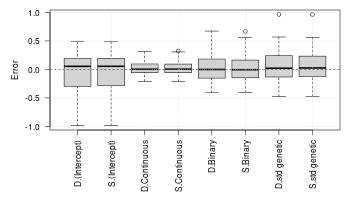
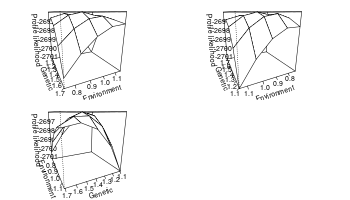
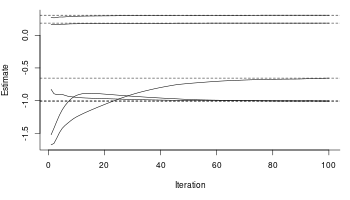

# pedmod: Pedigree Models

[](https://github.com/boennecd/pedmod/actions)

The pedmod package provides functions to estimate models for pedigree
data. Particularly, the package provides functions to estimate mixed
models of the form:

  
, 1) \\\\
\\vec\\epsilon_i = (\\epsilon_{i1}, \\dots, \\epsilon_{in_i})^\\top &\\sim
  N^{(n_i)}\\left(\\vec 0, \\sum_{l = 1}^K\\sigma_l^2 C_{il}
  \\right)
\\end{align*}")  

where
 is the binary outcome of interest for individual
 in
family/cluster
,
 is the individual’s known covariates,
 is the standard normal distribution’s CDF, and
 implies a binomial distribution such if ") then the density of
 is:

  
 = \\begin{pmatrix} n \\\\ z \\end{pmatrix}p^zp^{n-z}")  

A different and equivalent way of writing the model is as:

  
^\\top &\\sim
  N^{(n_i)}\\left(\\vec 0, I_{n_i} + \\sum_{l = 1}^K\\sigma_l^2 C_{il}
  \\right)
\\end{align*}")  

where
 is the

dimensional identity matrix which comes from the unshared/individual
specific random effect. This effect is always included.

The
s are known scale/correlation matrices where each of the
’th
types correspond to a type of effect. An arbitrary number of such
matrices can be passed to include e.g. a genetic effect, a maternal
effect, a paternal, an effect of a shared adult environment etc. A
typical example is that
 is two times the kinship matrix in which case we call:

  
  

the heritability (the proportion of the variance attributable to the
direct genetic effect). The scale parameters, the
s, may be the primary interest in an analysis. We fix the
unshared random effect’ variance to be one which gives the one in the
denominator. Other authors prefer that the denominator is restricted to
be one. Both restriction can be applied to ensure identification and
they do not have any implications as the scale is arbitrary.

This package provides randomized quasi-Monte Carlo methods to
approximate the log marginal likelihood for these types of models with
an arbitrary number scale matrices,
, and
the derivatives with respect to
^\\top")
(that is, we work with ). We have re-written the Fortran code by
Genz and Bretz (2002) in C++, made it easy to extend from a log marginal
likelihood approximation to other approximations such as the
derivatives, and added less precise but faster approximations of the
 and
. Our own experience suggests that using the latter has a
small effect on the precision of the result but can yield substantial
reduction in computation times for moderate sized families/clusters.

The approximation by Genz and Bretz (2002) have already been used to
estimate these types of models (Pawitan et al. 2004). However, not
having the gradients may slow down estimation substantially. Moreover,
our implementation supports computation in parallel which is a major
advantage given the availability of multi-core processors.

Since the implementation is easy to extend, possible extensions are:

1.  Survival times using mixed generalized survival models (Liu,
    Pawitan, and Clements 2017) with a similar random effect structure
    as the model shown above. This way, one avoids dichotomizing
    outcomes and can account for censoring.
2.  Generalized linear mixed model with binary, binomial, ordinal, or
    multinomial outcomes with a probit link. The method we use here may
    be beneficial if the number of random effects per cluster is not
    much smaller then the number observations in each cluster.

## Installation

The package can be installed from Github by calling:

``` r
remotes::install_github("boennecd/pedmod")
```

## Example

We start with a simple example only with a direct genetic effect. We
have one type of family which consists of two couples which are related
through by one of the parents being cousins.

``` r
# create the family we will use
fam <- data.frame(id = 1:10, sex = rep(1:2, 5L),
                  father = c(NA, NA, 1L, NA, 1L, NA, 3L, 3L, 5L, 5L), 
                  mother = c(NA, NA, 2L, NA, 2L, NA, 4L, 4L, 6L, 6L))

# plot the pedigree
library(kinship2)
ped <- with(fam, pedigree(id = id, dadid = father, momid = mother, sex = sex))
plot(ped)
```


We set the scale matrix to be two times the kinship matrix to model the
direct genetic effect. Each individual also have a standard normally
distributed covariate and a binary covariate. Thus, we can simulate a
data set with a function like:

``` r
# simulates a data set. 
# 
# Args:
#   n_fams: number of families.
#   beta: the fixed effect coefficients.
#   sig_sq: the scale parameter.
sim_dat <- function(n_fams, beta = c(-3, 1, 2), sig_sq = 3){
  # setup before the simulations
  Cmat <- 2 * kinship(ped)
  n_obs <- NROW(fam)
  Sig <- diag(n_obs) + sig_sq * Cmat
  Sig_chol <- chol(Sig)
  
  # simulate the data
  out <- replicate(
    n_fams, {
      # simulate covariates
      X <- cbind(`(Intercept)` = 1, Continuous = rnorm(n_obs), 
                 Binary = runif(n_obs) > .5)
      
      # assign the linear predictor + noise
      eta <- drop(X %*% beta) + drop(rnorm(n_obs) %*% Sig_chol)
      
      # return the list in the format needed for the package
      list(y = as.numeric(eta > 0), X = X, scale_mats = list(Cmat))
    }, simplify = FALSE)
  
  # add attributes with the true values and return 
  attributes(out) <- list(beta = beta, sig_sq = sig_sq)
  out
}
```

We can now estimate the model with a simulated data set as follows:

``` r
# simulate a data set
set.seed(27107390)
dat <- sim_dat(n_fams = 400L)

# get the starting values for the fixed effects. This is fast
y <- unlist(lapply(dat, `[[`, "y"))
X <- do.call(rbind, lapply(dat, `[[`, "X"))
start_fit <-  glm.fit(X, y, family = binomial("probit"))

# a bit far from the true values because of scaling but the signs are right
(beta <- start_fit$coefficients)
#> (Intercept)  Continuous      Binary 
#>     -1.4568      0.5050      0.9512
attributes(dat) # the true values
#> $beta
#> [1] -3  1  2
#> 
#> $sig_sq
#> [1] 3

# log likelihood of the model without random effects
-sum(start_fit$deviance) / 2 
#> [1] -1690

# select starting values for the scale parameter
sc <- log(1)

# ad-hock re-scale the fixed effects to match the scale parameter
# (we should use sum if there are more effects)
beta_scaled <- beta * sqrt(1 + sum(exp(sc)))

# perform the optimization
library(pedmod)
ll_terms <- get_pedigree_ll_terms(dat, max_threads = 4L)

# we start by using few samples
system.time(
  opt_out_quick <- pedmod_opt(
    ptr = ll_terms, par = c(beta_scaled, sc), maxvls = 5000L, abs_eps = 0, 
    rel_eps = 1e-2, minvls = 500L, use_aprx = TRUE, n_threads = 4L))
#>    user  system elapsed 
#>  38.838   0.019   9.774

# then we use more samples to increase the precision starting at the previous
# results
system.time(
  opt_out <- pedmod_opt(
    ptr = ll_terms, par = opt_out_quick$par, abs_eps = 0, use_aprx = TRUE, 
    n_threads = 4L, 
    # we changed the parameters
    maxvls = 25000L, rel_eps = 1e-3, minvls = 5000L))
#>    user  system elapsed 
#> 106.651   0.025  26.761
```

The results are shown below:

``` r
# parameter estimates versus the truth
rbind(opt_out       = head(opt_out      $par, -1), 
      opt_out_quick = head(opt_out_quick$par, -1), 
      truth         = attr(dat, "beta"))
#>               (Intercept) Continuous Binary
#> opt_out            -2.879     0.9713  1.883
#> opt_out_quick      -2.839     0.9584  1.857
#> truth              -3.000     1.0000  2.000
c(opt_out       = exp(tail(opt_out      $par, 1)), 
  opt_out_quick = exp(tail(opt_out_quick$par, 1)), 
  truth         = attr(dat, "sig_sq"))
#>       opt_out opt_out_quick         truth 
#>         2.928         2.820         3.000

# log marginal likelihoods
print(-opt_out_quick$value, digits = 8)
#> [1] -1618.4051
print(-opt_out      $value, digits = 8)
#> [1] -1618.4041
```

We can create can compute a profile likelihood curve like this:

``` r
rg <- range(exp(tail(opt_out$par, 1) / 2) * c(.75, 1.33),
            sqrt(attr(dat, "sig_sq")) * c(.9, 1.1))
sigs <- seq(rg[1], rg[2], length.out = 10)
sigs <- sort(c(sigs, exp(tail(opt_out$par, 1) / 2)))

ll_terms <- get_pedigree_ll_terms(dat, max_threads = 4L)
pl_curve_res <- lapply(sigs, function(sig){
  # set the parameters to pass
  sig_sq_log <- 2 * log(sig)
  beta_scaled <- beta * sqrt(1 + sig^2)
  
  # optimize like before but using the fix argument
  opt_out_quick <- pedmod_opt(
    ptr = ll_terms, par = c(beta_scaled, sig_sq_log), maxvls = 5000L, abs_eps = 0, 
    rel_eps = 1e-2, minvls = 500L, use_aprx = TRUE, n_threads = 4L, 
    fix = length(beta) + 1L)
  opt_out <- pedmod_opt(
    ptr = ll_terms, par = c(opt_out_quick$par, sig_sq_log), abs_eps = 0, 
    use_aprx = TRUE, n_threads = 4L, fix = length(beta) + 1L,
    # we changed the parameters
    maxvls = 25000L, rel_eps = 1e-3, minvls = 5000L)
  
  # report to console and return
  message(sprintf("\nLog-likelihood %.5f (%.5f). Estimated parameters:", 
                  -opt_out$value, -opt_out_quick$value))
  message(paste0(capture.output(print(
    c(opt_out$par, Scale = sig))), collapse = "\n"))
  
  list(opt_out_quick = opt_out_quick, opt_out = opt_out)
})
```

``` r
par(mar = c(5, 5, 1, 1))
pls <- -sapply(pl_curve_res, function(x) x$opt_out$value)
plot(sigs, pls, bty = "l",
     pch = 16, xlab = expression(sigma), ylab = "Profile likelihood")
grid()
lines(smooth.spline(sigs, pls))
abline(v = exp(tail(opt_out$par, 1) / 2), lty = 2) # the estimate
abline(v = sqrt(attr(dat, "sig_sq")), lty = 3)     # the true value
```


We make a small simulation study below where we are interested in the
estimation time and bias.

``` r
# the seeds we will use
seeds <- c(36451989L, 18774630L, 76585289L, 31898455L, 55733878L, 99681114L, 37725150L, 99188448L, 66989159L, 20673587L, 47985954L, 42571905L, 53089211L, 18457743L, 96049437L, 70222325L, 86393368L, 45380572L, 81116968L, 48291155L, 89755299L, 69891073L, 1846862L, 15263013L, 37537710L, 
           25194071L, 14471551L, 38278606L, 55596031L, 5436537L, 75008107L, 83382936L, 50689482L, 71708788L, 52258337L, 23423931L, 61069524L, 24452554L, 32406673L, 14900280L, 24818537L, 59733700L, 82407492L, 95500692L, 62528680L, 88728797L, 9891891L, 36354594L, 69630736L, 41755287L)

# run the simulation study
sim_study <- lapply(seeds, function(s){
  set.seed(s)
  
  # only run the result if it has not been computed
  f <- file.path("cache", "sim_study_simple", paste0("simple-", s, ".RDS"))
  if(!file.exists(f)){
    # simulate the data
    dat <- sim_dat(n_fams = 400L)
    
    # get the starting values
    y <- unlist(lapply(dat, `[[`, "y"))
    X <- do.call(rbind, lapply(dat, `[[`, "X"))
    start_fit <-  glm.fit(X, y, family = binomial("probit"))
    beta <- start_fit$coefficients
    
    sc <- log(1)
    beta_scaled <- beta * sqrt(1 + sum(exp(sc)))
    
    # get the log likelihood without random effects
    ll_no_rng <-  -sum(start_fit$deviance) / 2 
    
    # fit the model 
    library(pedmod)
    ll_terms <- get_pedigree_ll_terms(dat, max_threads = 4L)

    ti_quick <- system.time(
      opt_out_quick <- pedmod_opt(
        ptr = ll_terms, par = c(beta_scaled, sc), maxvls = 5000L, abs_eps = 0, 
        rel_eps = 1e-2, minvls = 500L, use_aprx = TRUE, n_threads = 4L))
    opt_out_quick$time <- ti_quick
    
    ti_slow <- system.time(
      opt_out <- pedmod_opt(
        ptr = ll_terms, par = opt_out_quick$par, abs_eps = 0, use_aprx = TRUE, 
        n_threads = 4L, 
        maxvls = 25000L, rel_eps = 1e-3, minvls = 5000L))
    opt_out$time <- ti_slow
    
    out <- list(opt_out_quick = opt_out_quick, opt_out = opt_out, 
                ll_no_rng = ll_no_rng)
    saveRDS(out, f)
  }
  
  # report to console and return 
  out <- readRDS(f)
  message(paste0(capture.output(out$opt_out$par), collapse = "\n"))
  
  out
})

# gather the estimates
beta_est <- sapply(sim_study, function(x) head(x$opt_out$par, 3))
sigma_est <- sapply(sim_study, function(x) exp(tail(x$opt_out$par, 1) / 2))

# compute the errors
tmp <- sim_dat(2L)
err <- rbind(beta_est, sigma = sigma_est) - 
  c(attr(tmp, "beta"), sqrt(attr(tmp, "sig_sq")))

# get the bias estimates and the standard errors
rbind(Bias = rowMeans(err), 
      SE   = apply(err, 1, sd) / sqrt(NCOL(err)))
#>      (Intercept) Continuous  Binary   sigma
#> Bias    -0.06284    0.02724 0.03541 0.05418
#> SE       0.05054    0.01708 0.03344 0.03886

# make a box plot
par(mar = c(5, 5, 1, 1))
boxplot(t(err), ylab = "Error")
abline(h = 0, lty = 2)
grid()
```



``` r
# get the average computation times
time_vals <- 
  sapply(sim_study, function(x) 
    x$opt_out$time["elapsed"] + x$opt_out_quick$time["elapsed"] )
summary(time_vals)
#>    Min. 1st Qu.  Median    Mean 3rd Qu.    Max. 
#>    7.96   14.87   24.22   23.10   27.67   71.05
```

### Adding Environmental Effects

As an extension, we can add an environmental effect. The new scale
matrix, the
’s, can be written as:

``` r
C_env <- matrix(0., NROW(fam), NROW(fam))
C_env[c(1:3, 5)   , c(1:3, 5)   ] <- 1
C_env[c(3:4, 7:8) , c(3:4, 7:8) ] <- 1
C_env[c(5:6, 9:10), c(5:6, 9:10)] <- 1

Matrix::Matrix(C_env, sparse = TRUE)
#> 10 x 10 sparse Matrix of class "dsCMatrix"
#>                          
#>  [1,] 1 1 1 . 1 . . . . .
#>  [2,] 1 1 1 . 1 . . . . .
#>  [3,] 1 1 1 1 1 . 1 1 . .
#>  [4,] . . 1 1 . . 1 1 . .
#>  [5,] 1 1 1 . 1 1 . . 1 1
#>  [6,] . . . . 1 1 . . 1 1
#>  [7,] . . 1 1 . . 1 1 . .
#>  [8,] . . 1 1 . . 1 1 . .
#>  [9,] . . . . 1 1 . . 1 1
#> [10,] . . . . 1 1 . . 1 1
```

We assign the new simulation function below but this time we include
only binary covariates:

``` r
# simulates a data set. 
# 
# Args:
#   n_fams: number of families.
#   beta: the fixed effect coefficients.
#   sig_sq: the scale parameters.
sim_dat <- function(n_fams, beta = c(-3, 4), sig_sq = c(2, 1)){
  # setup before the simulations
  Cmat <- 2 * kinship(ped)
  n_obs <- NROW(fam)
  Sig <- diag(n_obs) + sig_sq[1] * Cmat + sig_sq[2] * C_env
  Sig_chol <- chol(Sig)
  
  # simulate the data
  out <- replicate(
    n_fams, {
      # simulate covariates
      X <- cbind(`(Intercept)` = 1, Binary = runif(n_obs) > .9)
      
      # assign the linear predictor + noise
      eta <- drop(X %*% beta) + drop(rnorm(n_obs) %*% Sig_chol)
      
      # return the list in the format needed for the package
      list(y = as.numeric(eta > 0), X = X, scale_mats = list(
        Genetic = Cmat, Environment = C_env))
    }, simplify = FALSE)
  
  # add attributes with the true values and return 
  attributes(out) <- list(beta = beta, sig_sq = sig_sq)
  out
}
```

In this case, we exploit that some of log marginal likelihood terms are
identical. That is, some of the combinations of pedigrees, covariates,
and outcomes match. Therefor, we can use the `cluster_weights` arguments
to reduce the computation time:

``` r
# simulate a data set
set.seed(27107390)
dat <- sim_dat(n_fams = 1000L)

# compute the log marginal likelihood by not using that some of the log marginal 
# likelihood terms are identical
beta_true   <- attr(dat, "beta")
sig_sq_true <- attr(dat, "sig_sq")

library(pedmod)
ll_terms <- get_pedigree_ll_terms(dat, max_threads = 4L)
system.time(ll_res <- eval_pedigree_ll(
  ll_terms, c(beta_true, log(sig_sq_true)), maxvls = 100000L, abs_eps = 0, 
  rel_eps = 1e-3, minvls = 2500L, use_aprx = TRUE, n_threads = 4))
#>    user  system elapsed 
#>   2.233   0.001   0.612
system.time(grad_res <- eval_pedigree_grad(
  ll_terms, c(beta_true, log(sig_sq_true)), maxvls = 100000L, abs_eps = 0, 
  rel_eps = 1e-3, minvls = 2500L, use_aprx = TRUE, n_threads = 4))
#>    user  system elapsed 
#>   78.17    0.00   19.62

# find the duplicated combinations of pedigrees, covariates, and outcomes. One 
# likely needs to change this code if the pedigrees are not identical but are if 
# they are permuted. In this case, the code below will miss identical terms
dat_unqiue <- dat[!duplicated(dat)]
attributes(dat_unqiue) <- attributes(dat)
length(dat_unqiue) # number of unique terms
#> [1] 416

# get the weights. This can be written in a much more efficient way
c_weights <- sapply(dat_unqiue, function(x)
  sum(sapply(dat, identical, y = x)))

# get the C++ object and show that the computation time is reduced
ll_terms <- get_pedigree_ll_terms(dat_unqiue, max_threads = 4L)

system.time(ll_res_fast <- eval_pedigree_ll(
  ll_terms, c(beta_true, log(sig_sq_true)), maxvls = 100000L, abs_eps = 0, 
  rel_eps = 1e-3, minvls = 2500L, use_aprx = TRUE, n_threads = 4, 
  cluster_weights = c_weights))
#>    user  system elapsed 
#>   1.195   0.000   0.309
system.time(grad_res_fast <- eval_pedigree_grad(
  ll_terms, c(beta_true, log(sig_sq_true)), maxvls = 100000L, abs_eps = 0, 
  rel_eps = 1e-3, minvls = 2500L, use_aprx = TRUE, n_threads = 4, 
  cluster_weights = c_weights))
#>    user  system elapsed 
#>   32.51    0.00    8.15

# show that we get the same (up to a Monte Carlo error)
print(c(redundant = ll_res, fast = ll_res_fast), digits = 6)
#> redundant      fast 
#>  -2632.06  -2632.14
rbind(redundant = grad_res, fast = grad_res_fast)
#>             [,1]   [,2]  [,3]  [,4]
#> redundant -1.854 -5.201 3.434 1.079
#> fast      -1.852 -5.198 3.384 1.069
rm(dat) # will not need this anymore

# get the starting values for the fixed effects. Here we need to pass a weights
# argument
y <- unlist(lapply(dat_unqiue, `[[`, "y"))
X <- do.call(rbind, lapply(dat_unqiue, `[[`, "X"))
w <- unlist(Map(
  rep, c_weights, times = sapply(dat_unqiue, function(x) length(x$y))))
start_fit <-  glm.fit(X, y, weights = w, family = binomial("probit"))

# a bit far from the true values because of scaling but the signs are right
(beta <- start_fit$coefficients)
#> (Intercept)      Binary 
#>      -1.498       1.979

# log likelihood of the model without random effects
-sum(start_fit$deviance) / 2 
#> [1] -2836

# select starting values for the scale parameter
sc <- log(c(1 ,1))

# ad-hock re-scale the fixed effects to match the scale parameter
beta_scaled <- beta * sqrt(1 + sum(exp(sc)))

# we start by using few samples
system.time(
  opt_out_quick <- pedmod_opt(
    ptr = ll_terms, par = c(beta_scaled, sc), maxvls = 5000L, abs_eps = 0, 
    rel_eps = 1e-2, minvls = 500L, use_aprx = TRUE, n_threads = 4L, 
    cluster_weights = c_weights))
#>    user  system elapsed 
#>  28.033   0.000   7.015

# then we use more samples to increase the precision starting at the previous
# results
system.time(
  opt_out <- pedmod_opt(
    ptr = ll_terms, par = opt_out_quick$par, abs_eps = 0, use_aprx = TRUE, 
    n_threads = 4L,  cluster_weights = c_weights,
    # we changed the parameters
    maxvls = 25000L, rel_eps = 1e-3, minvls = 5000L))
#>    user  system elapsed 
#>  50.912   0.003  13.108
```

The results are shown below:

``` r
# parameter estimates versus the truth
rbind(opt_out       = head(opt_out      $par, -2), 
      opt_out_quick = head(opt_out_quick$par, -2), 
      truth         = attr(dat_unqiue, "beta"))
#>               (Intercept) Binary
#> opt_out            -2.930  3.874
#> opt_out_quick      -2.929  3.873
#> truth              -3.000  4.000
rbind(opt_out       = exp(tail(opt_out      $par, 2)), 
      opt_out_quick = exp(tail(opt_out_quick$par, 2)), 
      truth         = attr(dat_unqiue, "sig_sq"))
#>                           
#> opt_out       1.852 0.9709
#> opt_out_quick 1.862 0.9586
#> truth         2.000 1.0000

# log marginal likelihoods
print(-opt_out_quick$value, digits = 8)
#> [1] -2632.0278
print(-opt_out      $value, digits = 8)
#> [1] -2631.9483
```

We can make a 2D profile likelihood curve as follows:

``` r
# get the values at which we evaluate the profile likelihood
rg <- Map(function(est, truth)
  range(exp(est / 2) * c(.8, 1.25), truth), 
  est = tail(opt_out$par, 2), truth = sqrt(attr(dat_unqiue, "sig_sq")))

sig_vals1 <- seq(rg[[1]][1], rg[[1]][2], length.out = 5)
sig_vals2 <- seq(rg[[2]][1], rg[[2]][2], length.out = 5)
sigs <- expand.grid(sigma1 = sig_vals1,
                    sigma2 = sig_vals2)

# compute the profile likelihood
ll_terms <- get_pedigree_ll_terms(dat_unqiue, max_threads = 4L)
pl_curve_res <- Map(function(sig1, sig2){
  # set the parameters to pass
  sig <- c(sig1, sig2)
  sig_sq_log <- 2 * log(sig)
  beta_scaled <- beta * sqrt(1 + sum(sig^2))
  
  # optimize like before but using the fix argument
  opt_out_quick <- pedmod_opt(
    ptr = ll_terms, par = c(beta_scaled, sig_sq_log), maxvls = 5000L, abs_eps = 0, 
    rel_eps = 1e-2, minvls = 500L, use_aprx = TRUE, n_threads = 4L, 
    fix = length(beta) + 1:2, cluster_weights = c_weights)
  
  opt_out <- pedmod_opt(
    ptr = ll_terms, par = c(opt_out_quick$par, sig_sq_log), abs_eps = 0, 
    use_aprx = TRUE, n_threads = 4L, fix = length(beta) + 1:2,
    cluster_weights = c_weights,
    # we changed the parameters
    maxvls = 25000L, rel_eps = 1e-3, minvls = 5000L)
  
  # report to console and return
  message(sprintf("\nLog-likelihood %.5f (%.5f). Estimated parameters:", 
                  -opt_out$value, -opt_out_quick$value))
  message(paste0(capture.output(print(
    c(opt_out$par, Scale = sig))), collapse = "\n"))
  
  list(opt_out_quick = opt_out_quick, opt_out = opt_out)
}, sig1 = sigs$sigma1, sig2 = sigs$sigma2)
```

``` r
par(mfcol = c(2, 2), mar = c(1, 1, 1, 1))
pls <- -sapply(pl_curve_res, function(x) x$opt_out$value)
for(i in 1:3 - 1L)
  persp(sig_vals1, sig_vals2, matrix(pls, length(sig_vals1)), 
        xlab = "\nGenetic", ylab = "\nEnvironment", 
        zlab = "\n\nProfile likelihood", theta = 65 + i * 90, 
        ticktype = "detailed")
```



We make a small simulation study below where we are interested in the
estimation time and bias.

``` r
# the seeds we will use
seeds <- c(36451989L, 18774630L, 76585289L, 31898455L, 55733878L, 99681114L, 37725150L, 99188448L, 66989159L, 20673587L, 47985954L, 42571905L, 53089211L, 18457743L, 96049437L, 70222325L, 86393368L, 45380572L, 81116968L, 48291155L, 89755299L, 69891073L, 1846862L, 15263013L, 37537710L, 
           25194071L, 14471551L, 38278606L, 55596031L, 5436537L, 75008107L, 83382936L, 50689482L, 71708788L, 52258337L, 23423931L, 61069524L, 24452554L, 32406673L, 14900280L, 24818537L, 59733700L, 82407492L, 95500692L, 62528680L, 88728797L, 9891891L, 36354594L, 69630736L, 41755287L)

# run the simulation study
sim_study <- lapply(seeds, function(s){
  set.seed(s)
  
  # only run the result if it has not been computed
  f <- file.path("cache", "sim_study_simple_w_env", 
                 paste0("simple-", s, ".RDS"))
  if(!file.exists(f)){
    # simulate the data
    dat <- sim_dat(n_fams = 1000L)
    
    # get the weighted data set
    dat_unqiue <- dat[!duplicated(dat)]
    attributes(dat_unqiue) <- attributes(dat)
    c_weights <- sapply(dat_unqiue, function(x)
      sum(sapply(dat, identical, y = x)))
    rm(dat)
    
    # get the starting values
    y <- unlist(lapply(dat_unqiue, `[[`, "y"))
    X <- do.call(rbind, lapply(dat_unqiue, `[[`, "X"))
    w <- unlist(Map(
      rep, c_weights, times = sapply(dat_unqiue, function(x) length(x$y))))
    start_fit <-  glm.fit(X, y, weights = w, family = binomial("probit"))
    beta <- start_fit$coefficients
    
    sc <- log(c(1, 1))
    beta_scaled <- beta * sqrt(1 + sum(exp(sc)))
    
    # get the log likelihood without random effects
    ll_no_rng <-  -sum(start_fit$deviance) / 2 
    
    # fit the model 
    library(pedmod)
    ll_terms <- get_pedigree_ll_terms(dat_unqiue, max_threads = 4L)

    ti_quick <- system.time(
      opt_out_quick <- pedmod_opt(
        ptr = ll_terms, par = c(beta_scaled, sc), maxvls = 5000L, abs_eps = 0, 
        rel_eps = 1e-2, minvls = 500L, use_aprx = TRUE, n_threads = 4L, 
        cluster_weights = c_weights))
    opt_out_quick$time <- ti_quick
    
    ti_slow <- system.time(
      opt_out <- pedmod_opt(
        ptr = ll_terms, par = opt_out_quick$par, abs_eps = 0, use_aprx = TRUE, 
        n_threads = 4L, cluster_weights = c_weights,
        maxvls = 25000L, rel_eps = 1e-3, minvls = 5000L))
    opt_out$time <- ti_slow
    
    out <- list(opt_out_quick = opt_out_quick, opt_out = opt_out, 
                ll_no_rng = ll_no_rng)
    saveRDS(out, f)
  }
  
  # report to console and return 
  out <- readRDS(f)
  message(paste0(capture.output(out$opt_out$par), collapse = "\n"))
  
  out
})

# gather the estimates
tmp <- sim_dat(2L)
beta_est <- sapply(sim_study, function(x) head(x$opt_out$par, 2))
sigma_est <- sapply(sim_study, function(x) exp(tail(x$opt_out$par, 2) / 2))
rownames(sigma_est) <- names(tmp[[1L]]$scale_mats)

# compute the errors
err <- rbind(beta_est, sigma_est) - 
  c(attr(tmp, "beta"), sqrt(attr(tmp, "sig_sq")))

# get the bias estimates and the standard errors
rbind(Bias = rowMeans(err), 
      SE   = apply(err, 1, sd) / sqrt(NCOL(err)))
#>      (Intercept)  Binary  Genetic Environment
#> Bias    -0.01882 0.02599 0.009956    -0.01159
#> SE       0.04766 0.06506 0.038090     0.01318

# make a box plot
par(mar = c(5, 5, 1, 1))
boxplot(t(err), ylab = "Error")
abline(h = 0, lty = 2)
grid()
```


``` r
# get the average computation times
time_vals <- 
  sapply(sim_study, function(x) 
    x$opt_out$time["elapsed"] + x$opt_out_quick$time["elapsed"] )
summary(time_vals)
#>    Min. 1st Qu.  Median    Mean 3rd Qu.    Max. 
#>    11.0    30.5    35.7    34.8    39.2    68.6
```

### More Complicated Example

We source a file to get a function to simulate a data set with a
maternal effect and a genetic effect like in Mahjani et al. (2020):

``` r
# source the file to get the simulation function
source(system.file("gen-pedigree-data.R", package = "pedmod"))

# simulate a data set
set.seed(68167102)
dat <- sim_pedigree_data(n_families = 1000L)

# distribution of family sizes
par(mar = c(5, 4, 1, 1))
plot(table(sapply(dat$sim_data, function(x) length(x$y))), 
     xlab = "Family size", ylab = "Number of families", bty = "l")
```


``` r
# total number of observations
sum(sapply(dat$sim_data, function(x) length(x$y)))
#> [1] 49734

# average event rate
mean(unlist(sapply(dat$sim_data, `[[`, "y")))
#> [1] 0.2386
```

As Mahjani et al. (2020), we have data families linked by three
generations but we only have data for the last generation. We illustrate
this with the first family in the simulated data set:

``` r
# this is the full family 
library(kinship2)
fam1 <- dat$sim_data[[1L]]
plot(fam1$pedAll)
```


``` r
# here is the C matrix for the genetic effect
rev_img <- function(x, ...)
  image(x[, NROW(x):1], ...)
cl <- colorRampPalette(c("Red", "White", "Blue"))(101)

par(mar = c(2, 2, 1, 1))
rev_img(fam1$rel_mat, xaxt = "n", yaxt = "n", col = cl, 
        zlim = c(-1, 1))
```


``` r
# the first part of the matrix is given below
with(fam1, rel_mat[seq_len(min(10, NROW(rel_mat))), 
                   seq_len(min(10, NROW(rel_mat)))])
#>        9    10    15    16    17    21    22    28    29    36
#> 9  1.000 0.500 0.125 0.125 0.125 0.000 0.000 0.125 0.125 0.000
#> 10 0.500 1.000 0.125 0.125 0.125 0.000 0.000 0.125 0.125 0.000
#> 15 0.125 0.125 1.000 0.500 0.500 0.125 0.125 0.000 0.000 0.000
#> 16 0.125 0.125 0.500 1.000 0.500 0.125 0.125 0.000 0.000 0.000
#> 17 0.125 0.125 0.500 0.500 1.000 0.125 0.125 0.000 0.000 0.000
#> 21 0.000 0.000 0.125 0.125 0.125 1.000 0.500 0.000 0.000 0.000
#> 22 0.000 0.000 0.125 0.125 0.125 0.500 1.000 0.000 0.000 0.000
#> 28 0.125 0.125 0.000 0.000 0.000 0.000 0.000 1.000 0.500 0.125
#> 29 0.125 0.125 0.000 0.000 0.000 0.000 0.000 0.500 1.000 0.125
#> 36 0.000 0.000 0.000 0.000 0.000 0.000 0.000 0.125 0.125 1.000

# here is the C matrix for the maternal effect
rev_img(fam1$met_mat, xaxt = "n", yaxt = "n", col = cl, 
        zlim = c(-1, 1))
```


``` r
# each simulated family has such two matrices in addition to a design matrix
# for the fixed effects, X, and a vector with outcomes, y
str(fam1[c("X", "y")])
#> List of 2
#>  $ X: num [1:52, 1:3] 1 1 1 1 1 1 1 1 1 1 ...
#>   ..- attr(*, "dimnames")=List of 2
#>   .. ..$ : NULL
#>   .. ..$ : chr [1:3] "(Intercept)" "X1" ""
#>  $ y: Named logi [1:52] FALSE TRUE TRUE TRUE FALSE FALSE ...
#>   ..- attr(*, "names")= chr [1:52] "9" "10" "15" "16" ...
```

Then we perform the model estimation:

<!-- knitr::opts_knit$set(output.dir = ".") -->

<!-- knitr::load_cache("est_mod", path = "cache/README-") -->

``` r
# the true parameters are
dat$beta
#> (Intercept)          X1          X2 
#>        -1.0         0.3         0.2
dat$sc # the sigmas squared
#>  Genetic Maternal 
#>     0.50     0.33

# prepare the data to pass to the functions in the package
dat_arg <- lapply(dat$sim_data, function(x){
  # we need the following for each family: 
  #   y: the zero-one outcomes.
  #   X: the design matrix for the fixed effects. 
  #   scale_mats: list with the scale matrices for each type of effect.
  list(y = as.numeric(x$y), X = x$X,
       scale_mats = list(x$rel_mat, x$met_mat))
})

# create a C++ object
library(pedmod)
ll_terms <- get_pedigree_ll_terms(dat_arg, max_threads = 4L)

# get the starting values. This is very fast
y <- unlist(lapply(dat_arg, `[[`, "y"))
X <- do.call(rbind, lapply(dat_arg, `[[`, "X"))
start_fit <-  glm.fit(X, y, family = binomial("probit"))

# log-likelihood at the starting values without random effects
-sum(start_fit$deviance) / 2     
#> [1] -26480
(beta <- start_fit$coefficients) # starting values for fixed effects 
#> (Intercept)          X1             
#>     -0.7342      0.2234      0.1349

# start at moderate sized scale parameters
sc <- rep(log(.2), 2)

# check log likelihood at the starting values. First we assign a function 
# to approximate the log likelihood and the gradient
fn <- function(par, seed = 1L, rel_eps = 1e-2, use_aprx = TRUE, 
               n_threads = 4L, indices = NULL, maxvls = 25000L){
  set.seed(seed)
  -eval_pedigree_ll(
    ll_terms, par = par, maxvls = maxvls, abs_eps = 0, rel_eps = rel_eps, 
    minvls = 1000L, use_aprx = use_aprx, n_threads = n_threads, 
    indices = indices)
}
gr <- function(par, seed = 1L, rel_eps = 1e-2, use_aprx = TRUE, 
               n_threads = 4L, indices = NULL, maxvls = 25000L){
  set.seed(seed)
  out <- -eval_pedigree_grad(
    ll_terms, par = par, maxvls = maxvls, abs_eps = 0, rel_eps = rel_eps, 
    minvls = 1000L, use_aprx = use_aprx, n_threads = n_threads, 
    indices = indices)
  structure(c(out), value = -attr(out, "logLik"), 
            n_fails = attr(out, "n_fails"))
}

# check output at the starting values
system.time(ll <- -fn(c(beta, sc)))
#>    user  system elapsed 
#>   7.923   0.000   2.038
ll # the log likelihood at the starting values
#> [1] -26042
#> attr(,"n_fails")
#> [1] 0
system.time(gr_val <- gr(c(beta, sc)))
#>    user  system elapsed 
#>   131.0     0.0    33.2
gr_val # the gradient at the starting values
#> [1] 1894.52 -549.92 -235.39   47.16  -47.96
#> attr(,"value")
#> [1] 26042
#> attr(,"n_fails")
#> [1] 721

# standard deviation of the approximation
sd(sapply(1:25, function(seed) fn(c(beta, sc), seed = seed)))
#> [1] 0.09254

# we do the same for the gradient elements but only for a subset of the 
# log marginal likelihood elements
gr_hats <- sapply(1:25, function(seed) gr(c(beta, sc), seed = seed, 
                                          indices = 0:99))
apply(gr_hats, 1, sd)
#> [1] 0.06021 0.09439 0.06420 0.02612 0.02770

# verify the gradient (may not be exactly equal due to MC error)
rbind(numDeriv = numDeriv::grad(fn, c(beta, sc), indices = 0:10), 
      pedmod   = gr(c(beta, sc), indices = 0:10))
#>           [,1]    [,2]  [,3]  [,4]   [,5]
#> numDeriv 28.00 -0.2980 7.415 1.105 -1.071
#> pedmod   27.98 -0.3099 7.395 1.105 -1.076

# optimize the log likelihood approximation
system.time(opt <- optim(c(beta, sc), fn, gr, method = "BFGS"))
#>     user   system  elapsed 
#> 4157.410    0.048 1056.047
```

The output from the optimization is shown below:

``` r
print(-opt$value, digits = 8) # the maximum log likelihood
#> [1] -25823.042
opt$convergence               # check convergence
#> [1] 0

# compare the estimated fixed effects with the true values
rbind(truth     = dat$beta, 
      estimated = head(opt$par, length(dat$beta)))
#>           (Intercept)     X1     X2
#> truth          -1.000 0.3000 0.2000
#> estimated      -1.007 0.3075 0.1844

# compare estimated scale parameters with the true values
rbind(truth     = dat$sc, 
      estimated = exp(tail(opt$par, length(dat$sc))))
#>           Genetic Maternal
#> truth      0.5000    0.330
#> estimated  0.5112    0.368
```

### Computation in Parallel

The method scales reasonably well in the number of threads as shown
below:

``` r
library(microbenchmark)
microbenchmark(
  `fn (1 thread)`  = fn(c(beta, sc), n_threads = 1),
  `fn (2 threads)` = fn(c(beta, sc), n_threads = 2),
  `fn (4 threads)` = fn(c(beta, sc), n_threads = 4),
  `gr (1 thread)`  = gr(c(beta, sc), n_threads = 1),
  `gr (2 threads)` = gr(c(beta, sc), n_threads = 2),
  `gr (4 threads)` = gr(c(beta, sc), n_threads = 4),
  times = 1)
#> Unit: seconds
#>            expr     min      lq    mean  median      uq     max neval
#>   fn (1 thread)   7.496   7.496   7.496   7.496   7.496   7.496     1
#>  fn (2 threads)   3.928   3.928   3.928   3.928   3.928   3.928     1
#>  fn (4 threads)   2.099   2.099   2.099   2.099   2.099   2.099     1
#>   gr (1 thread) 113.448 113.448 113.448 113.448 113.448 113.448     1
#>  gr (2 threads)  61.071  61.071  61.071  61.071  61.071  61.071     1
#>  gr (4 threads)  31.761  31.761  31.761  31.761  31.761  31.761     1
```

### Using ADAM

We use stochastic gradient descent with the ADAM method (Kingma and Ba
2015) in this section. We define a function below to apply ADAM and use
it to estimate the model.

<!-- knitr::opts_knit$set(output.dir = ".") -->

<!-- knitr::load_cache("use_adam", path = "cache/README-") -->

``` r
#####
# performs stochastic gradient descent (using ADAM).
#
# Args:
#   par: starting value.
#   gr: function to evaluate the log marginal likelihood.
#   n_clust: number of observation.
#   n_blocks: number of blocks.
#   maxit: maximum number of iteration.
#   seed: seed to use.
#   epsilon, alpha, beta_1, beta_2: ADAM parameters.
#   maxvls: maximum number of samples to draw in each iteration. Thus, it 
#           needs maxit elements.
#   verbose: print output during the estimation.
#   ...: arguments passed to gr.
adam <- function(par, gr, n_clust, n_blocks, maxit = 10L,
                 seed = 1L, epsilon = 1e-8, alpha = .001, beta_1 = .9,
                 beta_2 = .999, maxvls = rep(10000L, maxit), 
                 verbose = FALSE, ...){
  grp_dummy <- (seq_len(n_clust) - 1L) %% n_blocks
  n_par <- length(par)
  m <- v <- numeric(n_par)
  fun_vals <- numeric(maxit)
  estimates <- matrix(NA_real_, n_par, maxit)
  i <- -1L

  for(k in 1:maxit){
    # sample groups
    indices <- sample.int(n_clust, replace = FALSE) - 1L
    blocks <- tapply(indices, grp_dummy, identity, simplify = FALSE)
    
    for(ii in 1:n_blocks){
      i <- i + 1L
      idx_b <- (i %% n_blocks) + 1L
      m_old <- m
      v_old <- v
      res <- gr(par, indices = blocks[[idx_b]], maxvls = maxvls[k])
      fun_vals[(i %/% n_blocks) + 1L] <-
        fun_vals[(i %/% n_blocks) + 1L] + attr(res, "value")
      res <- c(res)

      m <- beta_1 * m_old + (1 - beta_1) * res
      v <- beta_2 * v_old + (1 - beta_2) * res^2

      m_hat <- m / (1 - beta_1^(i + 1))
      v_hat <- v / (1 - beta_2^(i + 1))

      par <- par - alpha * m_hat / (sqrt(v_hat) + epsilon)
    }
    
    if(verbose){
      cat(sprintf("Ended iteration %4d. Running estimate of the function value is: %14.2f\n", 
                  k, fun_vals[k]))
      cat("Parameter estimates are:\n")
      cat(capture.output(print(par)), sep = "\n")
      cat("\n")
    }

    estimates[, k] <- par
  }

  list(par = par, estimates = estimates, fun_vals = fun_vals)
}

#####
# use the function
# assign the maximum number of samples we will use
maxit <- 100L
minvls <- 250L
maxpts <- formals(gr)$maxvls
maxpts_use <- exp(seq(log(2 * minvls), log(maxpts), length.out = maxit))

# show the maximum number of samples we use
par(mar = c(5, 4, 1, 1))
plot(maxpts_use, pch = 16, xlab = "Iteration number", bty = "l",
     ylab = "Maximum number of samples", ylim = range(0, maxpts_use))
```


``` r
set.seed(1)
system.time(
  adam_res <- adam(c(beta, sc), gr = gr, n_clust = length(dat_arg), 
                   n_blocks = 10L, alpha = 1e-2, maxit = maxit, 
                   verbose = FALSE, maxvls = maxpts_use, 
                   minvls = minvls))
#>     user   system  elapsed 
#> 4329.841    0.048 1109.790
```

The result is shown below.

``` r
print(-fn(adam_res$par), digits = 8) # the maximum log likelihood
#> [1] -25823.001
#> attr(,"n_fails")
#> [1] 0

# compare the estimated fixed effects with the true values
rbind(truth             = dat$beta,
      `estimated optim` = head(opt$par     , length(dat$beta)),
      `estimated ADAM`  = head(adam_res$par, length(dat$beta)))
#>                 (Intercept)     X1     X2
#> truth                -1.000 0.3000 0.2000
#> estimated optim      -1.007 0.3075 0.1844
#> estimated ADAM       -1.007 0.3072 0.1860

# compare estimated scale parameters with the true values
rbind(truth             = dat$sc, 
      `estimated optim` = exp(tail(opt$par     , length(dat$sc))), 
      `estimated ADAM`  = exp(tail(adam_res$par, length(dat$sc))))
#>                 Genetic Maternal
#> truth            0.5000   0.3300
#> estimated optim  0.5112   0.3680
#> estimated ADAM   0.5242   0.3635

# could possibly have stopped much earlier maybe. Dashed lines are final 
# estimates
par(mar = c(5, 4, 1, 1))
matplot(t(adam_res$estimates), type = "l", col = "Black", lty = 1, 
        bty = "l", xlab = "Iteration", ylab = "Estimate")
for(s in adam_res$par)
  abline(h = s, lty = 2)
```



### The Multivariate Normal CDF Approximation

We compare the multivariate normal CDF approximation in this section
with the approximation from the mvtnorm package which uses the
implementation by Genz and Bretz (2002). The same algorithm is used but
the version in this package is re-written in C++ and differs slightly.
Moreover, we have implemented an approximation of the standard normal
CDF and its inverse which reduces the computation time as we will show
below.

``` r
#####
# settings for the simulation study
library(mvtnorm)
library(pedmod)
library(microbenchmark)
set.seed(78459126)
n <- 5L         # number of variables to interate out
rel_eps <- 1e-4 # the relative error to use

#####
# run the simulation study
sim_res <- replicate(expr = {
  # simulate covariance matrix and the upper bound
  S <- drop(rWishart(1L, 2 * n, diag(n) / 2 / n))
  u <- rnorm(n)
  
  # function to use pmvnorm
  use_mvtnorm <- function(rel_eps)
    pmvnorm(upper = u, sigma = S, algorithm = GenzBretz(
      abseps = 0, releps = rel_eps, maxpts = 1e7))
  
  # function to use this package
  use_mvndst <- function(use_aprx = FALSE)
    mvndst(lower = rep(-Inf, n), upper = u, mu = rep(0, n), 
           sigma = S, use_aprx = use_aprx, abs_eps = 0, rel_eps = rel_eps,
           maxvls = 1e7)

  # get a very precise estimate
  truth <- use_mvtnorm(rel_eps / 100)
  
  # computes the error with repeated approximations and compute the time it
  # takes
  n_rep <- 5L
  run_n_time <- function(expr){
    expr <- substitute(expr)
    ti <- get_nanotime()
    res <- replicate(n_rep, eval(expr))
    ti <- get_nanotime() - ti
    err <- (res - truth) / truth
    c(SE = sqrt(sum(err^2) / n_rep), time = ti / n_rep / 1e9)
  }
  
  mvtnorm_res        <- run_n_time(use_mvtnorm(rel_eps))
  mvndst_no_aprx_res <- run_n_time(use_mvndst(FALSE))
  mvndst_w_aprx_res  <- run_n_time(use_mvndst(TRUE))
  
  # return 
  rbind(mvtnorm            = mvtnorm_res, 
        `mvndst (no aprx)` = mvndst_no_aprx_res, 
        `mvndst (w/ aprx)` = mvndst_w_aprx_res)
}, n = 100, simplify = "array")
```

They have about the same average relative error as expected:

``` r
rowMeans(sim_res[, "SE", ])
#>          mvtnorm mvndst (no aprx) mvndst (w/ aprx) 
#>        2.830e-05        3.163e-05        3.196e-05
par(mar = c(5, 4, 1, 1))
boxplot(t(sim_res[, "SE", ]))
```


The new implementation is faster when the approximation is used:

``` r
rowMeans(sim_res[, "time", ])
#>          mvtnorm mvndst (no aprx) mvndst (w/ aprx) 
#>          0.01701          0.01636          0.01105
par(mar = c(5, 4, 1, 1))
boxplot(t(sim_res[, "time", ]))
```


## References

<div id="refs" class="references">

<div id="ref-Genz02">

Genz, Alan, and Frank Bretz. 2002. “Comparison of Methods for the
Computation of Multivariate T Probabilities.” *Journal of Computational
and Graphical Statistics* 11 (4): 950–71.
<https://doi.org/10.1198/106186002394>.

</div>

<div id="ref-Kingma15">

Kingma, Diederik P., and Jimmy Ba. 2015. “Adam: A Method for Stochastic
Optimization.” *CoRR* abs/1412.6980.

</div>

<div id="ref-Liu17">

Liu, Xing-Rong, Yudi Pawitan, and Mark S. Clements. 2017. “Generalized
Survival Models for Correlated Time-to-Event Data.” *Statistics in
Medicine* 36 (29): 4743–62.
<https://doi.org/https://doi.org/10.1002/sim.7451>.

</div>

<div id="ref-Mahjani20">

Mahjani, Behrang, Lambertus Klei, Christina M. Hultman, Henrik Larsson,
Bernie Devlin, Joseph D. Buxbaum, Sven Sandin, and Dorothy E. Grice.
2020. “Maternal Effects as Causes of Risk for Obsessive-Compulsive
Disorder.” *Biological Psychiatry* 87 (12): 1045–51.
<https://doi.org/https://doi.org/10.1016/j.biopsych.2020.01.006>.

</div>

<div id="ref-Pawitan04">

Pawitan, Y., M. Reilly, E. Nilsson, S. Cnattingius, and P. Lichtenstein.
2004. “Estimation of Genetic and Environmental Factors for Binary Traits
Using Family Data.” *Statistics in Medicine* 23 (3): 449–65.
<https://doi.org/https://doi.org/10.1002/sim.1603>.

</div>

</div>
