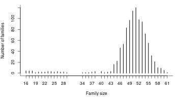
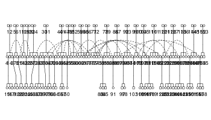

# pedmod: Pedigree Models

The pedmod package provides functions to estimate models for pedigree
data. Particularly, the package provides functions to estimate mixed
models of the form:

  
, 1) \\\\
\\vec\\epsilon_i &= (\\epsilon_{i1}, \\dots, \\epsilon_{in_i})^\\top \\sim
  N^{(n_i)}\\left(\\vec 0, \\sum_{l = 1}^K\\sigma_l^2 C_{il}
  \\right)
\\end{align*}")  

where  is the binary outcome of interest for individual
 in family/cluster
,  is the individual’s known covariates,
 is the
standard normal distribution’s CDF, and
 implies a binomial distribution such if ") then the density of
 is:

  
 = \\begin{pmatrix} n \\\\ z \\end{pmatrix}p^zp^{n-z}
")  

The s are known scale/correlation matrices where each of the
’th types correspond to
a type of effect. A typical example is that
 is
two times the kinship matrix in which case we call:

  
  

the heritability. The scale parameters, the
s, may be the primary interest in an analysis.

This package provides randomized quasi Monte Carlo methods to
approximate the marginal log likelihood for these types of models with
an arbitrary number scale matrices,
, and the derivatives
with respect to
^\\top").
We have re-written the Fortran code by Genz and Bretz (2002) in C++,
made it easy to extend from a marginal log likelihood approximation to
other approximations such as the derivatives, and added less precise but
faster approximations of the
 and
. Our own experience suggests that using the latter has a
small effect on the precision of the result but can yield substantial
reduction in computation times for moderate sized families/clusters.

The approximation by Genz and Bretz (2002) have already been used to
estimate these types of models (Pawitan et al. 2004). However, not
having the gradients may slow down estimation substantially. Moreover,
our implementation supports computation in parallel which is a major
advantage given the availability of multi-core processors.

Since the implementation is easy to extend, possible extensions are:

1.  Survival times using mixed generalized survival models (Liu,
    Pawitan, and Clements 2017) with a similar random effect structure
    as the model shown above. This way, one avoids dichotomizing
    outcomes and can account for censoring.
2.  Generalized linear mixed model with binary, binomial, ordinal, or
    multinomial outcomes with a probit link. The method we use here may
    be beneficial if the number of random effects per cluster is not
    much smaller then the number observations in each cluster.

## Example

First, we source a file to get a function to simulate a data set with a
maternal effect and a genetic effect like in Mahjani et al. (2020):

``` r
# souce the file to get the simulation function
source(system.file("gen-pedigree-data.R", package = "pedmod"))

# simulate a data set
set.seed(68167102)
dat <- sim_pedigree_data(n_families = 1000L)
#> Loading required package: Matrix
#> Loading required package: quadprog

# distribution of family sizes
par(mar = c(5, 4, 1, 1))
plot(table(sapply(dat$sim_data, function(x) length(x$y))), 
     xlab = "Family size", ylab = "Number of families", bty = "l")
```



``` r
# total number of observations
sum(sapply(dat$sim_data, function(x) length(x$y)))
#> [1] 49734

# average event rate
mean(unlist(sapply(dat$sim_data, `[[`, "y")))
#> [1] 0.2386
```

As Mahjani et al. (2020), we have data families linked by three
generations but we only have data for the last generation. We illustrate
this with the first family in the simulated data set:

``` r
# this is the full family 
library(kinship2)
fam1 <- dat$sim_data[[1L]]
plot(fam1$pedAll)
```



``` r
# here is the C matrix for the genetic effect
rev_img <- function(x, ...)
  image(x[, NROW(x):1], ...)
cl <- colorRampPalette(c("Red", "White", "Blue"))(101)

par(mar = c(2, 2, 1, 1))
rev_img(fam1$rel_mat, xaxt = "n", yaxt = "n", col = cl, 
        zlim = c(-1, 1))
```


``` r
# the first part of the matrix is given below
with(fam1, rel_mat[seq_len(min(10, NROW(rel_mat))), 
                   seq_len(min(10, NROW(rel_mat)))])
#>        9    10    15    16    17    21    22    28    29    36
#> 9  1.000 0.500 0.125 0.125 0.125 0.000 0.000 0.125 0.125 0.000
#> 10 0.500 1.000 0.125 0.125 0.125 0.000 0.000 0.125 0.125 0.000
#> 15 0.125 0.125 1.000 0.500 0.500 0.125 0.125 0.000 0.000 0.000
#> 16 0.125 0.125 0.500 1.000 0.500 0.125 0.125 0.000 0.000 0.000
#> 17 0.125 0.125 0.500 0.500 1.000 0.125 0.125 0.000 0.000 0.000
#> 21 0.000 0.000 0.125 0.125 0.125 1.000 0.500 0.000 0.000 0.000
#> 22 0.000 0.000 0.125 0.125 0.125 0.500 1.000 0.000 0.000 0.000
#> 28 0.125 0.125 0.000 0.000 0.000 0.000 0.000 1.000 0.500 0.125
#> 29 0.125 0.125 0.000 0.000 0.000 0.000 0.000 0.500 1.000 0.125
#> 36 0.000 0.000 0.000 0.000 0.000 0.000 0.000 0.125 0.125 1.000

# here is the C matrix for the maternal effect
rev_img(fam1$met_mat, xaxt = "n", yaxt = "n", col = cl, 
        zlim = c(-1, 1))
```


``` r
# each simulated family has such two matrices in addition to a design matrix
# for the fixed effects, X, and a vector with outcomes, y
str(fam1[c("X", "y")])
#> List of 2
#>  $ X: num [1:52, 1:3] 1 1 1 1 1 1 1 1 1 1 ...
#>   ..- attr(*, "dimnames")=List of 2
#>   .. ..$ : NULL
#>   .. ..$ : chr [1:3] "(Intercept)" "X1" ""
#>  $ y: Named logi [1:52] FALSE TRUE TRUE TRUE FALSE FALSE ...
#>   ..- attr(*, "names")= chr [1:52] "9" "10" "15" "16" ...
```

Then we perform the model estimation:

<!-- knitr::opts_knit$set(output.dir = ".") -->

<!-- knitr::load_cache("est_mod", path = "cache/README-") -->

``` r
# the true parameters are
dat$beta
#> (Intercept)          X1          X2 
#>        -1.0         0.3         0.2
dat$sc # the sigmas squared
#>   Gentic Maternal 
#>     0.50     0.33

# prepare the data to pass to the functions in the package
dat_arg <- lapply(dat$sim_data, function(x){
  # we need the following for each family: 
  #   y: the zero-one outcomes.
  #   X: the design matrix for the fixed effects. 
  #   scale_mats: list with the scale matrices for each type of effect.
  list(y = as.numeric(x$y), X = x$X,
       scale_mats = list(x$rel_mat, x$met_mat))
})

# create a C++ object
library(pedmod)
ll_terms <- get_pedigree_ll_terms(dat_arg, max_threads = 4L)

# get the starting values. This is very fast
y <- unlist(lapply(dat_arg, `[[`, "y"))
X <- do.call(rbind, lapply(dat_arg, `[[`, "X"))
start_fit <-  glm.fit(X, y, family = binomial("probit"))

# log-likelihood at the starting values without random effects
-sum(start_fit$deviance) / 2     
#> [1] -26480.15
(beta <- start_fit$coefficients) # starting values for fixed effects 
#> (Intercept)          X1             
#>  -0.7342081   0.2234018   0.1348577

# start at moderate sized scale parameters
sc <- rep(log(.2), 2)

# check log likelihood at the starting values. First we assign a function 
# to approximate the log likelihood and the gradient
fn <- function(par, seed = 1L, rel_eps = 1e-2, use_aprx = TRUE, 
               n_threads = 4L, indices = seq_along(dat_arg), 
               maxvls = 10000L){
  set.seed(seed)
  -eval_pedigree_ll(
    ll_terms, par = par, maxvls = maxvls, abs_eps = 0, rel_eps = rel_eps, 
    minvls = 1000L, use_aprx = use_aprx, n_threads = n_threads, 
    indices = indices)
}
gr <- function(par, seed = 1L, rel_eps = 1e-2, use_aprx = TRUE, 
               n_threads = 4L, indices = seq_along(dat_arg), 
               maxvls = 10000L){
  set.seed(seed)
  out <- -eval_pedigree_grad(
    ll_terms, par = par, maxvls = maxvls, abs_eps = 0, rel_eps = rel_eps, 
    minvls = 1000L, use_aprx = use_aprx, n_threads = n_threads, 
    indices = indices)
  structure(c(out), value = -attr(out, "logLik"))
}

# check output at the starting values
system.time(ll <- -fn(c(beta, sc)))
#>    user  system elapsed 
#>   7.892   0.004   1.995
ll # the log likelihood at the starting values
#> [1] -26011
system.time(gr_val <- gr(c(beta, sc)))
#>    user  system elapsed 
#>  32.901   0.000   8.394
gr_val # the gradient at the starting values
#> [1] 1893.76562 -545.43927 -238.06966   47.20176  -48.23157
#> attr(,"value")
#> [1] 26011.03

# variance of the approximation
sd(sapply(1:25, function(seed) fn(c(beta, sc), seed = seed)))
#> [1] 0.08668047

# verify the gradient (may not be exactly equal due to MC error)
numDeriv::grad(fn, c(beta, sc))
#> [1] 1861.88878  216.55846  304.32079  -12.26919  -46.27824

# optimize the log likelihood approximation
system.time(opt <- optim(c(beta, sc), fn, gr, method = "BFGS"))
#>     user   system  elapsed 
#> 2646.498    0.019  678.535
```

The output from the optimization is shown below:

``` r
-opt$value      # the maximum log likelihood
#> [1] -25791
opt$convergence # check convergence
#> [1] 0

# compare the estimated fixed effects with the true values
rbind(truth     = dat$beta, 
      estimated = head(opt$par, length(dat$beta)))
#>           (Intercept)     X1    X2
#> truth          -1.000 0.3000 0.200
#> estimated      -1.017 0.3068 0.189

# compare estimated scale parameters with the true values
rbind(truth     = dat$sc, 
      estimated = exp(tail(opt$par, length(dat$sc))))
#>           Gentic Maternal
#> truth     0.5000   0.3300
#> estimated 0.5642   0.3525
```

### Computation in Parallel

The method scales reasonably well in the number of threads as shown
below:

``` r
library(microbenchmark)
microbenchmark(
  `fn (1 thread)`  = fn(c(beta, sc), n_threads = 1),
  `fn (2 threads)` = fn(c(beta, sc), n_threads = 2),
  `fn (4 threads)` = fn(c(beta, sc), n_threads = 4),
  `gr (1 thread)`  = gr(c(beta, sc), n_threads = 1),
  `gr (2 threads)` = gr(c(beta, sc), n_threads = 2),
  `gr (4 threads)` = gr(c(beta, sc), n_threads = 4),
  times = 3)
#> Unit: seconds
#>            expr       min        lq      mean    median        uq       max
#>   fn (1 thread)  7.446051  7.460586  7.520465  7.475122  7.557673  7.640224
#>  fn (2 threads)  3.784194  3.784356  3.785882  3.784519  3.786726  3.788934
#>  fn (4 threads)  1.957820  1.975745  1.988392  1.993669  2.003678  2.013687
#>   gr (1 thread) 28.718582 28.741266 28.750657 28.763950 28.766694 28.769438
#>  gr (2 threads) 14.632176 14.759819 14.871989 14.887462 14.991896 15.096330
#>  gr (4 threads)  7.571400  7.744695  7.899354  7.917990  8.063331  8.208673
#>  neval
#>      3
#>      3
#>      3
#>      3
#>      3
#>      3
```

### Using ADAM

We use stochastic gradient descent with the ADAM method (Kingma and Ba
2015) in this section. We define a function below to apply ADAM and use
it to estimate the model.

<!-- knitr::opts_knit$set(output.dir = ".") -->

<!-- knitr::load_cache("use_adam", path = "cache/README-") -->

``` r
#####
# performs stochastic gradient descent (using ADAM).
#
# Args:
#   par: starting value.
#   gr: function to evaluate the log marginal likelihood.
#   n_clust: number of observation.
#   n_blocks: number of blocks.
#   maxit: maximum number of iteration.
#   seed: seed to use.
#   epsilon, alpha, beta_1, beta_2: ADAM parameters.
#   maxvls: maximum number of samples to draw in each iteration. Thus, it 
#           needs maxit elements.
#   verbose: print output during the estimation.
#   ...: arguments passed to gr.
adam <- function(par, gr, n_clust, n_blocks, maxit = 10L,
                 seed = 1L, epsilon = 1e-8, alpha = .001, beta_1 = .9,
                 beta_2 = .999, maxvls = rep(10000L, maxit), 
                 verbose = FALSE, ...){
  grp_dummy <- (seq_len(n_clust) - 1L) %% n_blocks
  n_par <- length(par)
  m <- v <- numeric(n_par)
  fun_vals <- numeric(maxit)
  estimates <- matrix(NA_real_, n_par, maxit)
  i <- -1L

  for(k in 1:maxit){
    # sample groups
    indices <- sample.int(n_clust, replace = FALSE) - 1L
    blocks <- tapply(indices, grp_dummy, identity, simplify = FALSE)
    
    for(ii in 1:n_blocks){
      i <- i + 1L
      idx_b <- (i %% n_blocks) + 1L
      m_old <- m
      v_old <- v
      res <- gr(par, indices = blocks[[idx_b]], maxvls = maxvls[k])
      fun_vals[(i %/% n_blocks) + 1L] <-
        fun_vals[(i %/% n_blocks) + 1L] + attr(res, "value")
      res <- c(res)

      m <- beta_1 * m_old + (1 - beta_1) * res
      v <- beta_2 * v_old + (1 - beta_2) * res^2

      m_hat <- m / (1 - beta_1^(i + 1))
      v_hat <- v / (1 - beta_2^(i + 1))

      par <- par - alpha * m_hat / (sqrt(v_hat) + epsilon)
    }
    
    if(verbose){
      cat(sprintf("Ended iteration %4d. Running estimate of the function value is: %14.2f\n", 
                  k, fun_vals[k]))
      cat("Parameter estimates are:\n")
      cat(capture.output(print(par)), sep = "\n")
      cat("\n")
    }

    estimates[, k] <- par
  }

  list(par = par, estimates = estimates, fun_vals = fun_vals)
}

#####
# use the function
# assign the maximum number of samples we will use
maxit <- 100L
minvls <- 250L
maxpts <- 10000L
maxpts_use <- exp(seq(log(2 * minvls), log(maxpts), length.out = maxit))

# show the maximum number of samples we use
par(mar = c(5, 4, 1, 1))
plot(maxpts_use, pch = 16, xlab = "Iteration number", bty = "l",
     ylab = "Maximum number of samples", ylim = range(0, maxpts_use))
```


``` r
set.seed(1)
system.time(
  adam_res <- adam(c(beta, sc), gr = gr, n_clust = length(dat_arg), 
                   n_blocks = 10L, alpha = 1e-2, maxit = maxit, 
                   verbose = FALSE, maxvls = maxpts_use, 
                   minvls = minvls))
#>     user   system  elapsed 
#> 1992.353    0.045  513.645
```

The result is shown below.

``` r
-fn(adam_res$par) # the maximum log likelihood
#> [1] -25792

# compare the estimated fixed effects with the true values
rbind(truth             = dat$beta,
      `estimated optim` = head(opt$par     , length(dat$beta)),
      `estimated ADAM`  = head(adam_res$par, length(dat$beta)))
#>                 (Intercept)     X1     X2
#> truth                -1.000 0.3000 0.2000
#> estimated optim      -1.017 0.3068 0.1890
#> estimated ADAM       -1.005 0.3066 0.1856

# compare estimated scale parameters with the true values
rbind(truth             = dat$sc, 
      `estimated optim` = exp(tail(opt$par     , length(dat$sc))), 
      `estimated ADAM`  = exp(tail(adam_res$par, length(dat$sc))))
#>                 Gentic Maternal
#> truth           0.5000   0.3300
#> estimated optim 0.5642   0.3525
#> estimated ADAM  0.5160   0.3639

# could possibly have stopped much earlier maybe. Dashed lines are final 
# estimates
par(mar = c(5, 4, 1, 1))
matplot(t(adam_res$estimates), type = "l", col = "Black", lty = 1, 
        bty = "l", xlab = "Iteration", ylab = "Estimate")
for(s in adam_res$par)
  abline(h = s, lty = 2)
```


### The Multivariate Normal CDF Approximation

We compare the multivariate normal CDF approximation in this section
with the approximation from the mvtnorm package which uses the
implementation by Genz and Bretz (2002). The same algorithm is used but
the version in this package is re-written in C++ and differs slightly.
Moreover, we have implemented an approximation of the standard normal
CDF and its inverse which reduces the computation time as we will show
below.

``` r
#####
# settings for the simulation study
library(mvtnorm)
library(pedmod)
library(microbenchmark)
set.seed(78459126)
n <- 5L         # number of variables to interate out
rel_eps <- 1e-4 # the relative error to use

#####
# run the simulation study
sim_res <- replicate(expr = {
  # simulate covariance matrix and the upper bound
  S <- drop(rWishart(1L, 2 * n, diag(n) / 2 / n))
  u <- rnorm(n)
  
  # function to use pmvnorm
  use_mvtnorm <- function(rel_eps)
    pmvnorm(upper = u, sigma = S, algorithm = GenzBretz(
      abseps = 0, releps = rel_eps, maxpts = 1e7))
  
  # function to use this package
  use_mvndst <- function(use_aprx = FALSE)
    mvndst(lower = rep(-Inf, n), upper = u, mu = rep(0, n), 
           sigma = S, use_aprx = use_aprx, abs_eps = 0, rel_eps = rel_eps,
           maxvls = 1e7)

  # get a very precise estimate
  truth <- use_mvtnorm(rel_eps / 100)
  
  # computes the error with repeated approximations and compute the time it
  # takes
  n_rep <- 5L
  run_n_time <- function(expr){
    expr <- substitute(expr)
    ti <- get_nanotime()
    res <- replicate(n_rep, eval(expr))
    ti <- get_nanotime() - ti
    err <- (res - truth) / truth
    c(SE = sqrt(sum(err^2) / n_rep), time = ti / n_rep / 1e9)
  }
  
  mvtnorm_res        <- run_n_time(use_mvtnorm(rel_eps))
  mvndst_no_aprx_res <- run_n_time(use_mvndst(FALSE))
  mvndst_w_aprx_res  <- run_n_time(use_mvndst(TRUE))
  
  # return 
  rbind(mvtnorm            = mvtnorm_res, 
        `mvndst (no aprx)` = mvndst_no_aprx_res, 
        `mvndst (w/ aprx)` = mvndst_w_aprx_res)
}, n = 100, simplify = "array")
```

They have about the same average relative error as expected:

``` r
rowMeans(sim_res[, "SE", ])
#>          mvtnorm mvndst (no aprx) mvndst (w/ aprx) 
#>        2.830e-05        3.163e-05        1.643e-02
par(mar = c(5, 4, 1, 1))
boxplot(t(sim_res[, "SE", ]))
```


``` r
# without extreme values
sum(keep <- colSums(sim_res[, "SE", ] > .5) < 1)
#> [1] 99
rowMeans(sim_res [, "SE", keep])
#>          mvtnorm mvndst (no aprx) mvndst (w/ aprx) 
#>        2.832e-05        3.176e-05        3.158e-05
boxplot(t(sim_res[, "SE", keep]))
```


The new implementation is faster when the approximation is used:

``` r
rowMeans(sim_res[, "time", ])
#>          mvtnorm mvndst (no aprx) mvndst (w/ aprx) 
#>          0.01760          0.01679          0.01115
par(mar = c(5, 4, 1, 1))
boxplot(t(sim_res[, "time", ]))
```


## References

<div id="refs" class="references">

<div id="ref-Genz02">

Genz, Alan, and Frank Bretz. 2002. “Comparison of Methods for the
Computation of Multivariate T Probabilities.” *Journal of Computational
and Graphical Statistics* 11 (4). Taylor & Francis: 950–71.
<https://doi.org/10.1198/106186002394>.

</div>

<div id="ref-Kingma15">

Kingma, Diederik P., and Jimmy Ba. 2015. “Adam: A Method for Stochastic
Optimization.” *CoRR* abs/1412.6980.

</div>

<div id="ref-Liu17">

Liu, Xing-Rong, Yudi Pawitan, and Mark S. Clements. 2017. “Generalized
Survival Models for Correlated Time-to-Event Data.” *Statistics in
Medicine* 36 (29): 4743–62.
<https://doi.org/https://doi.org/10.1002/sim.7451>.

</div>

<div id="ref-Mahjani20">

Mahjani, Behrang, Lambertus Klei, Christina M. Hultman, Henrik Larsson,
Bernie Devlin, Joseph D. Buxbaum, Sven Sandin, and Dorothy E. Grice.
2020. “Maternal Effects as Causes of Risk for Obsessive-Compulsive
Disorder.” *Biological Psychiatry* 87 (12): 1045–51.
<https://doi.org/https://doi.org/10.1016/j.biopsych.2020.01.006>.

</div>

<div id="ref-Pawitan04">

Pawitan, Y., M. Reilly, E. Nilsson, S. Cnattingius, and P. Lichtenstein.
2004. “Estimation of Genetic and Environmental Factors for Binary Traits
Using Family Data.” *Statistics in Medicine* 23 (3): 449–65.
<https://doi.org/https://doi.org/10.1002/sim.1603>.

</div>

</div>
