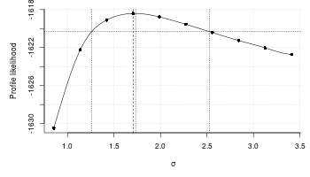
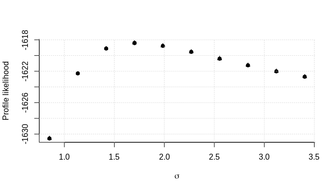
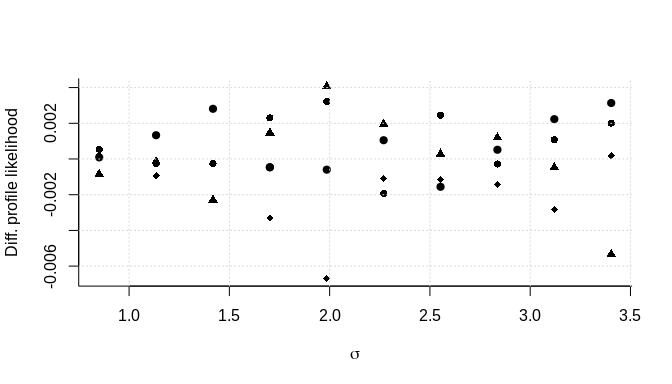
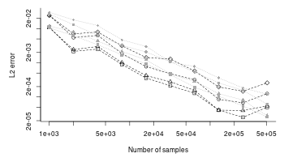
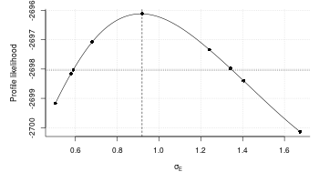
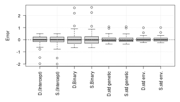
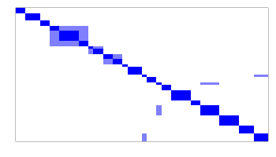

# pedmod: Pedigree Models

[](https://github.com/boennecd/pedmod/actions)

The pedmod package provides functions to estimate models for pedigree
data. Particularly, the package provides functions to estimate mixed
models of the form:

  
, 1) \\\\
\\vec\\epsilon_i = (\\epsilon_{i1}, \\dots, \\epsilon_{in_i})^\\top &\\sim
  N^{(n_i)}\\left(\\vec 0, \\sum_{l = 1}^K\\sigma_l^2 C_{il}
  \\right)
\\end{align*}")  

where
 is the binary outcome of interest for individual
 in
family/cluster
,
 is the individual’s known covariates,
 is the standard normal distribution’s CDF, and
 implies a binomial distribution such if ") then the density of
 is:

  
 = \\begin{pmatrix} n \\\\ z \\end{pmatrix}p^z(1 - p)^{n-z}")  

A different and equivalent way of writing the model is as:

  
^\\top &\\sim
  N^{(n_i)}\\left(\\vec 0, I_{n_i} + \\sum_{l = 1}^K\\sigma_l^2 C_{il}
  \\right)
\\end{align*}")  

where
 is the

dimensional identity matrix which comes from the unshared/individual
specific random effect. This effect is always included.

The
s are known scale/correlation matrices where each of the
’th
types correspond to a type of effect. An arbitrary number of such
matrices can be passed to include e.g. a genetic effect, a maternal
effect, a paternal, an effect of a shared adult environment etc.
Usually, these matrices are correlation matrices as this simplifies
later interpretation and we will assume that all the matrices are
correlation matrices. A typical example is that
 is two times the kinship matrix in which case we call:

  
  

the heritability. That is, the proportion of the variance attributable
to the the ’th effect which in this case is the direct genetic effect. The
scale parameters, the
s, may be the primary interest in an analysis. The scale
in the model cannot be identified. That is, an equivalent model is:

  
^\\top &\\sim
  N^{(n_i)}\\left(\\vec 0, 
  \\phi\\left(I_{n_i} + \\sum_{l = 1}^K\\sigma_l^2 C_{il}\\right)
  \\right)
\\end{align*}")  

for any . A common option other than  is to set ^{-1}"). This has the effect
that

  
  

is the proportion of variance attributable to the
’th
effect (assuming all
 matrices are correlation matrices). Moreover,
 is the proportion of variance attributable the individual
specific effect.

The parameterizations used in the package are  which we call the direct parameterizations and ^{-1}") which we call the standardized
parameterizations. The latter have the advantage that it is easier to
interpret as the scale parameters are the proportion of variance
attributable to each effect (assuming that only correlation matrices are
used) and the
 are often very close the estimate from a GLM
(that is, the model without the other random effects) when the
covariates are unrelated to random effects that are added to the model.
The latter makes it easy to find starting values.

For the above reason, two parameterization are used. For the direct
parameterization where , we work directly with
, and we use . For the standardized parameterization
where ^{-1}"), we work with ^{-1}"), , and

  
}{1 +\\sum_{l = 1}^k\\exp(\\psi_l)}\\Leftrightarrow\\sigma_l^2 = \\exp(\\psi_l).
")  

This package provides randomized quasi-Monte Carlo methods to
approximate the log marginal likelihood for these types of models with
an arbitrary number scale matrices,
, and
the derivatives with respect to
^\\top")
(that is, we work with ) or ").

We have re-written the Fortran code by Genz and Bretz (2002) in C++,
made it easy to extend from a log marginal likelihood approximation to
other approximations such as the derivatives, and added less precise but
faster approximations of the
 and
. Our own experience suggests that using the latter has a
small effect on the precision of the result but can yield substantial
reduction in computation times for moderate sized families/clusters.

The approximation by Genz and Bretz (2002) have already been used to
estimate these types of models (Pawitan et al. 2004). However, not
having the gradients may slow down estimation substantially. Moreover,
our implementation supports computation in parallel which is a major
advantage given the availability of multi-core processors.

Since the implementation is easy to extend, possible extensions are:

1.  Survival times using mixed generalized survival models (Liu,
    Pawitan, and Clements 2017) with a similar random effect structure
    as the model shown above. This way, one avoids dichotomizing
    outcomes and can account for censoring.
2.  Generalized linear mixed model with binary, binomial, ordinal, or
    multinomial outcomes with a probit link. The method we use here may
    be beneficial if the number of random effects per cluster is not
    much smaller then the number observations in each cluster. This is
    used for imputation in the mdgc package.

## Installation

The package can be installed from Github by calling:

``` r
remotes::install_github("boennecd/pedmod", build_vignettes = TRUE)
```

## Example

We start with a simple example only with a direct genetic effect. We
have one type of family which consists of two couples which are related
through one of the parents being siblings. The family is shown below.

``` r
# create the family we will use
fam <- data.frame(id = 1:10, sex = rep(1:2, 5L),
                  father = c(NA, NA, 1L, NA, 1L, NA, 3L, 3L, 5L, 5L), 
                  mother = c(NA, NA, 2L, NA, 2L, NA, 4L, 4L, 6L, 6L))

# plot the pedigree
library(kinship2)
ped <- with(fam, pedigree(id = id, dadid = father, momid = mother, sex = sex))
plot(ped)
```


We set the scale matrix to be two times the kinship matrix to model the
direct genetic effect. Each individual also have a standard normally
distributed covariate and a binary covariate. Thus, we can simulate a
data set with a function like:

``` r
# simulates a data set. 
# 
# Args:
#   n_fams: number of families.
#   beta: the fixed effect coefficients.
#   sig_sq: the scale parameter.
sim_dat <- function(n_fams, beta = c(-3, 1, 2), sig_sq = 3){
  # setup before the simulations
  Cmat <- 2 * kinship(ped)
  n_obs <- NROW(fam)
  Sig <- diag(n_obs) + sig_sq * Cmat
  Sig_chol <- chol(Sig)
  
  # simulate the data
  out <- replicate(
    n_fams, {
      # simulate covariates
      X <- cbind(`(Intercept)` = 1, Continuous = rnorm(n_obs), 
                 Binary = runif(n_obs) > .5)
      
      # assign the linear predictor + noise
      eta <- drop(X %*% beta) + drop(rnorm(n_obs) %*% Sig_chol)
      
      # return the list in the format needed for the package
      list(y = as.numeric(eta > 0), X = X, scale_mats = list(Cmat))
    }, simplify = FALSE)
  
  # add attributes with the true values and return 
  attributes(out) <- list(beta = beta, sig_sq = sig_sq)
  out
}
```

The model is

  
 \\\\
 B_{ij} &\\sim \\text{Bin}(0.5, 1) \\\\
 (G_{i1}, \\dots G_{in_{i}})^\\top &\\sim N^{(n_i)}(\\vec 0, \\sigma^2 C_{i1}) \\\\
 R_{ij} &\\sim N(0, 1)\\end{align*}")  

where
 is two times the kinship matrix and
 and
 are observed covariates. We can now estimate the model with a
simulated data set as follows:

``` r
# simulate a data set
set.seed(27107390)
dat <- sim_dat(n_fams = 400L)

# perform the optimization. We start with finding the starting values
library(pedmod)
ll_terms <- get_pedigree_ll_terms(dat, max_threads = 4L)
system.time(start <- pedmod_start(ptr = ll_terms, data = dat, n_threads = 4L))
#>    user  system elapsed 
#>  15.468   0.045   3.919

# log-likelihood without the random effects and at the starting values
start$logLik_no_rng
#> [1] -1690
start$logLik_est # this is unreliably/imprecise
#> [1] -1619

# estimate the model
system.time(
  opt_out <- pedmod_opt(
    ptr = ll_terms, par = start$par, abs_eps = 0, use_aprx = TRUE, 
    n_threads = 4L, 
    maxvls = 25000L, rel_eps = 1e-3, minvls = 5000L))
#>    user  system elapsed 
#>  71.928   0.008  18.036
```

The results of the estimation are shown below:

``` r
# parameter estimates versus the truth
rbind(opt_out       = head(opt_out$par, -1), 
      opt_out_quick = head(start  $par, -1), 
      truth         = attr(dat, "beta"))
#>               (Intercept) Continuous Binary
#> opt_out            -2.872     0.9689  1.878
#> opt_out_quick      -2.776     0.9625  1.813
#> truth              -3.000     1.0000  2.000
c(opt_out       = exp(tail(opt_out$par, 1)), 
  opt_out_quick = exp(tail(start  $par, 1)), 
  truth         = attr(dat, "sig_sq"))
#>       opt_out opt_out_quick         truth 
#>         2.906         2.632         3.000

# log marginal likelihoods
print(start   $logLik_est, digits = 8) # this is unreliably/imprecise
#> [1] -1618.5325
print(-opt_out$value     , digits = 8)
#> [1] -1618.4044
```

As an alternative to the direct parameterization we use above, we can
also use the standardized parameterization. Below are some illustrations
which you may skip.

``` r
#####
# transform the parameters and check that we get the same likelihood
std_par <- direct_to_standardized(opt_out$par, n_scales = 1L)
std_par # the standardized parameterization
#> (Intercept)  Continuous      Binary             
#>     -1.4530      0.4902      0.9503      1.0668
opt_out$par # the direct parameterization 
#> (Intercept)  Continuous      Binary             
#>     -2.8717      0.9689      1.8780      1.0668

# we can map back as follows
par_back <- standardized_to_direct(std_par, n_scales = 1L)
all.equal(opt_out$par, par_back, check.attributes = FALSE)
#> [1] TRUE
# the proportion of variance of each effect
attr(par_back, "variance proportions") 
#> Residual          
#>    0.256    0.744

# the proportion match
exp(tail(opt_out$par, 1)) / (exp(tail(opt_out$par, 1)) + 1)
#>       
#> 0.744

# compute the likelihood with either parameterization
set.seed(1L)
eval_pedigree_ll(ptr = ll_terms, par = opt_out$par, maxvls = 10000L, 
                 minvls = 1000L, rel_eps = 1e-3, use_aprx = TRUE, abs_eps = 0)
#> [1] -1618
#> attr(,"n_fails")
#> [1] 10
set.seed(1L)
eval_pedigree_ll(ptr = ll_terms, par = std_par    , maxvls = 10000L, 
                 minvls = 1000L, rel_eps = 1e-3, use_aprx = TRUE, abs_eps = 0, 
                 standardized = TRUE)
#> [1] -1618
#> attr(,"n_fails")
#> [1] 10

# we can also get the same gradient with an application of the chain rule
jac <- attr(
  standardized_to_direct(std_par, n_scales = 1L, jacobian = TRUE), 
  "jacobian")

set.seed(1L)
g1 <- eval_pedigree_grad(ptr = ll_terms, par = opt_out$par, maxvls = 10000L, 
                         minvls = 1000L, rel_eps = 1e-3, use_aprx = TRUE, 
                         abs_eps = 0)
set.seed(1L)
g2 <- eval_pedigree_grad(ptr = ll_terms, par = std_par, maxvls = 10000L, 
                         minvls = 1000L, rel_eps = 1e-3, use_aprx = TRUE, 
                         abs_eps = 0, standardized = TRUE)
all.equal(drop(g1 %*% jac), g2, check.attributes = FALSE)
#> [1] TRUE
```

The model can also be estimated with the the standardized
parameterization:

``` r
# perform the optimization. We start with finding the starting values
system.time(start_std <- pedmod_start(
  ptr = ll_terms, data = dat, n_threads = 4L, standardized = TRUE))
#>    user  system elapsed 
#>   5.112   0.009   1.296

# the starting values are close
standardized_to_direct(start_std$par, n_scales = 1L)
#> (Intercept)  Continuous      Binary             
#>     -2.7891      0.9669      1.8211      0.9805 
#> attr(,"variance proportions")
#> Residual          
#>   0.2728   0.7272
start$par
#> (Intercept)  Continuous      Binary             
#>     -2.7763      0.9625      1.8128      0.9678

# this may have required different number of gradient and function evaluations
start_std$opt$counts
#> function gradient 
#>       42        4
start    $opt$counts
#> function gradient 
#>       44       44

# estimate the model
system.time(
  opt_out_std <- pedmod_opt(
    ptr = ll_terms, par = start_std$par, abs_eps = 0, use_aprx = TRUE, 
    n_threads = 4L, standardized = TRUE,
    maxvls = 25000L, rel_eps = 1e-3, minvls = 5000L))
#>    user  system elapsed 
#> 114.307   0.004  28.751

# we get the same
standardized_to_direct(opt_out_std$par, n_scales = 1L)
#> (Intercept)  Continuous      Binary             
#>      -2.871       0.969       1.878       1.067 
#> attr(,"variance proportions")
#> Residual          
#>   0.2561   0.7439
opt_out$par
#> (Intercept)  Continuous      Binary             
#>     -2.8717      0.9689      1.8780      1.0668

# this may have required different number of gradient and function evaluations
opt_out_std$counts
#> function gradient 
#>       46        8
opt_out    $counts
#> function gradient 
#>       26        6
```

### Stochastic Quasi-Newton Method

The package includes a stochastic quasi-Newton method which can be used
to estimate the model. This may be useful for larger data sets or in
situations where `pedmod_opt` “get stuck” near a maximum. The reason for
the latter is presumably that `pedmod_opt` (by default) uses the BFGS
method which does not assume any noise in the gradient or the function.
We give an example below of how to use the stochastic quasi-Newton
method provided through the `pedmod_sqn` function.

``` r
# fit the model with the stochastic quasi-Newton method
set.seed(46712994)
system.time(
  sqn_out <- pedmod_sqn(
    ptr = ll_terms, par = start$par, abs_eps = 0, use_aprx = TRUE, 
    n_threads = 4L, rel_eps = 1e-3, step_factor = .1, maxvls = 25000L, 
    minvls = 1000L, n_it = 400L, n_grad_steps = 20L, n_grad = 50L, 
    n_hess = 200L))
#>    user  system elapsed 
#> 388.231   0.023  97.296

# show the log marginal likelihood
ll_wrapper <- function(x)
  eval_pedigree_ll(
    ptr = ll_terms, x, maxvls = 50000L, minvls = 1000L, abs_eps = 0, 
    rel_eps = 1e-4, n_threads = 4L)
print(ll_wrapper(sqn_out$par), digits = 8)
#> [1] -1618.5087
#> attr(,"n_fails")
#> [1] 155
print(ll_wrapper(opt_out$par), digits = 8)
#> [1] -1618.4088
#> attr(,"n_fails")
#> [1] 163

# compare the parameters
rbind(optim = opt_out$par, 
      sqn   = sqn_out$par)
#>       (Intercept) Continuous Binary       
#> optim      -2.872     0.9689  1.878 1.0668
#> sqn        -2.770     0.9461  1.828 0.9746

# plot the marginal log likelihood versus the iteration number
lls <- apply(sqn_out$omegas, 2L, ll_wrapper)
par(mar = c(5, 5, 1, 1))
plot(lls, ylab = "Log marginal likelihood", bty = "l", pch = 16,
     xlab = "Hessian updates")
lines(smooth.spline(seq_along(lls), lls))
grid()
```


``` r
# perhaps we could have used fewer samples in each iteration
set.seed(46712994)
system.time(
  sqn_out_few <- pedmod_sqn(
    ptr = ll_terms, par = start$par, abs_eps = 0, use_aprx = TRUE, 
    n_threads = 4L, rel_eps = 1e-3, step_factor = .1, maxvls = 25000L, 
    minvls = 1000L, n_grad_steps = 20L,
    # we take more iterations
    n_it = 600L, 
    # but use fewer samples in each iteration
    n_grad = 20L, n_hess = 100L))
#>    user  system elapsed 
#>  243.94    0.02   61.02

# compute the marginal log likelihood and compare the parameter estimates
print(ll_wrapper(sqn_out_few$par), digits = 8)
#> [1] -1618.4639
#> attr(,"n_fails")
#> [1] 148

rbind(optim       = opt_out    $par, 
      sqn         = sqn_out    $par, 
      `sqn (few)` = sqn_out_few$par)
#>           (Intercept) Continuous Binary       
#> optim          -2.872     0.9689  1.878 1.0668
#> sqn            -2.770     0.9461  1.828 0.9746
#> sqn (few)      -2.779     0.9300  1.817 0.9757
```

### Profile Likelihood Curve

We can compute a profile likelihood curve like this:

``` r
# assign the scale parameter at which we will evaluate the profile likelihood
rg <- range(exp(tail(opt_out$par, 1) / 2) * c(.5, 2),
            sqrt(attr(dat, "sig_sq")) * c(.9, 1.1))
sigs <- seq(rg[1], rg[2], length.out = 10)
sigs <- sort(c(sigs, exp(tail(opt_out$par, 1) / 2)))

# compute the profile likelihood
ll_terms <- get_pedigree_ll_terms(dat, max_threads = 4L)
pl_curve_res <- lapply(sigs, function(sig){
  # set the parameters to pass
  beta <- start$beta_no_rng
  sig_sq_log <- 2 * log(sig)
  beta_scaled <- beta * sqrt(1 + sig^2)
  
  # optimize like before but using the fix argument
  opt_out_quick <- pedmod_opt(
    ptr = ll_terms, par = c(beta_scaled, sig_sq_log), maxvls = 1000L, 
    abs_eps = 0, rel_eps = 1e-2, minvls = 100L, use_aprx = TRUE, n_threads = 4L, 
    fix = length(beta) + 1L)
  opt_out <- pedmod_opt(
    ptr = ll_terms, par = c(opt_out_quick$par, sig_sq_log), abs_eps = 0, 
    use_aprx = TRUE, n_threads = 4L, fix = length(beta) + 1L,
    # we changed the parameters
    maxvls = 25000L, rel_eps = 1e-3, minvls = 5000L)
  
  # report to console and return
  message(sprintf("\nLog-likelihood %.5f (%.5f). Estimated parameters:", 
                  -opt_out$value, -opt_out_quick$value))
  message(paste0(capture.output(print(
    c(opt_out$par, Scale = sig))), collapse = "\n"))
  
  list(opt_out_quick = opt_out_quick, opt_out = opt_out)
})
```

We can construct an approximate 95% confidence interval using an
estimated cubic smoothing spline for the profile likelihood (more `sigs`
points may be needed to get a good estimate of the cubic smoothing
spline):

``` r
# get the critical values
alpha <- .05
crit_val <- qchisq(1 - alpha, 1)

# fit the cubic smoothing spline
pls <- -sapply(pl_curve_res, function(x) x$opt_out$value)
smooth_est <- smooth.spline(sigs, pls)

# check that we have values within the bounds
max_ml <- -opt_out$value
ll_diffs <- 2 * (max_ml - pls)
stopifnot(any(head(ll_diffs, length(ll_diffs) / 2) > crit_val), 
          any(tail(ll_diffs, length(ll_diffs) / 2) > crit_val))

# find the values
max_par <- tail(opt_out$par, 1)
lb <- uniroot(function(x) 2 * (max_ml - predict(smooth_est, x)$y) - crit_val, 
              c(min(sigs)       , exp(max_par / 2)))$root
ub <- uniroot(function(x) 2 * (max_ml - predict(smooth_est, x)$y) - crit_val, 
              c(exp(max_par / 2), max(sigs)))$root

# the confidence interval 
c(lb, ub)
#> [1] 1.259 2.528
c(lb, ub)^2 # on the variance scale
#> [1] 1.586 6.391
```

A caveat is that issues with the
 approximation may arise on the boundary of the scale
parameter (; see <https://stats.stackexchange.com/a/4894/81865>).
Notice that the above may fail if the estimated profile likelihood is
not smooth e.g. because of convergence issues. We can plot the profile
likelihood and highlight the critical value as follows:

``` r
par(mar = c(5, 5, 1, 1))
plot(sigs, pls, bty = "l",
     pch = 16, xlab = expression(sigma), ylab = "Profile likelihood")
grid()
lines(predict(smooth_est, seq(min(sigs), max(sigs), length.out = 100)))
abline(v = exp(tail(opt_out$par, 1) / 2), lty = 2) # the estimate
abline(v = sqrt(attr(dat, "sig_sq")), lty = 3) # the true value
abline(v = lb, lty = 3) # mark the lower bound
abline(v = ub, lty = 3) # mark the upper bound
abline(h = max_ml - crit_val / 2, lty = 3) # mark the critical value
```



We only ran the above with one seed. We can draw the curve with using
different seeds to check if this does not change the estimates. We will
likely need to use more samples if the result depends on the seed.

``` r
# assign the seeds we will use along with the grid of seeds and scale parameters
seeds <- 1:4
seeds_n_sigs <- expand.grid(seed = seeds, sig = sigs)

# compute the profile likelihood
ll_terms <- get_pedigree_ll_terms(dat, max_threads = 4L)
pl_curve_res <- Map(function(sig, seed){
  # set the parameters to pass
  beta <- start$beta_no_rng
  sig_sq_log <- 2 * log(sig)
  beta_scaled <- beta * sqrt(1 + sig^2)
  
  # optimize like before but using the fix argument
  opt_out_quick <- pedmod_opt(
    ptr = ll_terms, par = c(beta_scaled, sig_sq_log), maxvls = 1000L, 
    abs_eps = 0, rel_eps = 1e-2, minvls = 100L, use_aprx = TRUE, n_threads = 4L, 
    fix = length(beta) + 1L, seed = seed)
  opt_out <- pedmod_opt(
    ptr = ll_terms, par = c(opt_out_quick$par, sig_sq_log), abs_eps = 0, 
    use_aprx = TRUE, n_threads = 4L, fix = length(beta) + 1L, seed = seed,
    # we changed the parameters
    maxvls = 25000L, rel_eps = 1e-3, minvls = 5000L)
  
  # report to console and return
  message(sprintf("\nLog-likelihood %.5f (%.5f). Estimated parameters:", 
                  -opt_out$value, -opt_out_quick$value))
  message(paste0(capture.output(print(
    c(opt_out$par, Scale = sig))), collapse = "\n"))
  
  list(opt_out_quick = opt_out_quick, opt_out = opt_out)
}, sig = seeds_n_sigs$sig, seed = seeds_n_sigs$seed)
```

The different profile likelihood curves are drawn below:

``` r
# plot the profile likelihood values
pls <- -sapply(pl_curve_res, function(x) x$opt_out$value)
pls <- matrix(pls, length(seeds), dimnames = list(seeds, sigs))
matplot(sigs, t(pls), pch = seq_along(seeds) + 15L, bty = "l", col = "black", 
        xlab = expression(sigma), ylab = "Profile likelihood")
grid()
```



``` r
# plot the difference from the mean
matplot(sigs, t(pls) - colMeans(pls), pch = seq_along(seeds) + 15L, bty = "l", 
        col = "black", xlab = expression(sigma), 
        ylab = "Diff. profile likelihood")
grid()
```



### Randomized Quasi-Monte Carlo

There are two randomized quasi-Monte Carlo methods which are implemented
in the package: randomized Korobov rules as in the implementation by
Genz and Bretz (2002) and scrambled Sobol sequences. The former is used
by default. The questions is which method to use. As an example, we will
increase the number of samples with either methods and see how this
effects the error for the gradient of the log likelihood from the first
couple of families. We do this below:

``` r
# create a simple function which computes the gradient. We set the convergence 
# threshold values low such that all the samples will be used
gr <- function(maxvls, method, par = start$par)
  eval_pedigree_grad(ptr = ll_terms, par = par, maxvls = maxvls, abs_eps = 0,
                     rel_eps = 1e-12, indices = 0:9, minvls = 500L, 
                     method = method, n_threads = 4L)

# compute the estimator for either method using an increasing number of samples
n_samp <- 1000 * 2^(0:8) # the sample sizes we will use
seeds <- 1:20 # the seeds we will use

res <- sapply(setNames(n_samp, n_samp), function(maxvls){
  sapply(c(Korobov = 0, Sobol = 1), function(method){
    # estimate the gradient
    ests <- sapply(seeds, function(s){
      set.seed(s)
      gr(maxvls = maxvls, method = method)
    })
    
    # return the mean of the estimators and the standard deviation
    rbind(mean = rowMeans(ests), 
          sd = apply(ests, 1L, sd))
  }, simplify = "array")
}, simplify = "array")

# set the names of the dimensions
dimnames(res) <- list(
  metric = dimnames(res)[[1L]], parameter = names(opt_out$par),
  method = dimnames(res)[[3L]], samples = n_samp)

# they seem to converge to the same estimate as expected
print(t(res["mean", , "Korobov", ]), digits = 6)
#>         parameter
#> samples  (Intercept) Continuous   Binary          
#>   1000     -0.574342    3.15164 -1.68665 -0.916353
#>   2000     -0.573327    3.14947 -1.68619 -0.913212
#>   4000     -0.573546    3.14929 -1.68674 -0.914656
#>   8000     -0.573690    3.14831 -1.68711 -0.909426
#>   16000    -0.572719    3.14687 -1.68763 -0.910876
#>   32000    -0.573521    3.14694 -1.68845 -0.909164
#>   64000    -0.573441    3.14754 -1.68813 -0.907874
#>   128000   -0.573404    3.14774 -1.68808 -0.907799
#>   256000   -0.573401    3.14784 -1.68799 -0.907651
print(t(res["mean", , "Sobol"  , ]), digits = 6)
#>         parameter
#> samples  (Intercept) Continuous   Binary          
#>   1000     -0.573192    3.16048 -1.68978 -0.913189
#>   2000     -0.572949    3.15180 -1.68936 -0.913209
#>   4000     -0.573665    3.14976 -1.68834 -0.909705
#>   8000     -0.573186    3.14774 -1.68840 -0.908310
#>   16000    -0.573510    3.14795 -1.68792 -0.907266
#>   32000    -0.573381    3.14794 -1.68796 -0.907055
#>   64000    -0.573386    3.14772 -1.68802 -0.907413
#>   128000   -0.573402    3.14779 -1.68803 -0.907550
#>   256000   -0.573391    3.14780 -1.68801 -0.907507

# get a best estimator of the gradient by combining the two
precise_est <- rowMeans(res["mean", , , length(n_samp)])
  
# the standard deviation of the result scaled by the absolute value of the 
# estimated gradient to get the number of significant digits
round(t(res["sd", , "Korobov", ] / abs(precise_est)), 6)
#>         parameter
#> samples  (Intercept) Continuous   Binary         
#>   1000      0.015930   0.003541 0.003398 0.026822
#>   2000      0.012431   0.004108 0.005342 0.020352
#>   4000      0.009963   0.003914 0.003727 0.015039
#>   8000      0.003553   0.001934 0.001717 0.009082
#>   16000     0.002487   0.001602 0.000788 0.007930
#>   32000     0.001215   0.000583 0.000724 0.003978
#>   64000     0.000551   0.000218 0.000218 0.001696
#>   128000    0.000512   0.000120 0.000135 0.001036
#>   256000    0.000220   0.000074 0.000081 0.000569
round(t(res["sd", , "Sobol"  , ] / abs(precise_est)), 6)
#>         parameter
#> samples  (Intercept) Continuous   Binary         
#>   1000      0.018947   0.006001 0.007477 0.032229
#>   2000      0.012082   0.004619 0.005132 0.023051
#>   4000      0.005312   0.001541 0.002330 0.011723
#>   8000      0.003169   0.001005 0.001333 0.004809
#>   16000     0.001467   0.000522 0.000723 0.002963
#>   32000     0.000700   0.000312 0.000326 0.000956
#>   64000     0.000399   0.000158 0.000207 0.000910
#>   128000    0.000182   0.000053 0.000078 0.000342
#>   256000    0.000102   0.000040 0.000055 0.000173
```

``` r
# look at log-log regression for convergence rate. We except a rate between 
# 0.5, O(sqrt(n)) rate, and 1, O(n) rate, which can be seen from minus the 
# slopes below
lm(t(log(res["sd", , "Korobov", ])) ~ log(n_samp))
#> 
#> Call:
#> lm(formula = t(log(res["sd", , "Korobov", ])) ~ log(n_samp))
#> 
#> Coefficients:
#>              (Intercept)  Continuous  Binary        
#> (Intercept)   1.146        1.757       0.982   1.500
#> log(n_samp)  -0.807       -0.795      -0.782  -0.710
lm(t(log(res["sd", , "Sobol", ])) ~ log(n_samp))
#> 
#> Call:
#> lm(formula = t(log(res["sd", , "Sobol", ])) ~ log(n_samp))
#> 
#> Coefficients:
#>              (Intercept)  Continuous  Binary        
#> (Intercept)   2.262        2.672       2.159   3.344
#> log(n_samp)  -0.966       -0.941      -0.925  -0.968

# plot the two standard deviation estimates
par(mar = c(5, 4, 1, 1))
matplot(n_samp, t(res["sd", , "Korobov", ]), log = "xy", ylab = "L2 error", 
        type = "p", pch = 1:4, col = "black", bty = "l", 
        xlab = "Number of samples", ylim = range(res["sd", , , ]))
matlines(n_samp, t(res["sd", , "Korobov", ]), col = "black", lty = 2)

# add the points from Sobol method
matplot(n_samp, t(res["sd", , "Sobol", ]), type = "p", pch = 16:19, 
        col = "darkgray", add = TRUE)
matlines(n_samp, t(res["sd", , "Sobol", ]), col = "darkgray", lty = 3)
```



The above seems to suggest that the scrambled Sobol sequences have a
higher initial error but a convergence rate which is closer to the
optimal ") rate for some small epsilon.

We fit the model again below as example of using the scrambled Sobol
sequences:

``` r
# estimate the model using Sobol sequences
system.time(
  opt_out_sobol <- pedmod_opt(
    ptr = ll_terms, par = start$par, abs_eps = 0, use_aprx = TRUE, 
    n_threads = 4L, 
    maxvls = 25000L, rel_eps = 1e-3, minvls = 5000L, method = 1L))
#>    user  system elapsed 
#> 176.881   0.061  44.912

# compare the result. We start with the log-likelihood
print(-opt_out_sobol$value, digits = 8)
#> [1] -1618.4027
print(-opt_out      $value, digits = 8)
#> [1] -1618.4044

# the parameters
rbind(Korobov = opt_out      $par, 
      Sobol   = opt_out_sobol$par)
#>         (Intercept) Continuous Binary      
#> Korobov      -2.872     0.9689  1.878 1.067
#> Sobol        -2.874     0.9694  1.879 1.069

# number of used function and gradient evaluations
opt_out$counts
#> function gradient 
#>       26        6
opt_out_sobol$counts
#> function gradient 
#>       34        7
```

### Simulation Study

We make a small simulation study below where we are interested in the
estimation time and bias.

``` r
# the seeds we will use
seeds <- c(36451989L, 18774630L, 76585289L, 31898455L, 55733878L, 99681114L, 37725150L, 99188448L, 66989159L, 20673587L, 47985954L, 42571905L, 53089211L, 18457743L, 96049437L, 70222325L, 86393368L, 45380572L, 81116968L, 48291155L, 89755299L, 69891073L, 1846862L, 15263013L, 37537710L, 
           25194071L, 14471551L, 38278606L, 55596031L, 5436537L, 75008107L, 83382936L, 50689482L, 71708788L, 52258337L, 23423931L, 61069524L, 24452554L, 32406673L, 14900280L, 24818537L, 59733700L, 82407492L, 95500692L, 62528680L, 88728797L, 9891891L, 36354594L, 69630736L, 41755287L)

# run the simulation study
sim_study <- lapply(seeds, function(s){
  set.seed(s)
  
  # only run the result if it has not been computed
  f <- file.path("cache", "sim_study_simple", paste0("simple-", s, ".RDS"))
  if(!file.exists(f)){
    # simulate the data
    dat <- sim_dat(n_fams = 400L)
    
    # get the starting values
    library(pedmod)
    do_fit <- function(standardized){
      ll_terms <- get_pedigree_ll_terms(dat, max_threads = 4L)
      ti_start <- system.time(start <- pedmod_start(
        ptr = ll_terms, data = dat, n_threads = 4L, 
        standardized = standardized))
      start$time <- ti_start
      
      ti_fit <- system.time(
        opt_out <- pedmod_opt(
          ptr = ll_terms, par = start$par, abs_eps = 0, use_aprx = TRUE, 
          n_threads = 4L, 
          maxvls = 25000L, rel_eps = 1e-3, minvls = 5000L, 
          standardized = standardized))
      opt_out$time <- ti_fit
      
      if(standardized){
        start$par   <- standardized_to_direct(start$par, 1L)
        opt_out$par <- standardized_to_direct(opt_out$par, 1L)
      }
      
      list(start = start, opt_out = opt_out, 
           ll_no_rng = start$logLik_no_rng)
    }
    
    fit_direct <- do_fit(standardized = FALSE)
    fit_std    <- do_fit(standardized = TRUE)
    saveRDS(list(fit_direct = fit_direct, fit_std = fit_std), f)
  }
  
  # report to console and return 
  out <- readRDS(f)
  message(paste0(capture.output(out$fit_direct$opt_out$par), collapse = "\n"))
  message(paste0(capture.output(out$fit_std   $opt_out$par), collapse = "\n"))
  message(sprintf(
    "Time %12.1f, %12.1f. Max ll: %12.4f, %12.4f\n",
    with(out$fit_direct, start$time["elapsed"] + opt_out$time["elapsed"]),
    with(out$fit_std   , start$time["elapsed"] + opt_out$time["elapsed"]),
    -out$fit_direct$opt_out$value,
    -out$fit_std   $opt_out$value))
  
  out
})

# gather the estimates
beta_est <- sapply(sim_study, function(x) 
  cbind(Direct       = head(x$fit_direct$opt_out$par, 3), 
        Standardized = head(x$fit_std   $opt_out$par, 3)), 
  simplify = "array")
sigma_est <- sapply(sim_study, function(x) 
  cbind(Direct       = exp(tail(x$fit_direct$opt_out$par, 1) / 2), 
        Standardized = exp(tail(x$fit_std   $opt_out$par, 1) / 2)), 
  simplify = "array")

# compute the errors
tmp <- sim_dat(2L)
err_beta  <- beta_est  - attr(tmp, "beta")
err_sigma <- sigma_est - sqrt(attr(tmp, "sig_sq"))
dimnames(err_sigma)[[1L]] <- "std genetic"
err <- abind::abind(err_beta, err_sigma, along = 1)

# get the bias estimates and the standard errors
bias <- apply(err, 1:2, mean)
n_sims <- dim(err)[[3]]
SE <- apply(err , 1:2, sd) / sqrt(n_sims)
bias
#>               Direct Standardized
#> (Intercept) -0.06493     -0.06598
#> Continuous   0.02797      0.02828
#> Binary       0.03670      0.03760
#> std genetic  0.05571      0.05660
SE
#>              Direct Standardized
#> (Intercept) 0.04981      0.04990
#> Continuous  0.01690      0.01692
#> Binary      0.03305      0.03307
#> std genetic 0.03826      0.03838

# make a box plot
b_vals <- expand.grid(rownames(err), strtrim(colnames(err), 1))
box_dat <- data.frame(Error = c(err), 
                      Parameter = rep(b_vals$Var1, n_sims), 
                      Method = rep(b_vals$Var2, dim(err)[[3]]))
par(mar = c(7, 5, 1, 1))
# S is for the standardized and D is for the direct parameterization
boxplot(Error ~ Method + Parameter, box_dat, ylab = "Error", las = 2, 
        xlab = "")
abline(h = 0, lty = 2)
grid()
```


``` r
# get the average computation times
time_vals <- sapply(sim_study, function(x) {
  . <- function(z){
    keep <- c("opt_out", "start")
    out <- setNames(sapply(z[keep], function(z) z$time["elapsed"]), keep)
    c(out, total = sum(out))
  }
  
  rbind(Direct       = .(x$fit_direct), 
        Standardized = .(x$fit_std))
}, simplify = "array")
apply(time_vals, 1:2, mean)
#>              opt_out start total
#> Direct         19.38 4.672 24.05
#> Standardized   22.02 2.210 24.23
apply(time_vals, 1:2, sd)
#>              opt_out  start total
#> Direct         4.243 2.7273 4.977
#> Standardized   7.363 0.7509 7.549
apply(time_vals, 1:2, quantile)
#> , , opt_out
#> 
#>      Direct Standardized
#> 0%    14.01        14.55
#> 25%   15.89        17.16
#> 50%   18.19        19.84
#> 75%   22.49        24.20
#> 100%  31.60        52.78
#> 
#> , , start
#> 
#>      Direct Standardized
#> 0%    0.947        0.877
#> 25%   2.533        1.588
#> 50%   4.346        2.188
#> 75%   6.857        2.788
#> 100% 12.297        3.474
#> 
#> , , total
#> 
#>      Direct Standardized
#> 0%    16.85        15.65
#> 25%   20.84        19.05
#> 50%   23.46        22.37
#> 75%   26.02        27.10
#> 100%  41.42        54.55
```

## Example: Adding Environmental Effects

As an extension, we can add an environmental effect. The new scale
matrix, the
’s, can be written as:

``` r
C_env <- matrix(0., NROW(fam), NROW(fam))
C_env[c(1:3, 5)   , c(1:3, 5)   ] <- 1
C_env[c(3:4, 7:8) , c(3:4, 7:8) ] <- 1
C_env[c(5:6, 9:10), c(5:6, 9:10)] <- 1

Matrix::Matrix(C_env, sparse = TRUE)
#> 10 x 10 sparse Matrix of class "dsCMatrix"
#>                          
#>  [1,] 1 1 1 . 1 . . . . .
#>  [2,] 1 1 1 . 1 . . . . .
#>  [3,] 1 1 1 1 1 . 1 1 . .
#>  [4,] . . 1 1 . . 1 1 . .
#>  [5,] 1 1 1 . 1 1 . . 1 1
#>  [6,] . . . . 1 1 . . 1 1
#>  [7,] . . 1 1 . . 1 1 . .
#>  [8,] . . 1 1 . . 1 1 . .
#>  [9,] . . . . 1 1 . . 1 1
#> [10,] . . . . 1 1 . . 1 1
```

We assign the new simulation function below but this time we include
only binary covariates:

``` r
# simulates a data set. 
# 
# Args:
#   n_fams: number of families.
#   beta: the fixed effect coefficients.
#   sig_sq: the scale parameters.
sim_dat <- function(n_fams, beta = c(-3, 4), sig_sq = c(2, 1)){
  # setup before the simulations
  Cmat <- 2 * kinship(ped)
  n_obs <- NROW(fam)
  Sig <- diag(n_obs) + sig_sq[1] * Cmat + sig_sq[2] * C_env
  Sig_chol <- chol(Sig)
  
  # simulate the data
  out <- replicate(
    n_fams, {
      # simulate covariates
      X <- cbind(`(Intercept)` = 1, Binary = runif(n_obs) > .9)
      
      # assign the linear predictor + noise
      eta <- drop(X %*% beta) + drop(rnorm(n_obs) %*% Sig_chol)
      
      # return the list in the format needed for the package
      list(y = as.numeric(eta > 0), X = X, scale_mats = list(
        Genetic = Cmat, Environment = C_env))
    }, simplify = FALSE)
  
  # add attributes with the true values and return 
  attributes(out) <- list(beta = beta, sig_sq = sig_sq)
  out
}
```

The model is

  
 \\\\
 B_{ij} &\\sim \\text{Bin}(0.5, 1) \\\\
 (G_{i1}, \\dots G_{in_{i}})^\\top &\\sim N^{(n_i)}(\\vec 0, \\sigma^2_G C_{i1}) \\\\
(E_{i1}, \\dots E_{in_{i}})^\\top &\\sim N^{(n_i)}(\\vec 0, \\sigma^2_E C_{i2}) \\\\
 R_{ij} &\\sim N(0, 1)\\end{align*}")  

where
 is two times the kinship matrix,
 is singular matrix for the environment effect, and
 is an observed covariate. In this case, we exploit that some
of log marginal likelihood terms are identical. That is, some of the
combinations of pedigrees, covariates, and outcomes match. Therefor, we
can use the `cluster_weights` arguments to reduce the computation time
as shown below:

``` r
# simulate a data set
set.seed(27107390)
dat <- sim_dat(n_fams = 1000L)

# compute the log marginal likelihood by not using that some of the log marginal 
# likelihood terms are identical
beta_true   <- attr(dat, "beta")
sig_sq_true <- attr(dat, "sig_sq")

library(pedmod)
ll_terms <- get_pedigree_ll_terms(dat, max_threads = 4L)
system.time(ll_res <- eval_pedigree_ll(
  ll_terms, c(beta_true, log(sig_sq_true)), maxvls = 100000L, abs_eps = 0, 
  rel_eps = 1e-3, minvls = 2500L, use_aprx = TRUE, n_threads = 4))
#>    user  system elapsed 
#>   2.236   0.000   0.615
system.time(grad_res <- eval_pedigree_grad(
  ll_terms, c(beta_true, log(sig_sq_true)), maxvls = 100000L, abs_eps = 0, 
  rel_eps = 1e-3, minvls = 2500L, use_aprx = TRUE, n_threads = 4))
#>    user  system elapsed 
#>   74.80    0.00   18.75

# find the duplicated combinations of pedigrees, covariates, and outcomes. One 
# likely needs to change this code if the pedigrees are not identical but are 
# identical if they are permuted. In this case, the code below will miss 
# identical log marginal likelihood terms
dat_unqiue <- dat[!duplicated(dat)]
attributes(dat_unqiue) <- attributes(dat)
length(dat_unqiue) # number of unique terms
#> [1] 416

# get the weights. This can be written in a much more efficient way
c_weights <- sapply(dat_unqiue, function(x)
  sum(sapply(dat, identical, y = x)))

# get the C++ object and show that the computation time is reduced
ll_terms <- get_pedigree_ll_terms(dat_unqiue, max_threads = 4L)

system.time(ll_res_fast <- eval_pedigree_ll(
  ll_terms, c(beta_true, log(sig_sq_true)), maxvls = 100000L, abs_eps = 0, 
  rel_eps = 1e-3, minvls = 2500L, use_aprx = TRUE, n_threads = 4, 
  cluster_weights = c_weights))
#>    user  system elapsed 
#>   1.200   0.000   0.311
system.time(grad_res_fast <- eval_pedigree_grad(
  ll_terms, c(beta_true, log(sig_sq_true)), maxvls = 100000L, abs_eps = 0, 
  rel_eps = 1e-3, minvls = 2500L, use_aprx = TRUE, n_threads = 4, 
  cluster_weights = c_weights))
#>    user  system elapsed 
#>  31.381   0.000   7.859

# show that we get the same (up to a Monte Carlo error)
print(c(redundant = ll_res, fast = ll_res_fast), digits = 6)
#> redundant      fast 
#>  -2632.06  -2632.14
rbind(redundant = grad_res, fast = grad_res_fast)
#>             [,1]   [,2]  [,3]  [,4]
#> redundant -1.851 -5.203 3.435 1.086
#> fast      -1.850 -5.204 3.500 1.083
rm(dat) # will not need this anymore

# find the starting values
system.time(
  start <- pedmod_start(ptr = ll_terms, data = dat_unqiue, 
                        cluster_weights = c_weights))
#>    user  system elapsed 
#>   9.462   0.000   9.461

# optimize
system.time(
  opt_out_quick <- pedmod_opt(
    ptr = ll_terms, par = start$par, abs_eps = 0, use_aprx = TRUE, 
    n_threads = 4L,  cluster_weights = c_weights,
    maxvls = 5000L, rel_eps = 1e-2, minvls = 500L))
#>    user  system elapsed 
#>  16.352   0.000   4.089
system.time(
  opt_out <- pedmod_opt(
    ptr = ll_terms, par = opt_out_quick$par, abs_eps = 0, use_aprx = TRUE, 
    n_threads = 4L,  cluster_weights = c_weights,
    # we changed the parameters
    maxvls = 25000L, rel_eps = 1e-3, minvls = 5000L))
#>    user  system elapsed 
#> 111.520   0.004  28.543
```

The results are shown below:

``` r
# parameter estimates versus the truth
rbind(opt_out       = head(opt_out$par, -2), 
      opt_out_quick = head(start  $par, -2), 
      truth         = attr(dat_unqiue, "beta"))
#>               (Intercept) Binary
#> opt_out            -2.954  3.906
#> opt_out_quick      -2.828  3.736
#> truth              -3.000  4.000
rbind(opt_out       = exp(tail(opt_out$par, 2)), 
      opt_out_quick = exp(tail(start  $par, 2)), 
      truth         = attr(dat_unqiue, "sig_sq"))
#>                           
#> opt_out       1.915 0.9734
#> opt_out_quick 1.645 0.9199
#> truth         2.000 1.0000

# log marginal likelihoods
print( start  $logLik_est, digits = 8)  # this is unreliably/imprecise
#> [1] -2632.0603
print(-opt_out$value     , digits = 8)
#> [1] -2631.9566
```

As before, we can also work with the standardized parameterization.

``` r
#####
# transform the parameters and check that we get the same likelihood
std_par <- direct_to_standardized(opt_out$par, n_scales = 2L)
std_par # the standardized parameterization
#> (Intercept)      Binary                         
#>    -1.49809     1.98102     0.64974    -0.02694
opt_out$par # the direct parameterization 
#> (Intercept)      Binary                         
#>    -2.95412     3.90641     0.64974    -0.02694

# we can map back as follows
par_back <- standardized_to_direct(std_par, n_scales = 2L)
all.equal(opt_out$par, par_back, check.attributes = FALSE)
#> [1] TRUE
# the proportion of variance of each effect
attr(par_back, "variance proportions") 
#> Residual                   
#>   0.2572   0.4925   0.2503

# the proportions match
total_var <- sum(exp(tail(opt_out$par, 2))) + 1
exp(tail(opt_out$par, 2)) / total_var
#>               
#> 0.4925 0.2503

# compute the likelihood with either parameterization
set.seed(1L)
eval_pedigree_ll(ptr = ll_terms, par = opt_out$par, maxvls = 10000L, 
                 minvls = 1000L, rel_eps = 1e-3, use_aprx = TRUE, abs_eps = 0)
#> [1] -1757
#> attr(,"n_fails")
#> [1] 36
set.seed(1L)
eval_pedigree_ll(ptr = ll_terms, par = std_par    , maxvls = 10000L, 
                 minvls = 1000L, rel_eps = 1e-3, use_aprx = TRUE, abs_eps = 0, 
                 standardized = TRUE)
#> [1] -1757
#> attr(,"n_fails")
#> [1] 36

# we can also get the same gradient with an application of the chain rule
jac <- attr(
  standardized_to_direct(std_par, n_scales = 2L, jacobian = TRUE), 
  "jacobian")

set.seed(1L)
g1 <- eval_pedigree_grad(ptr = ll_terms, par = opt_out$par, maxvls = 10000L, 
                         minvls = 1000L, rel_eps = 1e-3, use_aprx = TRUE, 
                         abs_eps = 0)
set.seed(1L)
g2 <- eval_pedigree_grad(ptr = ll_terms, par = std_par, maxvls = 10000L, 
                         minvls = 1000L, rel_eps = 1e-3, use_aprx = TRUE, 
                         abs_eps = 0, standardized = TRUE)
all.equal(drop(g1 %*% jac), g2, check.attributes = FALSE)
#> [1] TRUE
```

The model can also be estimated with the the standardized
parameterization:

``` r
# perform the optimization. We start with finding the starting values
system.time(start_std <- pedmod_start(
  ptr = ll_terms, data = dat_unqiue, cluster_weights = c_weights, 
  standardized = TRUE))
#>    user  system elapsed 
#>   7.121   0.014   7.133

# are the starting values similar?
standardized_to_direct(start_std$par, n_scales = 2L)
#> (Intercept)      Binary                         
#>    -2.83083     3.73984     0.49824    -0.07708 
#> attr(,"variance proportions")
#> Residual                   
#>   0.2800   0.4608   0.2592
start$par
#> (Intercept)      Binary                         
#>    -2.82827     3.73647     0.49792    -0.08348

# this may have required different number of gradient and function evaluations
start_std$opt$counts
#> function gradient 
#>       46       13
start    $opt$counts
#> function gradient 
#>       23       23

# estimate the model
system.time(
  opt_out_quick_std <- pedmod_opt(
    ptr = ll_terms, par = start_std$par, abs_eps = 0, use_aprx = TRUE, 
    n_threads = 4L,  cluster_weights = c_weights, standardized = TRUE,
    maxvls = 5000L, rel_eps = 1e-2, minvls = 500L))
#>    user  system elapsed 
#>  15.885   0.004   3.974
system.time(
  opt_out_std <- pedmod_opt(
    ptr = ll_terms, par = opt_out_quick_std$par, abs_eps = 0, use_aprx = TRUE, 
    n_threads = 4L,  cluster_weights = c_weights, standardized = TRUE,
    # we changed the parameters
    maxvls = 25000L, rel_eps = 1e-3, minvls = 5000L))
#>    user  system elapsed 
#> 119.225   0.004  30.604

# we get the same
standardized_to_direct(opt_out_std$par, n_scales = 2L)
#> (Intercept)      Binary                         
#>    -2.95744     3.91078     0.65307    -0.02428 
#> attr(,"variance proportions")
#> Residual                   
#>   0.2566   0.4930   0.2504
opt_out$par
#> (Intercept)      Binary                         
#>    -2.95412     3.90641     0.64974    -0.02694

# this may have required different number of gradient and function evaluations
opt_out_quick_std$counts
#> function gradient 
#>       50        5
opt_out_quick    $counts
#> function gradient 
#>       51        5

opt_out_std$counts
#> function gradient 
#>       47        6
opt_out    $counts
#> function gradient 
#>       38        7
```

### Profile Likelihood Curve

We can make a 2D profile likelihood curve as follows:

``` r
# get the values at which we evaluate the profile likelihood
rg <- Map(function(est, truth)
  range(exp(est / 2) * c(.8, 1.25), truth), 
  est = tail(opt_out$par, 2), truth = sqrt(attr(dat_unqiue, "sig_sq")))

sig_vals1 <- seq(rg[[1]][1], rg[[1]][2], length.out = 5)
sig_vals2 <- seq(rg[[2]][1], rg[[2]][2], length.out = 5)
sigs <- expand.grid(sigma1 = sig_vals1,
                    sigma2 = sig_vals2)

# function to compute the profile likelihood. 
# 
# Args:
#   fix: indices óf parameters to fix. 
#   fix_val: values of the fixed parameters.
#   sig_start: starting values for the scale parameters.
ll_terms <- get_pedigree_ll_terms(dat_unqiue, max_threads = 4L)
pl_curve_func <- function(fix, fix_val, 
                          sig_start = exp(tail(opt_out$par, 2) / 2)){
  # get the fixed indices of the fixed parameters
  beta = start$beta_no_rng
  is_fix_beta <- fix <= length(beta)
  fix_beta <- fix[is_fix_beta]
  is_fix_sigs <- fix >  length(beta)
  fix_sigs <- fix[is_fix_sigs]
  
  # set the parameters to pass
  sig <- sig_start
  if(length(fix_sigs) > 0)
    sig[fix_sigs - length(beta)] <- fix_val[is_fix_sigs]
  
  # re-scale beta and setup the sigma argument to pass
  sig_sq_log <- 2 * log(sig)
  beta_scaled <- beta * sqrt(1 + sum(sig^2))
  
  # setup the parameter vector
  fix_par <- c(beta_scaled, sig_sq_log)
  if(length(fix_beta) > 0)
    fix_par[fix_beta] <- fix_val[is_fix_beta]
  
  # optimize like before but using the fix argument
  opt_out_quick <- pedmod_opt(
    ptr = ll_terms, par = fix_par, maxvls = 5000L, abs_eps = 0, 
    rel_eps = 1e-2, minvls = 500L, use_aprx = TRUE, n_threads = 4L, 
    fix = fix, cluster_weights = c_weights)
  
  # notice that pedmod_opt only returns a subset of the parameters. These are 
  # the parameters that have been optimized over
  par_new <- fix_par
  par_new[-fix] <- opt_out_quick$par
  opt_out <- pedmod_opt(
    ptr = ll_terms, par = par_new, abs_eps = 0, 
    use_aprx = TRUE, n_threads = 4L, fix = fix,
    cluster_weights = c_weights,
    # we changed the parameters
    maxvls = 25000L, rel_eps = 1e-3, minvls = 5000L)
  
  # report to console and return
  message(sprintf("\nLog-likelihood %.5f (%.5f). Estimated parameters:", 
                  -opt_out$value, -opt_out_quick$value))
  message(paste0(capture.output(print(
    c(`non-fixed` = opt_out$par, fixed = fix_par[fix]))), collapse = "\n"))
  
  list(opt_out_quick = opt_out_quick, opt_out = opt_out)
}

# compute the profile likelihood
pl_curve_res <- Map(
  function(sig1, sig2) pl_curve_func(fix = 0:1 + length(opt_out$par) - 1L, 
                                     fix_val = c(sig1, sig2)), 
  sig1 = sigs$sigma1, sig2 = sigs$sigma2)
```

``` r
par(mfcol = c(2, 2), mar = c(1, 1, 1, 1))
pls <- -sapply(pl_curve_res, function(x) x$opt_out$value)
for(i in 1:3 - 1L)
  persp(sig_vals1, sig_vals2, matrix(pls, length(sig_vals1)), 
        xlab = "\nGenetic", ylab = "\nEnvironment", 
        zlab = "\n\nProfile likelihood", theta = 65 + i * 90, 
        ticktype = "detailed")
```


We may just be interested creating two profile likelihood curves for
each of the scale parameters. This can be done as follows:

``` r
# First we compute data for the two profile likelihood curves staring with the
# curve for the additive genetic effect
sigs_genetic <- exp(opt_out$par[3] / 2)
sigs_genetic <- c(sigs_genetic,
                  seq(sigs_genetic - .5, sigs_genetic + .7, length.out = 15))
sigs_genetic <- sort(sigs_genetic)

pl_genetic <- lapply(sigs_genetic, pl_curve_func, fix = 
                       length(start$beta_no_rng) + 1L)

# then we compute the curve for the environmental effect
sigs_env <- exp(opt_out$par[4] / 2)
sigs_env <- c(sigs_env, seq(sigs_env - .3, sigs_env + .5, length.out = 15))
sigs_env <- sort(sigs_env)

pl_env <- lapply(sigs_env, pl_curve_func, fix = 
                       length(start$beta_no_rng) + 2L)
```

``` r
# we create the plots starting with the additive genetic effect  
par(mar = c(5, 5, 1, 1))
pls <- -sapply(pl_genetic, function(x) x$opt_out$value)
plot(sigs_genetic, pls, bty = "l",
     pch = 16, xlab = bquote(paste(sigma['G'])), 
     ylab = "Profile likelihood")
grid()
smooth_est <- smooth.spline(sigs_genetic, pls)
lines(predict(smooth_est, seq(min(sigs_genetic), max(sigs_genetic), 
                              length.out = 100)))
abline(v = exp(opt_out$par[3] / 2), lty = 2) # the estimate
abline(v = sqrt(attr(dat_unqiue, "sig_sq")[1]), lty = 3) # the true value
alpha <- .05
crit_val <- qchisq(1 - alpha, 1)
abline(h = -opt_out$value - crit_val / 2, lty = 3) # mark the critical value
```


``` r
# then we create the plot for the environmental effect 
par(mar = c(5, 5, 1, 1))
pls <- -sapply(pl_env, function(x) x$opt_out$value)
plot(sigs_env, pls, bty = "l",
     pch = 16, xlab = bquote(paste(sigma['E'])), 
     ylab = "Profile likelihood")
grid()
smooth_est <- smooth.spline(sigs_env, pls)
lines(predict(smooth_est, seq(min(sigs_env), max(sigs_env), length.out = 100)))
abline(v = exp(opt_out$par[4] / 2), lty = 2) # the estimate
abline(v = sqrt(attr(dat_unqiue, "sig_sq")[2]), lty = 3) # the true value
abline(h = -opt_out$value - crit_val / 2, lty = 3) # mark the critical value
```



### Simulation Study

We make a small simulation study below where we are interested in the
estimation time and bias.

``` r
# the seeds we will use
seeds <- c(36451989L, 18774630L, 76585289L, 31898455L, 55733878L, 99681114L, 37725150L, 99188448L, 66989159L, 20673587L, 47985954L, 42571905L, 53089211L, 18457743L, 96049437L, 70222325L, 86393368L, 45380572L, 81116968L, 48291155L, 89755299L, 69891073L, 1846862L, 15263013L, 37537710L, 
           25194071L, 14471551L, 38278606L, 55596031L, 5436537L, 75008107L, 83382936L, 50689482L, 71708788L, 52258337L, 23423931L, 61069524L, 24452554L, 32406673L, 14900280L, 24818537L, 59733700L, 82407492L, 95500692L, 62528680L, 88728797L, 9891891L, 36354594L, 69630736L, 41755287L)

# run the simulation study
sim_study <- lapply(seeds, function(s){
  set.seed(s)
  
  # only run the result if it has not been computed
  f <- file.path("cache", "sim_study_simple_w_env", 
                 paste0("simple-w-env-", s, ".RDS"))
  if(!file.exists(f)){
    # simulate the data
    dat <- sim_dat(n_fams = 1000L)
    
    # get the weighted data set
    dat_unqiue <- dat[!duplicated(dat)]
    attributes(dat_unqiue) <- attributes(dat)
    c_weights <- sapply(dat_unqiue, function(x)
      sum(sapply(dat, identical, y = x)))
    rm(dat)
    
    # get the starting values
    library(pedmod)
    do_fit <- function(standardized){
      ll_terms <- get_pedigree_ll_terms(dat_unqiue, max_threads = 4L)
      ti_start <- system.time(start <- pedmod_start(
        ptr = ll_terms, data = dat_unqiue, n_threads = 4L, 
        cluster_weights = c_weights, standardized = standardized))
      start$time <- ti_start
      
      # fit the model
      ti_quick <- system.time(
        opt_out_quick <- pedmod_opt(
          ptr = ll_terms, par = start$par, maxvls = 5000L, abs_eps = 0, 
          rel_eps = 1e-2, minvls = 500L, use_aprx = TRUE, n_threads = 4L, 
          cluster_weights = c_weights, standardized = standardized))
      opt_out_quick$time <- ti_quick
      
      ti_slow <- system.time(
        opt_out <- pedmod_opt(
          ptr = ll_terms, par = opt_out_quick$par, abs_eps = 0, use_aprx = TRUE, 
          n_threads = 4L, cluster_weights = c_weights,
           standardized = standardized,
          # we changed the parameters
          maxvls = 25000L, rel_eps = 1e-3, minvls = 5000L))
      opt_out$time <- ti_slow
      
      if(standardized){
        start$par     <- standardized_to_direct(start$par        , 2L)
        opt_out$par   <- standardized_to_direct(opt_out$par      , 2L)
        opt_out_quick$par <- standardized_to_direct(opt_out_quick$par, 2L)
      }
      
      list(start = start, opt_out = opt_out, opt_out_quick = opt_out_quick, 
           ll_no_rng = start$logLik_no_rng)
    }
    
    fit_direct <- do_fit(standardized = FALSE)
    fit_std    <- do_fit(standardized = TRUE)
    
    saveRDS(list(fit_direct = fit_direct, fit_std = fit_std), f)
  }
  
  # report to console and return 
  out <- readRDS(f)
  message(paste0(capture.output(out$fit_direct$opt_out$par), collapse = "\n"))
  message(paste0(capture.output(out$fit_std   $opt_out$par), collapse = "\n"))
  message(sprintf(
    "Time %12.1f, %12.1f. Max ll: %12.4f, %12.4f\n",
    with(out$fit_direct, start$time["elapsed"] + opt_out$time["elapsed"] +
           opt_out_quick$time["elapsed"]),
    with(out$fit_std   , start$time["elapsed"] + opt_out$time["elapsed"]  +
           opt_out_quick$time["elapsed"]),
    -out$fit_direct$opt_out$value,
    -out$fit_std   $opt_out$value))
  
  out
})

# gather the estimates
beta_est <- sapply(sim_study, function(x) 
  cbind(Direct       = head(x$fit_direct$opt_out$par, 2), 
        Standardized = head(x$fit_std   $opt_out$par, 2)), 
  simplify = "array")
sigma_est <- sapply(sim_study, function(x) 
  cbind(Direct       = exp(tail(x$fit_direct$opt_out$par, 2) / 2), 
        Standardized = exp(tail(x$fit_std   $opt_out$par, 2) / 2)), 
  simplify = "array")

# compute the errors
tmp <- sim_dat(2L)
err_beta  <- beta_est  - attr(tmp, "beta")
err_sigma <- sigma_est - sqrt(attr(tmp, "sig_sq"))
dimnames(err_sigma)[[1L]] <- c("std genetic", "std env.")
err <- abind::abind(err_beta, err_sigma, along = 1)

# get the bias estimates and the standard errors
bias <- apply(err, 1:2, mean)
n_sims <- dim(err)[[3]]
SE <- apply(err , 1:2, sd) / sqrt(n_sims)
bias
#>                Direct Standardized
#> (Intercept) -0.012787     -0.03214
#> Binary       0.017712      0.04629
#> std genetic  0.003647      0.01375
#> std env.    -0.010494     -0.02875
SE
#>              Direct Standardized
#> (Intercept) 0.04813      0.05842
#> Binary      0.06601      0.08063
#> std genetic 0.03814      0.05395
#> std env.    0.01358      0.02263

# make a box plot
b_vals <- expand.grid(rownames(err), strtrim(colnames(err), 1))
box_dat <- data.frame(Error = c(err), 
                      Parameter = rep(b_vals$Var1, n_sims), 
                      Method = rep(b_vals$Var2, dim(err)[[3]]))
par(mar = c(7, 5, 1, 1))
# S is for the standardized and D is for the direct parameterization
boxplot(Error ~ Method + Parameter, box_dat, ylab = "Error", las = 2, 
        xlab = "")
abline(h = 0, lty = 2)
grid()
```



``` r
# get the average computation times
time_vals <- sapply(sim_study, function(x) {
  . <- function(z){
    keep <- c("opt_out", "start")
    out <- setNames(sapply(z[keep], function(z) z$time["elapsed"]), keep)
    c(out, total = sum(out))
  }
  
  rbind(Direct       = .(x$fit_direct), 
        Standardized = .(x$fit_std))
}, simplify = "array")
apply(time_vals, 1:2, mean)
#>              opt_out start total
#> Direct         29.04 6.227 35.27
#> Standardized   31.91 4.674 36.59
apply(time_vals, 1:2, sd)
#>              opt_out start total
#> Direct         17.19 3.655 16.35
#> Standardized   20.85 1.936 20.26
apply(time_vals, 1:2, quantile)
#> , , opt_out
#> 
#>      Direct Standardized
#> 0%    3.243        4.317
#> 25%  20.032       20.092
#> 50%  26.782       28.009
#> 75%  31.515       32.591
#> 100% 99.877      119.889
#> 
#> , , start
#> 
#>      Direct Standardized
#> 0%    2.418        1.957
#> 25%   3.091        3.341
#> 50%   5.443        4.251
#> 75%   7.809        5.629
#> 100% 17.210       10.632
#> 
#> , , total
#> 
#>       Direct Standardized
#> 0%     6.336        9.073
#> 25%   26.901       25.606
#> 50%   33.193       33.461
#> 75%   39.893       38.828
#> 100% 102.468      121.846
```

## More Complicated Example

We consider a more complicated example in this section and use some of
the lower level functions in the package as an example. We start by
sourcing a file to get a function to simulate a data set with a maternal
effect and a genetic effect like in Mahjani et al. (2020):

``` r
# source the file to get the simulation function
source(system.file("gen-pedigree-data.R", package = "pedmod"))

# simulate a data set
set.seed(68167102)
dat <- sim_pedigree_data(n_families = 1000L)

# distribution of family sizes
par(mar = c(5, 4, 1, 1))
plot(table(sapply(dat$sim_data, function(x) length(x$y))), 
     xlab = "Family size", ylab = "Number of families", bty = "l")
```


``` r
# total number of observations
sum(sapply(dat$sim_data, function(x) length(x$y)))
#> [1] 49734

# average event rate
mean(unlist(sapply(dat$sim_data, `[[`, "y")))
#> [1] 0.2386
```

As Mahjani et al. (2020), we have data families linked by three
generations but we only have data for the last generation. We illustrate
this with the first family in the simulated data set:

``` r
# this is the full family 
library(kinship2)
fam1 <- dat$sim_data[[1L]]
plot(fam1$pedAll)
```


``` r
# here is the C matrix for the genetic effect
rev_img <- function(x, ...)
  image(x[, NROW(x):1], ...)
cl <- colorRampPalette(c("Red", "White", "Blue"))(101)

par(mar = c(2, 2, 1, 1))
rev_img(fam1$rel_mat, xaxt = "n", yaxt = "n", col = cl, 
        zlim = c(-1, 1))
```


``` r
# the first part of the matrix is given below
with(fam1, rel_mat[seq_len(min(10, NROW(rel_mat))), 
                   seq_len(min(10, NROW(rel_mat)))])
#>        9    10    15    16    17    21    22    28    29    36
#> 9  1.000 0.500 0.125 0.125 0.125 0.000 0.000 0.125 0.125 0.000
#> 10 0.500 1.000 0.125 0.125 0.125 0.000 0.000 0.125 0.125 0.000
#> 15 0.125 0.125 1.000 0.500 0.500 0.125 0.125 0.000 0.000 0.000
#> 16 0.125 0.125 0.500 1.000 0.500 0.125 0.125 0.000 0.000 0.000
#> 17 0.125 0.125 0.500 0.500 1.000 0.125 0.125 0.000 0.000 0.000
#> 21 0.000 0.000 0.125 0.125 0.125 1.000 0.500 0.000 0.000 0.000
#> 22 0.000 0.000 0.125 0.125 0.125 0.500 1.000 0.000 0.000 0.000
#> 28 0.125 0.125 0.000 0.000 0.000 0.000 0.000 1.000 0.500 0.125
#> 29 0.125 0.125 0.000 0.000 0.000 0.000 0.000 0.500 1.000 0.125
#> 36 0.000 0.000 0.000 0.000 0.000 0.000 0.000 0.125 0.125 1.000

# here is the C matrix for the maternal effect
rev_img(fam1$met_mat, xaxt = "n", yaxt = "n", col = cl, 
        zlim = c(-1, 1))
```



``` r
# each simulated family has such two matrices in addition to a design matrix
# for the fixed effects, X, and a vector with outcomes, y
str(fam1[c("X", "y")])
#> List of 2
#>  $ X: num [1:52, 1:3] 1 1 1 1 1 1 1 1 1 1 ...
#>   ..- attr(*, "dimnames")=List of 2
#>   .. ..$ : NULL
#>   .. ..$ : chr [1:3] "(Intercept)" "X1" ""
#>  $ y: Named logi [1:52] FALSE TRUE TRUE TRUE FALSE FALSE ...
#>   ..- attr(*, "names")= chr [1:52] "9" "10" "15" "16" ...
```

Then we perform the model estimation:

<!-- knitr::opts_knit$set(output.dir = ".") -->

<!-- knitr::load_cache("est_mod", path = "cache/README-") -->

``` r
# the true parameters are
dat$beta
#> (Intercept)          X1          X2 
#>        -1.0         0.3         0.2
dat$sc # the sigmas squared
#>  Genetic Maternal 
#>     0.50     0.33

# prepare the data to pass to the functions in the package
dat_arg <- lapply(dat$sim_data, function(x){
  # we need the following for each family: 
  #   y: the zero-one outcomes.
  #   X: the design matrix for the fixed effects. 
  #   scale_mats: list with the scale matrices for each type of effect.
  list(y = as.numeric(x$y), X = x$X,
       scale_mats = list(x$rel_mat, x$met_mat))
})

# create a C++ object
library(pedmod)
ll_terms <- get_pedigree_ll_terms(dat_arg, max_threads = 4L)

# get the starting values. This is very fast
y <- unlist(lapply(dat_arg, `[[`, "y"))
X <- do.call(rbind, lapply(dat_arg, `[[`, "X"))
start_fit <-  glm.fit(X, y, family = binomial("probit"))

# log-likelihood at the starting values without random effects
-sum(start_fit$deviance) / 2     
#> [1] -26480
(beta <- start_fit$coefficients) # starting values for fixed effects 
#> (Intercept)          X1             
#>     -0.7342      0.2234      0.1349

# start at moderate sized scale parameters
sc <- rep(log(.2), 2)

# check log likelihood at the starting values. First we assign a function 
# to approximate the log likelihood and the gradient
fn <- function(par, seed = 1L, rel_eps = 1e-2, use_aprx = TRUE, 
               n_threads = 4L, indices = NULL, maxvls = 25000L, 
               method = 0L){
  set.seed(seed)
  -eval_pedigree_ll(
    ptr = ll_terms, par = par, maxvls = maxvls, abs_eps = 0, rel_eps = rel_eps, 
    minvls = 1000L, use_aprx = use_aprx, n_threads = n_threads, 
    indices = indices, method = method)
}
gr <- function(par, seed = 1L, rel_eps = 1e-2, use_aprx = TRUE, 
               n_threads = 4L, indices = NULL, maxvls = 25000L, 
               method = 0L){
  set.seed(seed)
  out <- -eval_pedigree_grad(
    ptr = ll_terms, par = par, maxvls = maxvls, abs_eps = 0, rel_eps = rel_eps, 
    minvls = 1000L, use_aprx = use_aprx, n_threads = n_threads, 
    indices = indices, method = method)
  structure(c(out), value = -attr(out, "logLik"), 
            n_fails = attr(out, "n_fails"))
}

# check output at the starting values
system.time(ll <- -fn(c(beta, sc)))
#>    user  system elapsed 
#>   7.606   0.083   2.029
ll # the log likelihood at the starting values
#> [1] -26042
#> attr(,"n_fails")
#> [1] 0
system.time(gr_val <- gr(c(beta, sc)))
#>    user  system elapsed 
#> 107.029   0.004  27.028
gr_val # the gradient at the starting values
#> [1] 1894.83 -549.43 -235.73   47.21  -47.84
#> attr(,"value")
#> [1] 26042
#> attr(,"n_fails")
#> [1] 715

# standard deviation of the approximation
sd(sapply(1:25, function(seed) fn(c(beta, sc), seed = seed)))
#> [1] 0.09254

# we do the same for the gradient elements but only for a subset of the 
# log marginal likelihood elements
gr_hats <- sapply(1:25, function(seed) gr(c(beta, sc), seed = seed, 
                                          indices = 0:99))
apply(gr_hats, 1, sd)
#> [1] 0.06953 0.11432 0.06340 0.02204 0.02467

# verify the gradient (may not be exactly equal due to MC error)
rbind(numDeriv = numDeriv::grad(fn, c(beta, sc), indices = 0:10), 
      pedmod   = gr(c(beta, sc), indices = 0:10))
#>           [,1]   [,2]  [,3]  [,4]   [,5]
#> numDeriv 28.00 -0.298 7.415 1.105 -1.071
#> pedmod   27.98 -0.331 7.402 1.113 -1.062

# optimize the log likelihood approximation
system.time(opt <- optim(c(beta, sc), fn, gr, method = "BFGS"))
#>     user   system  elapsed 
#> 3727.520    0.059  948.535
```

The output from the optimization is shown below:

``` r
print(-opt$value, digits = 8) # the maximum log likelihood
#> [1] -25823.021
opt$convergence               # check convergence
#> [1] 0

# compare the estimated fixed effects with the true values
rbind(truth     = dat$beta, 
      estimated = head(opt$par, length(dat$beta)))
#>           (Intercept)     X1     X2
#> truth          -1.000 0.3000 0.2000
#> estimated      -1.007 0.3059 0.1866

# compare estimated scale parameters with the true values
rbind(truth     = dat$sc, 
      estimated = exp(tail(opt$par, length(dat$sc))))
#>           Genetic Maternal
#> truth      0.5000   0.3300
#> estimated  0.5233   0.3643
```

### Computation in Parallel

The method scales reasonably well in the number of threads as shown
below:

``` r
library(microbenchmark)
microbenchmark(
  `fn (1 thread)`  = fn(c(beta, sc), n_threads = 1),
  `fn (2 threads)` = fn(c(beta, sc), n_threads = 2),
  `fn (4 threads)` = fn(c(beta, sc), n_threads = 4),
  `gr (1 thread)`  = gr(c(beta, sc), n_threads = 1),
  `gr (2 threads)` = gr(c(beta, sc), n_threads = 2),
  `gr (4 threads)` = gr(c(beta, sc), n_threads = 4),
  times = 1)
#> Unit: seconds
#>            expr     min      lq    mean  median      uq     max neval
#>   fn (1 thread)   7.523   7.523   7.523   7.523   7.523   7.523     1
#>  fn (2 threads)   4.021   4.021   4.021   4.021   4.021   4.021     1
#>  fn (4 threads)   1.991   1.991   1.991   1.991   1.991   1.991     1
#>   gr (1 thread) 102.469 102.469 102.469 102.469 102.469 102.469     1
#>  gr (2 threads)  55.753  55.753  55.753  55.753  55.753  55.753     1
#>  gr (4 threads)  28.019  28.019  28.019  28.019  28.019  28.019     1
```

### Using ADAM

We use stochastic gradient descent with the ADAM method (Kingma and Ba
2015) in this section. We define a function below to apply ADAM and use
it to estimate the model.

<!-- knitr::opts_knit$set(output.dir = ".") -->

<!-- knitr::load_cache("use_adam", path = "cache/README-") -->

``` r
#####
# performs stochastic gradient descent (using ADAM).
#
# Args:
#   par: starting value.
#   gr: function to evaluate the log marginal likelihood.
#   n_clust: number of observation.
#   n_blocks: number of blocks.
#   maxit: maximum number of iteration.
#   seed: seed to use.
#   epsilon, alpha, beta_1, beta_2: ADAM parameters.
#   maxvls: maximum number of samples to draw in each iteration. Thus, it 
#           needs maxit elements.
#   verbose: print output during the estimation.
#   ...: arguments passed to gr.
adam <- function(par, gr, n_clust, n_blocks, maxit = 10L,
                 seed = 1L, epsilon = 1e-8, alpha = .001, beta_1 = .9,
                 beta_2 = .999, maxvls = rep(10000L, maxit), 
                 verbose = FALSE, ...){
  grp_dummy <- (seq_len(n_clust) - 1L) %% n_blocks
  n_par <- length(par)
  m <- v <- numeric(n_par)
  fun_vals <- numeric(maxit)
  estimates <- matrix(NA_real_, n_par, maxit)
  i <- -1L

  for(k in 1:maxit){
    # sample groups
    indices <- sample.int(n_clust, replace = FALSE) - 1L
    blocks <- tapply(indices, grp_dummy, identity, simplify = FALSE)
    
    for(ii in 1:n_blocks){
      i <- i + 1L
      idx_b <- (i %% n_blocks) + 1L
      m_old <- m
      v_old <- v
      res <- gr(par, indices = blocks[[idx_b]], maxvls = maxvls[k])
      fun_vals[(i %/% n_blocks) + 1L] <-
        fun_vals[(i %/% n_blocks) + 1L] + attr(res, "value")
      res <- c(res)

      m <- beta_1 * m_old + (1 - beta_1) * res
      v <- beta_2 * v_old + (1 - beta_2) * res^2

      m_hat <- m / (1 - beta_1^(i + 1))
      v_hat <- v / (1 - beta_2^(i + 1))

      par <- par - alpha * m_hat / (sqrt(v_hat) + epsilon)
    }
    
    if(verbose){
      cat(sprintf("Ended iteration %4d. Running estimate of the function value is: %14.2f\n", 
                  k, fun_vals[k]))
      cat("Parameter estimates are:\n")
      cat(capture.output(print(par)), sep = "\n")
      cat("\n")
    }

    estimates[, k] <- par
  }

  list(par = par, estimates = estimates, fun_vals = fun_vals)
}

#####
# use the function
# assign the maximum number of samples we will use
maxit <- 100L
minvls <- 250L
maxpts <- formals(gr)$maxvls
maxpts_use <- exp(seq(log(2 * minvls), log(maxpts), length.out = maxit))

# show the maximum number of samples we use
par(mar = c(5, 4, 1, 1))
plot(maxpts_use, pch = 16, xlab = "Iteration number", bty = "l",
     ylab = "Maximum number of samples", ylim = range(0, maxpts_use))
```


``` r
set.seed(1)
system.time(
  adam_res <- adam(c(beta, sc), gr = gr, n_clust = length(dat_arg), 
                   n_blocks = 10L, alpha = 1e-2, maxit = maxit, 
                   verbose = FALSE, maxvls = maxpts_use, 
                   minvls = minvls))
#>     user   system  elapsed 
#> 4146.020    0.164 1060.332
```

The result is shown below.

``` r
print(-fn(adam_res$par), digits = 8) # the maximum log likelihood
#> [1] -25823.228
#> attr(,"n_fails")
#> [1] 0

# compare the estimated fixed effects with the true values
rbind(truth             = dat$beta,
      `estimated optim` = head(opt$par     , length(dat$beta)),
      `estimated ADAM`  = head(adam_res$par, length(dat$beta)))
#>                 (Intercept)     X1     X2
#> truth                -1.000 0.3000 0.2000
#> estimated optim      -1.007 0.3059 0.1866
#> estimated ADAM       -1.006 0.3068 0.1858

# compare estimated scale parameters with the true values
rbind(truth             = dat$sc, 
      `estimated optim` = exp(tail(opt$par     , length(dat$sc))), 
      `estimated ADAM`  = exp(tail(adam_res$par, length(dat$sc))))
#>                 Genetic Maternal
#> truth            0.5000   0.3300
#> estimated optim  0.5233   0.3643
#> estimated ADAM   0.5191   0.3653

# could possibly have stopped much earlier maybe. Dashed lines are final 
# estimates
par(mar = c(5, 4, 1, 1))
matplot(t(adam_res$estimates), type = "l", col = "Black", lty = 1, 
        bty = "l", xlab = "Iteration", ylab = "Estimate")
for(s in adam_res$par)
  abline(h = s, lty = 2)
```


### The Multivariate Normal CDF Approximation

We compare the multivariate normal CDF approximation in this section
with the approximation from the mvtnorm package which uses the
implementation by Genz and Bretz (2002). The same algorithm is used but
the version in this package is re-written in C++ and differs slightly.
Moreover, we have implemented an approximation of the standard normal
CDF and its inverse which reduces the computation time as we will show
below.

``` r
#####
# settings for the simulation study
library(mvtnorm)
library(pedmod)
library(microbenchmark)
set.seed(78459126)
n <- 5L         # number of variables to integrate out
rel_eps <- 1e-4 # the relative error to use

#####
# run the simulation study
sim_res <- replicate(expr = {
  # simulate covariance matrix and the upper bound
  S <- drop(rWishart(1L, 2 * n, diag(n) / 2 / n))
  u <- rnorm(n)
  
  # function to use pmvnorm
  use_mvtnorm <- function(rel_eps)
    pmvnorm(upper = u, sigma = S, algorithm = GenzBretz(
      abseps = 0, releps = rel_eps, maxpts = 1e7))
  
  # function to use this package
  use_mvndst <- function(use_aprx = FALSE, method = 0L)
    mvndst(lower = rep(-Inf, n), upper = u, mu = rep(0, n), 
           sigma = S, use_aprx = use_aprx, abs_eps = 0, rel_eps = rel_eps,
           maxvls = 1e7, method = method)

  # get a very precise estimate
  truth <- use_mvtnorm(rel_eps / 100)
  
  # computes the error with repeated approximations and compute the time it
  # takes
  n_rep <- 5L
  run_n_time <- function(expr){
    expr <- substitute(expr)
    ti <- get_nanotime()
    res <- replicate(n_rep, eval(expr))
    ti <- get_nanotime() - ti
    err <- (res - truth) / truth
    c(SE = sqrt(sum(err^2) / n_rep), time = ti / n_rep / 1e9)
  }
  
  mvtnorm_res                <- run_n_time(use_mvtnorm(rel_eps))
  mvndst_no_aprx_res_Korobov <- run_n_time(use_mvndst(FALSE, method = 0L))
  mvndst_w_aprx_res_Korobov  <- run_n_time(use_mvndst(TRUE , method = 0L))
  mvndst_no_aprx_res_Sobol   <- run_n_time(use_mvndst(FALSE, method = 1L))
  mvndst_w_aprx_res_Sobol    <- run_n_time(use_mvndst(TRUE , method = 1L))
  
  # return 
  rbind(mvtnorm            = mvtnorm_res, 
        `no aprx; Korobov` = mvndst_no_aprx_res_Korobov, 
        `no aprx; Sobol` = mvndst_no_aprx_res_Sobol, 
        `w/ aprx; Korobov` = mvndst_w_aprx_res_Korobov,
        `w/ aprx; Sobol` = mvndst_w_aprx_res_Sobol)
}, n = 100, simplify = "array")
```

They have about the same average relative error as expected:

``` r
rowMeans(sim_res[, "SE", ])
#>          mvtnorm no aprx; Korobov   no aprx; Sobol w/ aprx; Korobov   w/ aprx; Sobol 
#>        2.651e-05        3.128e-05        3.015e-05        3.062e-05        2.922e-05
par(mar = c(9, 4, 1, 1), bty = "l")
boxplot(t(sim_res[, "SE", ]), las = 2)
grid()
```


The new implementation is faster when the approximation is used:

``` r
rowMeans(sim_res[, "time", ])
#>          mvtnorm no aprx; Korobov   no aprx; Sobol w/ aprx; Korobov   w/ aprx; Sobol 
#>          0.02024          0.02074          0.02398          0.01404          0.01668
par(mar = c(9, 4, 1, 1), bty = "l")
boxplot(t(sim_res[, "time", ]), log = "y", las = 2)
grid()
```


## References

<div id="refs" class="references">

<div id="ref-Genz02">

Genz, Alan, and Frank Bretz. 2002. “Comparison of Methods for the
Computation of Multivariate T Probabilities.” *Journal of Computational
and Graphical Statistics* 11 (4): 950–71.
<https://doi.org/10.1198/106186002394>.

</div>

<div id="ref-Kingma15">

Kingma, Diederik P., and Jimmy Ba. 2015. “Adam: A Method for Stochastic
Optimization.” *CoRR* abs/1412.6980.

</div>

<div id="ref-Liu17">

Liu, Xing-Rong, Yudi Pawitan, and Mark S. Clements. 2017. “Generalized
Survival Models for Correlated Time-to-Event Data.” *Statistics in
Medicine* 36 (29): 4743–62.
<https://doi.org/https://doi.org/10.1002/sim.7451>.

</div>

<div id="ref-Mahjani20">

Mahjani, Behrang, Lambertus Klei, Christina M. Hultman, Henrik Larsson,
Bernie Devlin, Joseph D. Buxbaum, Sven Sandin, and Dorothy E. Grice.
2020. “Maternal Effects as Causes of Risk for Obsessive-Compulsive
Disorder.” *Biological Psychiatry* 87 (12): 1045–51.
<https://doi.org/https://doi.org/10.1016/j.biopsych.2020.01.006>.

</div>

<div id="ref-Pawitan04">

Pawitan, Y., M. Reilly, E. Nilsson, S. Cnattingius, and P. Lichtenstein.
2004. “Estimation of Genetic and Environmental Factors for Binary Traits
Using Family Data.” *Statistics in Medicine* 23 (3): 449–65.
<https://doi.org/https://doi.org/10.1002/sim.1603>.

</div>

</div>
