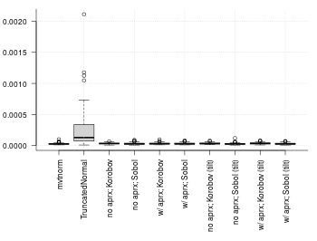
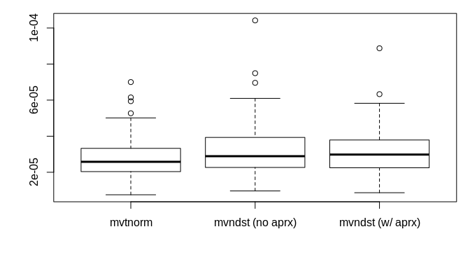

<!-- README.md is generated from README.Rmd. Please edit that file -->

# pedmod

<!-- badges: start -->

<!-- badges: end -->

The goal of pedmod is to …

## Installation

You can install the released version of pedmod from
[CRAN](https://CRAN.R-project.org) with:

``` r
install.packages("pedmod")
```

## Example

TODO: write text about the example

``` r
#####
# settings for the simulation study
library(mvtnorm)
library(pedmod)
library(microbenchmark)
set.seed(78459126)
n <- 5L         # number of variables to interate out
rel_eps <- 1e-4 # the relative error to use

#####
# run the simulation study
sim_res <- replicate(expr = {
  # simulate covariance matrix and the upper bound
  S <- drop(rWishart(1L, 2 * n, diag(n) / 2 / n))
  u <- rnorm(n)
  
  # function to use pmvnorm
  use_mvtnorm <- function(rel_eps)
    pmvnorm(upper = u, sigma = S, algorithm = GenzBretz(
      abseps = 0, releps = rel_eps, maxpts = 1e7))
  
  # function to use this package
  use_mvndst <- function(use_aprx = FALSE)
    mvndst(lower = rep(-Inf, n), upper = u, mu = rep(0, n), 
           sigma = S, use_aprx = use_aprx, abs_eps = 0, rel_eps = rel_eps,
           maxvls = 1e7)

  # get a very precise estimate
  truth <- use_mvtnorm(rel_eps / 100)
  
  # computes the error in a repeated approximations and takes the time
  n_rep <- 5L
  run_n_time <- function(expr){
    expr <- substitute(expr)
    ti <- get_nanotime()
    res <- replicate(n_rep, eval(expr))
    ti <- get_nanotime() - ti
    err <- (res - truth) / truth
    c(SE = sqrt(sum(err^2) / n_rep), time = ti / n_rep / 1e9)
  }
  
  mvtnorm_res        <- run_n_time(use_mvtnorm(rel_eps))
  mvndst_no_aprx_res <- run_n_time(use_mvndst(FALSE))
  mvndst_w_aprx_res  <- run_n_time(use_mvndst(TRUE))
  
  # return 
  rbind(mvtnorm            = mvtnorm_res, 
        `mvndst (no aprx)` = mvndst_no_aprx_res, 
        `mvndst (w/ aprx)` = mvndst_w_aprx_res)
}, n = 100, simplify = "array")
```

They have about the same average relative error as expected:

``` r
rowMeans(sim_res[, "SE", ])
#>          mvtnorm mvndst (no aprx) mvndst (w/ aprx) 
#>     0.0000282989     0.0000316296     0.0164280867
boxplot(t(sim_res[, "SE", ]))
```



``` r

# without extreme values
sum(keep <- colSums(sim_res[, "SE", ] > .5) < 1)
#> [1] 99
rowMeans(sim_res [, "SE", keep])
#>          mvtnorm mvndst (no aprx) mvndst (w/ aprx) 
#>     2.831528e-05     3.176110e-05     3.157978e-05
boxplot(t(sim_res[, "SE", keep]))
```



The new implementation is faster when the approximation is used:

``` r
rowMeans(sim_res[, "time", ])
#>          mvtnorm mvndst (no aprx) mvndst (w/ aprx) 
#>       0.01721708       0.01666676       0.01097902
boxplot(t(sim_res[, "time", ]))
```


